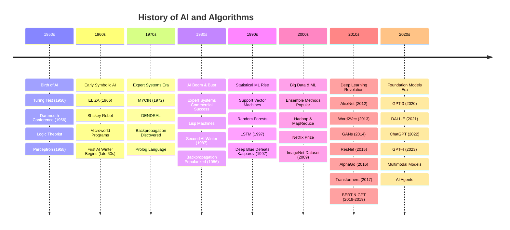
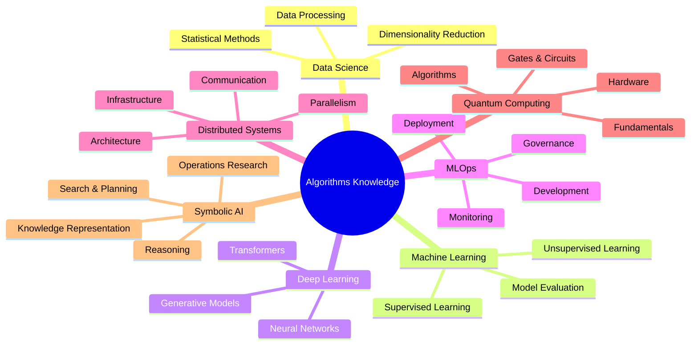

# Algorithms Knowledge Base

A comprehensive mental map and knowledge repository for algorithms, artificial intelligence, and related computational fields.

## Overview

This repository serves as a structured knowledge base, organized hierarchically to facilitate understanding and navigation through complex algorithmic concepts. Each section contains progressively detailed information, from high-level overviews to in-depth technical explanations.

## Historical Evolution of AI

## Repository Mind Map

Explore the complete hierarchical structure of all knowledge areas:

[View Full Repository Mind Map](diagrams/repository-overview-mindmap.mmd)

## Knowledge Areas

### 🧠 [Symbolic AI](symbolic-ai/README.md)
Classical artificial intelligence approaches based on logic, rules, and symbolic reasoning. Covers expert systems, knowledge representation, planning, and reasoning systems.
- [View Symbolic AI Mind Map](symbolic-ai/diagrams/symbolic-ai-mindmap.mmd)

### 📊 [Data Science](data-science/README.md)
The interdisciplinary field combining statistics, data analysis, and domain expertise. Includes data preprocessing, exploratory analysis, visualization, and statistical modeling.
- [View Data Science Mind Map](data-science/diagrams/ds-field-mindmap.mmd)

### 🤖 [Machine Learning](machine-learning/README.md)
Algorithms and techniques that enable systems to learn from data. Covers supervised learning, unsupervised learning, reinforcement learning, and classical ML algorithms.
- [View Machine Learning Mind Map](machine-learning/diagrams/ml-field-mindmap.mmd)

### 🧬 [Deep Learning](deep-learning/README.md)
Neural network architectures and techniques for learning hierarchical representations. Includes CNNs, RNNs, Transformers, and modern deep learning frameworks.
- [View Deep Learning Mind Map](deep-learning/diagrams/dl-field-mindmap.mmd)

### 🔧 [MLOps](mlops/README.md)
Practices and tools for deploying, monitoring, and maintaining machine learning systems in production. Covers CI/CD for ML, model versioning, and infrastructure.
- [View MLOps Mind Map](mlops/diagrams/mlops-field-mindmap.mmd)

### ⚛️ [Quantum Computing](quantum-computing/README.md)
Quantum algorithms and computational paradigms leveraging quantum mechanical phenomena. Includes quantum gates, algorithms, and quantum machine learning.
- [View Quantum Computing Mind Map](quantum-computing/diagrams/quantum-computing-mindmap.mmd)

### 🌐 [Distributed Systems](distributed-systems/README.md)
Architectures and algorithms for distributed computing. Covers consensus protocols, distributed training, parallel processing, and scalability patterns.
- [View Distributed Systems Mind Map](distributed-systems/diagrams/distributed-systems-mindmap.mmd)

## Navigation Guide

- Each topic folder contains a `README.md` with an overview and mental map
- Detailed concept pages are organized within topic folders
- Diagrams are stored in `diagrams/` subfolders as PNG files
- Use the folder structure to navigate from general to specific concepts

## Contributing to This Knowledge Base

When adding new content:
1. Follow the hierarchical structure (topic → sub-topic → detail)
2. Update relevant README files with links to new content
3. Store diagrams as PNG files in appropriate `diagrams/` folders
4. Maintain consistent formatting and cross-references

## Structure Philosophy

This knowledge base is designed as a **mental map** with multiple layers:
- **Layer 1**: This README (high-level overview)
- **Layer 2**: Topic READMEs (conceptual frameworks)
- **Layer 3**: Detail pages (in-depth explanations)
- **Supporting**: Diagrams and visual aids

---

*Last Updated: 2026-04-07*