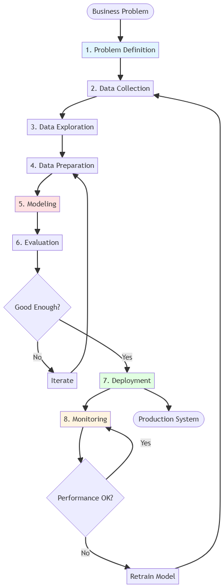

# Data Science

[← Back to Main](../README.md)

## Overview

Data Science focuses on extracting insights from data through statistical analysis, visualization, and modeling. This section covers data manipulation techniques (dimensionality reduction, imputation, sampling, normalization, augmentation) and model analysis methods (fairness, complexity, explainability, metrics).

## Data Techniques

### Dimensionality Reduction

**Core Concept**: Reducing feature space while preserving information

**Approaches**: Matrix-based (linear algebra) vs Graph-based (manifold learning)

| Method | Type | Linear | Preserves | Speed | Best For | Limitations |
|--------|------|--------|-----------|-------|----------|-------------|
| **[PCA](pca.md)** | Matrix | Yes | Global variance | Fast | High-dim data, preprocessing | Assumes linearity |
| **[t-SNE](tsne.md)** | Graph | No | Local structure | Slow | Visualization (2D/3D) | Not for new data, slow |
| **[UMAP](umap.md)** | Graph | No | Local + global | Fast | Large datasets, clustering | Hyperparameter sensitive |
| **[LDA](lda.md)** | Matrix | Yes | Class separation | Fast | Supervised tasks | Requires labels |
| **[ICA](ica.md)** | Matrix | Yes | Independence | Medium | Signal separation | Assumes independence |
| **[Isomap](isomap.md)** | Graph | No | Geodesic distance | Medium | Non-linear manifolds | Sensitive to noise |
| **[LLE](lle.md)** | Graph | No | Local geometry | Medium | Non-linear manifolds | Requires dense sampling |
| **[Autoencoder](autoencoder-dr.md)** | Neural | No | Learned features | Medium | Complex patterns | Needs training data |

**Selection Guide**:
- **Visualization**: t-SNE, UMAP
- **Preprocessing**: PCA, ICA
- **Supervised**: LDA
- **Large datasets**: UMAP, PCA
- **Non-linear patterns**: UMAP, Autoencoder, Kernel PCA

### Data Imputation

**Core Concept**: Handling missing values

**Missing Data Patterns**:
- **MCAR** (Missing Completely At Random): Missingness independent of data
- **MAR** (Missing At Random): Missingness depends on observed data
- **MNAR** (Missing Not At Random): Missingness depends on unobserved data

| Method | Type | Complexity | Preserves Distribution | Best For | Limitations |
|--------|------|------------|----------------------|----------|-------------|
| **[Mean/Median/Mode](simple-imputation.md)** | Simple | Low | No | Quick baseline, MCAR | Reduces variance |
| **[Forward/Backward Fill](ffill-bfill.md)** | Simple | Low | Partial | Time series | Creates autocorrelation |
| **[Constant Value](constant-imputation.md)** | Simple | Low | No | Domain knowledge | Arbitrary choice |
| **[Random Sampling](random-imputation.md)** | Simple | Low | Yes | MCAR data | Ignores relationships |
| **[Regression](regression-imputation.md)** | Statistical | Medium | Partial | MAR, relationships | Underestimates variance |
| **[Stochastic Regression](stochastic-regression.md)** | Statistical | Medium | Yes | MAR, variance preservation | More complex |
| **[KNN](knn-imputation.md)** | ML | Medium | Yes | Local patterns | Computationally expensive |
| **[MICE](mice.md)** | ML | High | Yes | Multiple variables, MAR | Slow, requires iterations |
| **[Matrix Factorization](matrix-factorization.md)** | ML | High | Yes | High-dimensional, patterns | Needs sufficient data |
| **[Deep Learning](dl-imputation.md)** | ML | High | Yes | Complex patterns | Requires training data |

**Selection Guide**:
- **Quick analysis**: Mean/Median
- **Time series**: Forward/Backward fill
- **Preserve variance**: Stochastic regression, MICE
- **Complex patterns**: KNN, Deep Learning
- **Multiple variables**: MICE, Matrix Factorization

### Sampling Techniques

| Method | Type | Preserves Distribution | Complexity | Best For | Limitations |
|--------|------|----------------------|------------|----------|-------------|
| **[Simple Random](simple-random.md)** | Probability | No | Low | Homogeneous population | May miss subgroups |
| **[Systematic](systematic-sampling.md)** | Probability | No | Low | Ordered data | Periodic patterns risk |
| **[Stratified](stratified-sampling.md)** | Probability | Yes | Medium | Heterogeneous population | Requires strata knowledge |
| **[Cluster](cluster-sampling.md)** | Probability | Partial | Medium | Geographically dispersed | Higher variance |
| **[Bootstrap](bootstrap.md)** | Resampling | Yes | Low | Confidence intervals | Assumes independence |
| **[Cross-Validation](cross-validation.md)** | Resampling | Yes | Medium | Model evaluation | Computationally expensive |

**Imbalanced Data Sampling**:

| Technique | Approach | Data Size | Overfitting Risk | Best For | Avoid When |
|-----------|----------|-----------|-----------------|----------|------------|
| **[Random Oversampling](random-oversample.md)** | Duplicate minority | Increases | High | Quick baseline | Exact duplicates |
| **[SMOTE](smote.md)** | Synthetic minority | Increases | Medium | General purpose | High-dimensional |
| **[ADASYN](adasyn.md)** | Adaptive synthetic | Increases | Medium | Varying density | Noisy data |
| **[Random Undersampling](random-undersample.md)** | Remove majority | Decreases | Low | Large datasets | Information loss |
| **[Tomek Links](tomek-links.md)** | Remove boundary | Decreases | Low | Clean boundaries | Aggressive removal |
| **[SMOTEENN](smoteenn.md)** | SMOTE + ENN | Varies | Low | Noisy boundaries | Complex |
| **[SMOTETomek](smotetomek.md)** | SMOTE + Tomek | Varies | Low | Clean synthetic | Two-step process |

### Normalization and Scaling

**Core Concept**: Bringing features to comparable scales

#### Feature Scaling Methods

| Method | Formula | Range | Robust to Outliers | Best For | Avoid When |
|--------|---------|-------|-------------------|----------|------------|
| **[Min-Max](minmax-scaling.md)** | (x - min) / (max - min) | [0, 1] | No | Neural networks, bounded features | Outliers present |
| **[Standardization](standardization.md)** | (x - μ) / σ | Unbounded | No | Linear models, PCA, clustering | Non-Gaussian data |
| **[Robust Scaling](robust-scaling.md)** | (x - median) / IQR | Unbounded | Yes | Outliers present | Need specific range |
| **[MaxAbs](maxabs-scaling.md)** | x / \|max\| | [-1, 1] | No | Sparse data | Dense data with outliers |
| **[L1 Normalization](l1-norm.md)** | x / Σ\|x\| | Sum = 1 | No | Text data, sparse features | Need variance info |
| **[L2 Normalization](l2-norm.md)** | x / √(Σx²) | Norm = 1 | No | Cosine similarity, embeddings | Need magnitude info |

#### Distribution Transformations

| Method | Purpose | Handles Negatives | Handles Zeros | Best For | Limitations |
|--------|---------|------------------|---------------|----------|-------------|
| **[Log](log-transform.md)** | Reduce skewness | No | No | Right-skewed data | Requires x > 0 |
| **[Box-Cox](box-cox.md)** | Normalize distribution | No | No | Positive data, find optimal λ | Requires x > 0 |
| **[Yeo-Johnson](yeo-johnson.md)** | Normalize distribution | Yes | Yes | Any data, find optimal λ | More complex |
| **[Quantile](quantile-transform.md)** | Match target distribution | Yes | Yes | Non-parametric, uniform/normal | Loses outlier info |
| **[Power](power-transform.md)** | Reduce skewness | Depends | Yes | Flexible transformation | Parameter selection |

#### Categorical Encoding

| Method | Output | Cardinality | Preserves Order | Best For | Limitations |
|--------|--------|-------------|----------------|----------|-------------|
| **[One-Hot](onehot-encoding.md)** | Binary columns | High-dim | No | Tree models, low cardinality | Curse of dimensionality |
| **[Label](label-encoding.md)** | Integer | Low-dim | No | Tree models only | Implies ordering |
| **[Ordinal](ordinal-encoding.md)** | Integer | Low-dim | Yes | Ordered categories | Requires order |
| **[Target](target-encoding.md)** | Float | Low-dim | No | High cardinality | Overfitting risk |
| **[Binary](binary-encoding.md)** | Binary | Medium-dim | No | High cardinality | Less interpretable |
| **[Frequency](frequency-encoding.md)** | Float | Low-dim | No | Rare categories | Loses uniqueness |

**Selection Guide**:
- **Distance-based models** (KNN, SVM): Standardization or Min-Max
- **Tree-based models**: No scaling needed (but encoding required)
- **Neural networks**: Min-Max or Standardization
- **With outliers**: Robust Scaling
- **Sparse data**: MaxAbs, L1 normalization

### Data Augmentation

| Modality | Technique | Preserves Semantics | Complexity | Best For | Risk |
|----------|-----------|-------------------|------------|----------|------|
| **[Image](image-augmentation.md)** | Geometric transforms | Yes | Low | CV, small datasets | Over-augmentation |
| **[Image](image-augmentation.md)** | Color jittering | Yes | Low | Lighting variations | Unrealistic colors |
| **[Image](image-augmentation.md)** | Mixup/CutMix | Partial | Medium | Regularization | Label noise |
| **[Image](image-augmentation.md)** | AutoAugment | Yes | High | Optimal policy | Expensive search |
| **[Text](text-augmentation.md)** | Synonym replacement | Yes | Low | Small datasets | Context loss |
| **[Text](text-augmentation.md)** | Back-translation | Yes | High | Paraphrasing | Translation errors |
| **[Text](text-augmentation.md)** | Contextual embeddings | Yes | Medium | Semantic variations | Requires LLM |
| **[Tabular](tabular-augmentation.md)** | SMOTE | Partial | Medium | Imbalanced data | Unrealistic combinations |
| **[Tabular](tabular-augmentation.md)** | Gaussian noise | Partial | Low | Continuous features | Distribution shift |
| **[Tabular](tabular-augmentation.md)** | CTGAN | Yes | High | Complex distributions | Training required |
| **[Time Series](time-series-augmentation.md)** | Window slicing | Yes | Low | More samples | Temporal correlation |
| **[Time Series](time-series-augmentation.md)** | Jittering | Yes | Low | Noise robustness | Signal distortion |
| **[Time Series](time-series-augmentation.md)** | Time warping | Yes | Medium | Temporal variations | Pattern distortion |

**Augmentation Strategy**:
- **Small datasets**: Aggressive augmentation
- **Large datasets**: Light augmentation for regularization
- **Imbalanced**: Focus on minority class
- **Production**: Test augmented data quality

## Model Analysis

### Model Complexity

**Core Concept**: Understanding model capacity and generalization

**Bias-Variance Tradeoff**:
- **High Bias (Underfitting)**: Model too simple, poor training performance
- **High Variance (Overfitting)**: Model too complex, poor generalization
- **Optimal Complexity**: Balance between bias and variance
- **Diagnosis**: Learning curves, validation curves

#### Regularization Techniques

| Technique | Effect | Sparsity | Complexity | Best For | Trade-off |
|-----------|--------|----------|------------|----------|-----------|
| **[L1 (Lasso)](l1-regularization.md)** | Feature selection | Yes | O(n) | High-dimensional | May underfit |
| **[L2 (Ridge)](l2-regularization.md)** | Weight shrinkage | No | O(n) | Multicollinearity | Keeps all features |
| **[Elastic Net](elastic-net.md)** | L1 + L2 | Partial | O(n) | Correlated features | Two hyperparameters |
| **[Dropout](dropout.md)** | Random deactivation | No | O(n) | Neural networks | Training time |
| **[Early Stopping](early-stopping.md)** | Stop training | No | O(1) | Any iterative | Validation needed |

#### Model Selection Criteria

| Criterion | Formula | Penalty | Best For | Limitations |
|-----------|---------|---------|----------|-------------|
| **[AIC](aic.md)** | 2k - 2ln(L) | 2k | Large samples | Overfits small data |
| **[BIC](bic.md)** | k×ln(n) - 2ln(L) | k×ln(n) | Model selection | Penalizes complexity more |
| **[MDL](mdl.md)** | L(model) + L(data\|model) | Description length | Compression | Computationally complex |
| **[Cross-Validation](cv-selection.md)** | Empirical error | None | Robust estimate | Computationally expensive |

**Model Capacity Measures**:
- **VC Dimension**: Maximum points that can be shattered
- **Rademacher Complexity**: Expected supremum of empirical process
- **Parameter Count**: Number of learnable weights
- **Depth vs Width**: Network architecture trade-offs

### Model Explainability

| Method | Scope | Model-Agnostic | Complexity | Best For | Limitations |
|--------|-------|----------------|------------|----------|-------------|
| **[Permutation Importance](permutation-importance.md)** | Global | Yes | O(n×m) | Any model | Correlated features |
| **[Tree Importance](tree-importance.md)** | Global | No | O(1) | Tree models | Biased to high-cardinality |
| **[Coefficients](coefficient-importance.md)** | Global | No | O(1) | Linear models | Requires scaling |
| **[SHAP](shap.md)** | Local/Global | Yes | O(2^n) or O(n²) | Consistent values | Computationally expensive |
| **[LIME](lime.md)** | Local | Yes | O(k×m) | Simple explanations | Unstable |
| **[PDP](pdp.md)** | Global | Yes | O(n×m) | Feature effects | Assumes independence |
| **[ICE](ice.md)** | Local | Yes | O(n×m) | Individual effects | Many plots |
| **[ALE](ale.md)** | Global | Yes | O(n×m) | Correlated features | Complex interpretation |
| **[Counterfactuals](counterfactuals.md)** | Local | Yes | O(optimization) | Actionable insights | May be unrealistic |

**Selection Guide**:
- **Global understanding**: SHAP summary, Permutation Importance, PDP
- **Local predictions**: SHAP force plots, LIME, Counterfactuals
- **Fast computation**: Tree importance, Coefficients
- **Correlated features**: ALE, SHAP

### Model Fairness

**Core Concept**: Ensuring equitable predictions across groups

#### Fairness Metrics

| Metric | Definition | Requires | Best For | Limitations |
|--------|------------|----------|----------|-------------|
| **[Demographic Parity](demographic-parity.md)** | P(Ŷ=1\|A=0) = P(Ŷ=1\|A=1) | Predictions | Equal selection rates | Ignores ground truth |
| **[Equalized Odds](equalized-odds.md)** | TPR & FPR equal across groups | Labels | Overall fairness | Strict requirement |
| **[Equal Opportunity](equal-opportunity.md)** | TPR equal across groups | Labels | Positive outcomes | Ignores FPR |
| **[Predictive Parity](predictive-parity.md)** | PPV equal across groups | Labels | Precision fairness | May allow different TPR |
| **[Individual Fairness](individual-fairness.md)** | Similar individuals → similar predictions | Similarity metric | Case-by-case | Defining similarity |

#### Bias Mitigation Strategies

| Stage | Technique | Approach | Complexity | Best For | Limitations |
|-------|-----------|----------|------------|----------|-------------|
| **[Pre-processing](preprocessing-fairness.md)** | Reweighting | Adjust sample weights | Low | Simple fix | Limited impact |
| **[Pre-processing](preprocessing-fairness.md)** | Resampling | Balance groups | Low | Imbalanced data | Data loss/duplication |
| **[In-processing](inprocessing-fairness.md)** | Fairness constraints | Regularization | Medium | During training | Model-specific |
| **[In-processing](inprocessing-fairness.md)** | Adversarial debiasing | GAN-like training | High | Deep learning | Training complexity |
| **[Post-processing](postprocessing-fairness.md)** | Threshold optimization | Adjust decision boundary | Low | Model-agnostic | May reduce accuracy |
| **[Post-processing](postprocessing-fairness.md)** | Calibration | Adjust probabilities | Medium | Probabilistic models | Requires validation set |

**Fairness-Accuracy Trade-off**:
- No free lunch: improving fairness often reduces accuracy
- Context matters: legal, ethical, and domain considerations
- Multi-objective optimization: Pareto frontier analysis
- Stakeholder involvement: define acceptable trade-offs

### Evaluation Metrics

#### Classification Metrics

| Metric | Formula | Range | Balanced | Best For | Limitations |
|--------|---------|-------|----------|----------|-------------|
| **[Accuracy](accuracy.md)** | (TP+TN)/(TP+TN+FP+FN) | [0, 1] | No | Balanced classes | Misleading with imbalance |
| **[Precision](precision.md)** | TP/(TP+FP) | [0, 1] | No | Minimize false positives | Ignores false negatives |
| **[Recall](recall.md)** | TP/(TP+FN) | [0, 1] | No | Minimize false negatives | Ignores false positives |
| **[F1-Score](f1-score.md)** | 2×(P×R)/(P+R) | [0, 1] | Yes | Balance P and R | Equal weight to P/R |
| **[F-beta](f-beta.md)** | (1+β²)×(P×R)/(β²P+R) | [0, 1] | Yes | Custom P/R weight | Parameter selection |
| **[ROC-AUC](roc-auc.md)** | Area under ROC curve | [0, 1] | Yes | Threshold-independent | Optimistic with imbalance |
| **[PR-AUC](pr-auc.md)** | Area under PR curve | [0, 1] | Yes | Imbalanced data | Less intuitive |
| **[MCC](mcc.md)** | Correlation coefficient | [-1, 1] | Yes | Imbalanced data | Less known |
| **[Cohen's Kappa](cohens-kappa.md)** | Agreement beyond chance | [-1, 1] | Yes | Inter-rater reliability | Requires interpretation |
| **[Log Loss](log-loss.md)** | -Σ(y×log(p)) | [0, ∞] | Yes | Probability calibration | Sensitive to confidence |

**Multi-class Averaging**:
- **Macro**: Unweighted mean (treats all classes equally)
- **Micro**: Aggregate then compute (favors frequent classes)
- **Weighted**: Weighted by class frequency

#### Regression Metrics

| Metric | Formula | Units | Robust to Outliers | Interpretable | Best For |
|--------|---------|-------|-------------------|---------------|----------|
| **[MAE](mae.md)** | Σ\|y-ŷ\|/n | Same as y | Yes | Yes | General purpose |
| **[MSE](mse.md)** | Σ(y-ŷ)²/n | Squared | No | No | Penalize large errors |
| **[RMSE](rmse.md)** | √(Σ(y-ŷ)²/n) | Same as y | No | Yes | Penalize large errors |
| **[MAPE](mape.md)** | Σ\|y-ŷ\|/y×100 | Percentage | No | Yes | Relative errors |
| **[R²](r-squared.md)** | 1 - SS_res/SS_tot | [0, 1] | No | Yes | Variance explained |
| **[Adjusted R²](adj-r-squared.md)** | 1 - (1-R²)(n-1)/(n-p-1) | [0, 1] | No | Yes | Penalize complexity |
| **[Median AE](median-ae.md)** | median(\|y-ŷ\|) | Same as y | Yes | Yes | Outliers present |
| **[Huber](huber.md)** | Piecewise (L2/L1) | Same as y | Partial | No | Some outliers |
| **[Quantile](quantile-loss.md)** | Asymmetric L1 | Same as y | Yes | No | Specific quantiles |

**Selection Guide**:
- **General**: RMSE, MAE
- **Outliers**: Median AE, Huber
- **Interpretability**: MAE, MAPE, R²
- **Large errors matter**: MSE, RMSE
- **Relative errors**: MAPE

#### Clustering Metrics

**Internal Metrics** (no ground truth needed):

| Metric | Range | Higher is Better | Measures | Best For | Limitations |
|--------|-------|-----------------|----------|----------|-------------|
| **[Silhouette](silhouette.md)** | [-1, 1] | Yes | Cohesion & separation | General purpose | Convex clusters |
| **[Davies-Bouldin](davies-bouldin.md)** | [0, ∞] | No | Cluster similarity | Compact clusters | Euclidean bias |
| **[Calinski-Harabasz](calinski-harabasz.md)** | [0, ∞] | Yes | Between/within variance | Dense clusters | Convex clusters |
| **[Dunn Index](dunn-index.md)** | [0, ∞] | Yes | Min separation/max diameter | Well-separated | Sensitive to outliers |

**External Metrics** (requires ground truth):

| Metric | Range | Higher is Better | Measures | Properties |
|--------|-------|-----------------|----------|------------|
| **[Adjusted Rand Index](ari.md)** | [-1, 1] | Yes | Pair agreement | Chance-corrected |
| **[NMI](nmi.md)** | [0, 1] | Yes | Mutual information | Normalized |
| **[Fowlkes-Mallows](fowlkes-mallows.md)** | [0, 1] | Yes | Geometric mean of P/R | Symmetric |
| **[Homogeneity](homogeneity.md)** | [0, 1] | Yes | Cluster purity | One-sided |
| **[Completeness](completeness.md)** | [0, 1] | Yes | Class grouping | One-sided |
| **[V-measure](v-measure.md)** | [0, 1] | Yes | Harmonic mean H/C | Balanced |

## Statistical Analysis

### Hypothesis Testing

- **[Parametric Tests](parametric-tests.md)** - Distributional assumptions
  - t-test (one-sample, two-sample, paired)
  - ANOVA (one-way, two-way)
  - F-test
  - Z-test
  - Assumptions and violations

- **[Non-parametric Tests](nonparametric-tests.md)** - Distribution-free
  - Mann-Whitney U test
  - Wilcoxon signed-rank test
  - Kruskal-Wallis test
  - Chi-square test
  - Kolmogorov-Smirnov test

- **[Multiple Testing](multiple-testing.md)** - Correction methods
  - Bonferroni correction
  - Holm-Bonferroni
  - Benjamini-Hochberg (FDR)
  - Family-wise error rate
  - False discovery rate

### Correlation and Causation

- **[Correlation Analysis](correlation-analysis.md)** - Relationships
  - Pearson correlation
  - Spearman correlation
  - Kendall's tau
  - Point-biserial correlation
  - Partial correlation

- **[Causal Inference](causal-inference.md)** - Causality
  - Randomized controlled trials
  - Observational studies
  - Confounding variables
  - Propensity score matching
  - Instrumental variables
  - Difference-in-differences

## Data Visualization

### Exploratory Visualization

- **[Univariate Plots](univariate-plots.md)** - Single variable
  - Histograms
  - Box plots
  - Violin plots
  - Density plots
  - QQ plots

- **[Bivariate Plots](bivariate-plots.md)** - Two variables
  - Scatter plots
  - Line plots
  - Heatmaps
  - Hexbin plots
  - Joint plots

- **[Multivariate Plots](multivariate-plots.md)** - Multiple variables
  - Pair plots
  - Parallel coordinates
  - Radar charts
  - 3D scatter plots
  - Dimensionality reduction plots

### Statistical Visualization

- **[Distribution Plots](distribution-plots.md)** - Data distributions
  - Empirical CDF
  - Probability plots
  - Quantile plots
  - Kernel density estimation

- **[Comparison Plots](comparison-plots.md)** - Group comparisons
  - Bar charts
  - Grouped box plots
  - Strip plots
  - Swarm plots

## Best Practices

### Data Preparation
1. Understand data types and distributions
2. Handle missing values appropriately
3. Detect and treat outliers
4. Scale features when necessary
5. Create validation strategy early

### Model Evaluation
1. Use appropriate metrics for the problem
2. Employ cross-validation
3. Check for overfitting/underfitting
4. Analyze errors and residuals
5. Consider business metrics

### Fairness and Ethics
1. Identify protected attributes
2. Measure fairness metrics
3. Mitigate detected biases
4. Document limitations
5. Consider societal impact

## Related Topics

- [Machine Learning](../machine-learning/README.md) - ML models
- [Deep Learning](../deep-learning/README.md) - Neural networks
- [Tabular Data](../modalities/tabular/README.md) - Structured data techniques
- [MLOps](../mlops/README.md) - Production considerations

## Further Learning

### Books
- "Python for Data Analysis" by Wes McKinney
- "The Art of Statistics" by David Spiegelhalter
- "Storytelling with Data" by Cole Nussbaumer Knaflic
- "Fairness and Machine Learning" by Barocas, Hardt, Narayanan

### Courses
- Statistical Learning (Stanford)
- Data Science Specialization (Johns Hopkins/Coursera)
- Applied Data Science with Python (Michigan/Coursera)
- Practical Statistics for Data Scientists

### Libraries
- **pandas** - Data manipulation
- **NumPy** - Numerical computing
- **scikit-learn** - ML and preprocessing
- **matplotlib/seaborn** - Visualization
- **SHAP** - Model explainability
- **imbalanced-learn** - Imbalanced data

---

*Data Science provides the techniques and tools for extracting insights from data and ensuring models are robust, fair, and interpretable.*