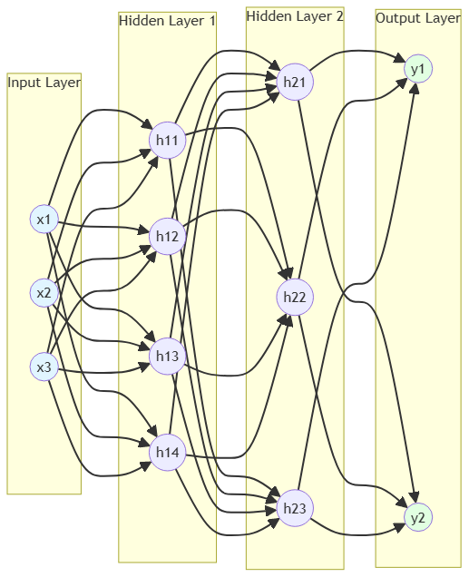
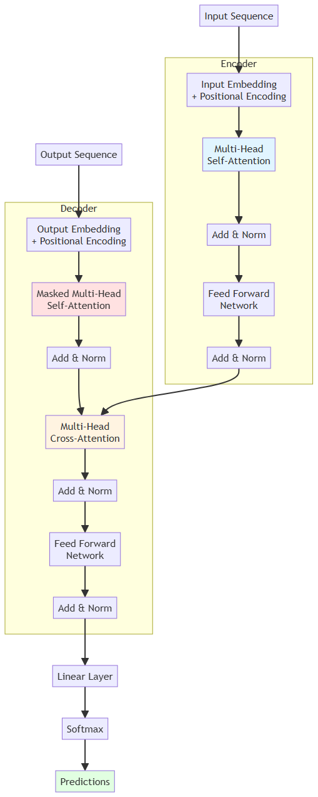
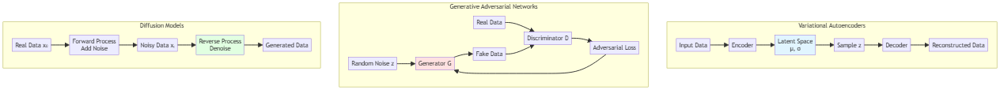

# Deep Learning

[← Back to Main](../README.md)

## Overview

Deep Learning focuses on neural network architectures and training techniques. This section covers DL-specific models (MLP, attention mechanisms, Mamba), architectural patterns (encoders/decoders), generative models (VAE, GANs, diffusion), and advanced training techniques (quantization, distillation, physics-informed learning).

## Architecture Selection Guide

Choosing the right deep learning architecture depends on your data type and task. Use this decision flowchart:

```mermaid
graph TD
    Start([What type of data?]) --> DataType{Data Type}
    
    DataType -->|Images| ImageQ{Task?}
    DataType -->|Text/Sequences| TextQ{Task?}
    DataType -->|Tabular| TabularQ{Size?}
    DataType -->|Time Series| TimeQ{Length?}
    DataType -->|Audio| AudioQ{Task?}
    
    subgraph Images["🖼️ Image Tasks"]
        ImageQ -->|Classification| ImgClass{Dataset size?}
        ImageQ -->|Object Detection| ObjDet[CNN + Detection Head<br/>YOLO, Faster R-CNN]
        ImageQ -->|Segmentation| Segment[U-Net, Mask R-CNN<br/>Semantic/Instance]
        ImageQ -->|Generation| ImgGen[GAN, Diffusion, VAE<br/>Stable Diffusion]
        
        ImgClass -->|Small <10K| Transfer[Transfer Learning<br/>Fine-tune ResNet/EfficientNet]
        ImgClass -->|Large >100K| TrainCNN[Train CNN<br/>ResNet, EfficientNet, ConvNeXt]
    end
    
    subgraph Text["📝 Text/Sequence Tasks"]
        TextQ -->|Classification| TxtClass{Length?}
        TextQ -->|Generation| TxtGen{Model size?}
        TextQ -->|Translation| Translation[Encoder-Decoder<br/>T5, BART, mBART]
        TextQ -->|Q&A| QA[Encoder-only<br/>BERT, RoBERTa]
        
        TxtClass -->|Short <512| BERT_Class[BERT-based<br/>Fine-tune encoder]
        TxtClass -->|Long >512| LongFormer[Longformer, BigBird<br/>Efficient attention]
        
        TxtGen -->|Small task| GPT_Small[GPT-2, DistilGPT<br/>Fine-tune decoder]
        TxtGen -->|Large task| GPT_Large[GPT-3/4, LLaMA<br/>Prompt or fine-tune]
    end
    
    subgraph Tabular["📊 Tabular Data"]
        TabularQ -->|Small <10K| TabSmall[Simple MLP<br/>2-3 hidden layers]
        TabularQ -->|Medium 10K-1M| TabMed{Feature types?}
        TabularQ -->|Large >1M| TabLarge[Deep MLP<br/>Residual connections]
        
        TabMed -->|Mixed| TabNet[TabNet<br/>Attention-based]
        TabMed -->|Numeric| DeepMLP[Deep MLP<br/>Batch norm, dropout]
    end
    
    subgraph TimeSeries["📈 Time Series"]
        TimeQ -->|Short <100| TimeShort{Pattern?}
        TimeQ -->|Long >100| TimeLong{Need attention?}
        
        TimeShort -->|Simple| LSTM_Short[LSTM/GRU<br/>1-2 layers]
        TimeShort -->|Complex| CNN1D[1D CNN<br/>Temporal patterns]
        
        TimeLong -->|Yes| Transformer_TS[Transformer<br/>Temporal Fusion]
        TimeLong -->|No| Mamba_TS[Mamba/SSM<br/>Efficient long sequences]
    end
    
    subgraph Audio["🎵 Audio Tasks"]
        AudioQ -->|Speech Recognition| ASR[Wav2Vec2, Whisper<br/>End-to-end]
        AudioQ -->|Classification| AudioClass[CNN + RNN<br/>Mel spectrograms]
        AudioQ -->|Generation| AudioGen[WaveNet, Diffusion<br/>Raw waveform]
    end
    
    Transfer --> Eval
    TrainCNN --> Eval
    ObjDet --> Eval
    Segment --> Eval
    ImgGen --> Eval
    
    BERT_Class --> Eval
    LongFormer --> Eval
    GPT_Small --> Eval
    GPT_Large --> Eval
    Translation --> Eval
    QA --> Eval
    
    TabSmall --> Eval
    TabNet --> Eval
    DeepMLP --> Eval
    TabLarge --> Eval
    
    LSTM_Short --> Eval
    CNN1D --> Eval
    Transformer_TS --> Eval
    Mamba_TS --> Eval
    
    ASR --> Eval
    AudioClass --> Eval
    AudioGen --> Eval
    
    Eval{Performance<br/>good?}
    Eval -->|No| Improve[Improve:<br/>• More data<br/>• Data augmentation<br/>• Better architecture<br/>• Hyperparameter tuning<br/>• Regularization]
    Eval -->|Yes| Deploy[Deploy Model]
    
    Improve -.->|Try again| Start
    
    style Start fill:#e1f5ff
    style Deploy fill:#90EE90
    style Improve fill:#FFD700
    style Transfer fill:#90EE90
    style BERT_Class fill:#90EE90
    style TabSmall fill:#90EE90
    style LSTM_Short fill:#90EE90
```

**Quick Navigation by Data Type**:
- **🖼️ Images**: CNNs for classification, U-Net for segmentation, GANs/Diffusion for generation
- **📝 Text**: BERT for classification, GPT for generation, T5 for translation
- **📊 Tabular**: MLPs with proper regularization, TabNet for attention-based
- **📈 Time Series**: LSTM/GRU for short sequences, Transformers/Mamba for long sequences
- **🎵 Audio**: Wav2Vec2 for speech, WaveNet for generation

The flowchart guides you through dataset size, task requirements, and performance needs to select the optimal architecture.

## Deep Learning Models

### Multi-Layer Perceptron (MLP)

**Core Concept**: Fully connected feedforward neural networks

- **[Basic MLP](pages/mlp-basics.md)** - Foundational architecture
  - Input layer, hidden layers, output layer
  - Fully connected (dense) layers
  - Non-linear activation functions
  - Universal approximation theorem

- **[Activation Functions](pages/activation-functions.md)** - Non-linearity

| Function | Formula | Range | Gradient | Best For | Issues |
|----------|---------|-------|----------|----------|--------|
| **[ReLU](pages/relu.md)** | max(0, x) | [0, ∞) | 0 or 1 | Hidden layers (default) | Dying ReLU |
| **[Leaky ReLU](pages/leaky-relu.md)** | max(αx, x) | (-∞, ∞) | α or 1 | Avoid dying ReLU | Hyperparameter α |
| **[PReLU](pages/prelu.md)** | max(αx, x) | (-∞, ∞) | Learned | Learn negative slope | More parameters |
| **[ELU](pages/elu.md)** | x if x>0 else α(e^x-1) | (-α, ∞) | Smooth | Faster convergence | Exponential cost |
| **[GELU](pages/gelu.md)** | x·Φ(x) | (-∞, ∞) | Smooth | Transformers, NLP | Slower than ReLU |
| **[Swish](pages/swish.md)** | x·σ(βx) | (-∞, ∞) | Smooth | Deep networks | Slower than ReLU |
| **[Mish](pages/mish.md)** | x·tanh(softplus(x)) | (-∞, ∞) | Smooth | Better than Swish | Slowest |
| **[Sigmoid](pages/sigmoid.md)** | 1/(1+e^-x) | (0, 1) | Vanishing | Output (binary) | Vanishing gradient |
| **[Tanh](pages/tanh.md)** | (e^x-e^-x)/(e^x+e^-x) | (-1, 1) | Vanishing | RNN (legacy) | Vanishing gradient |
| **[Softmax](pages/softmax.md)** | e^xi/Σe^xj | (0, 1), Σ=1 | Varies | Output (multi-class) | Numerical stability |

**Selection Guide**:
- **Default**: ReLU (fast, works well)
- **Transformers/NLP**: GELU
- **Avoid dying neurons**: Leaky ReLU, ELU
- **Deep networks**: Swish, Mish
- **Output layer**: Sigmoid (binary), Softmax (multi-class)

- **[Deep Feedforward Networks](pages/deep-feedforward.md)** - Many-layered MLPs
  - Depth vs width tradeoffs
  - Skip connections
  - Residual connections
  - Highway networks

### Attention Mechanisms

**Core Concept**: Dynamic focus on relevant information

| Mechanism | Complexity | Memory | Parallelizable | Best For | Limitations |
|-----------|------------|--------|----------------|----------|-------------|
| **[Self-Attention](pages/self-attention.md)** | O(n²) | O(n²) | Yes | Short sequences | Quadratic cost |
| **[Multi-Head](pages/multi-head-attention.md)** | O(n²) | O(n²) | Yes | Rich representations | More parameters |
| **[Cross-Attention](pages/cross-attention.md)** | O(nm) | O(nm) | Yes | Seq2seq, multimodal | Two sequences needed |
| **[Local Attention](pages/local-attention.md)** | O(nw) | O(nw) | Yes | Long sequences | Limited context |
| **[Sparse Attention](pages/sparse-attention.md)** | O(n√n) | O(n√n) | Partial | Very long sequences | Pattern design |
| **[Flash Attention](pages/flash-attention.md)** | O(n²) | O(n) | Yes | Memory-bound | Hardware-specific |
| **[Linear Attention](pages/linear-attention.md)** | O(n) | O(n) | Yes | Very long sequences | Approximation |

**Attention Variants Comparison**:

| Variant | Pattern | Context | Use Case |
|---------|---------|---------|----------|
| **Full** | All-to-all | Global | Standard Transformer |
| **Local** | Window | Local | Long documents |
| **Strided** | Every k-th | Sparse global | Longformer |
| **Block** | Block diagonal | Structured | BigBird |
| **Random** | Random subset | Approximate global | Sparse Transformer |
| **Axial** | Row + Column | 2D | Images |

### Mamba (State Space Models)

**Core Concept**: Efficient sequence modeling alternative to attention

- **[State Space Models (SSM)](pages/state-space-models.md)** - Linear recurrence
  - Continuous-time formulation
  - Discretization methods
  - Structured matrices
  - Linear time complexity O(n)

- **[Mamba Architecture](pages/mamba.md)** - Selective SSM
  - Input-dependent parameters
  - Selective scan algorithm
  - Hardware-aware implementation
  - Competitive with Transformers

- **[Mamba vs Attention](pages/mamba-vs-attention.md)** - Comparison
  - Computational efficiency
  - Long-range dependencies
  - Training dynamics
  - Use case selection

## Architectural Patterns

### Encoder-Decoder Architectures

| Architecture | Direction | Training | Examples | Best For |
|--------------|-----------|----------|----------|----------|
| **[Encoder-Only](pages/encoder-only.md)** | Bidirectional | Masked LM | BERT, RoBERTa | Classification, NER |
| **[Decoder-Only](pages/decoder-only.md)** | Causal | Next token | GPT family | Text generation |
| **[Encoder-Decoder](pages/encoder-decoder-models.md)** | Both | Seq2seq | T5, BART | Translation, summarization |

### Convolutional Architectures

| Architecture | Innovation | Parameters | Depth | Best For |
|--------------|-----------|------------|-------|----------|
| **[CNN Basics](pages/cnn-basics.md)** | Local connectivity | Low | Shallow | Image features |
| **[ResNet](pages/modern-cnns.md)** | Residual connections | Medium | Very deep (50-152) | Image classification |
| **[DenseNet](pages/modern-cnns.md)** | Dense connections | High | Deep (121-201) | Feature reuse |
| **[EfficientNet](pages/modern-cnns.md)** | Compound scaling | Optimized | Varies | Efficiency |
| **[ConvNeXt](pages/modern-cnns.md)** | Modernized design | Medium | Deep | Competitive with ViT |

### Recurrent Architectures

| Architecture | Gates | Parameters | Memory | Best For | Limitations |
|--------------|-------|------------|--------|----------|-------------|
| **[Vanilla RNN](pages/rnn-basics.md)** | None | Low | Short-term | Simple sequences | Vanishing gradients |
| **[LSTM](pages/lstm.md)** | 3 (forget, input, output) | High | Long-term | Long sequences | Slow training |
| **[GRU](pages/gru.md)** | 2 (reset, update) | Medium | Long-term | Efficient sequences | Less expressive |

## Generative Models

### Variational Autoencoders (VAE)

| Variant | Innovation | Latent Space | Training | Best For |
|---------|-----------|--------------|----------|----------|
| **[Vanilla VAE](pages/vae-fundamentals.md)** | ELBO optimization | Continuous Gaussian | Stable | General generation |
| **[β-VAE](pages/vae-variants.md)** | Weighted KL | Disentangled | Stable | Interpretable factors |
| **[CVAE](pages/vae-variants.md)** | Conditional | Conditional | Stable | Controlled generation |
| **[VQ-VAE](pages/vae-variants.md)** | Vector quantization | Discrete codebook | Complex | High-quality images |
| **[Hierarchical VAE](pages/vae-variants.md)** | Multi-level | Hierarchical | Complex | Complex distributions |

### Generative Adversarial Networks (GAN)

| Variant | Innovation | Stability | Quality | Best For |
|---------|-----------|-----------|---------|----------|
| **[Vanilla GAN](pages/gan-fundamentals.md)** | Adversarial training | Low | Medium | Proof of concept |
| **[DCGAN](pages/gan-variants.md)** | Convolutional | Medium | Good | Image generation |
| **[StyleGAN](pages/gan-variants.md)** | Style-based | High | Excellent | High-res faces |
| **[CycleGAN](pages/gan-variants.md)** | Cycle consistency | Medium | Good | Unpaired translation |
| **[Progressive GAN](pages/gan-variants.md)** | Progressive growing | High | Excellent | High-resolution |
| **[BigGAN](pages/gan-variants.md)** | Large-scale | Medium | Excellent | ImageNet scale |

**GAN Training Challenges**:

| Issue | Solution | Complexity | Effectiveness |
|-------|----------|------------|---------------|
| **Mode collapse** | Minibatch discrimination | Medium | Partial |
| **Training instability** | WGAN, Spectral norm | Medium | High |
| **Gradient issues** | Gradient penalty | Low | High |
| **Convergence** | Two time-scale update | Low | Medium |

### Diffusion Models

| Model | Approach | Quality | Speed | Memory | Best For |
|-------|----------|---------|-------|--------|----------|
| **[Diffusion Fundamentals](pages/diffusion-fundamentals.md)** | Iterative denoising | High | Slow | Medium | Understanding basics |
| **[DDPM](pages/ddpm.md)** | Markov chain | High | Very Slow | Medium | High-quality generation |
| **[Latent Diffusion](pages/latent-diffusion.md)** | VAE + diffusion | High | Medium | Low | Efficient generation (Stable Diffusion) |
| **[Diffusion Variants](pages/diffusion-variants.md)** | Advanced techniques | High | Varies | Varies | Specialized applications |

**Diffusion Process Components**:
- **Forward diffusion**: Gradual noise addition to data
- **Reverse diffusion**: Learned denoising process
- **Score matching**: Estimating data distribution gradients
- **Noise schedule**: Controls diffusion speed and quality

### Other Generative Models

| Model Type | Likelihood | Invertible | Speed | Quality | Best For |
|------------|------------|------------|-------|---------|----------|
| **[Normalizing Flows](pages/normalizing-flows.md)** | Exact | Yes | Fast | Good | Exact likelihood needed |
| **[Autoregressive Models](pages/autoregressive-models.md)** | Exact | No | Slow | Excellent | Sequential data, text |

**Model Characteristics**:
- **Normalizing Flows**: Bijective transformations, exact likelihood computation
- **Autoregressive**: Sequential generation (PixelCNN, WaveNet, GPT)

## Training Techniques

### Supervised Fine-Tuning (SFT)

| Approach | Parameters Updated | Memory | Training Time | Best For | Risk |
|----------|-------------------|--------|---------------|----------|------|
| **[Full Fine-Tuning](pages/fine-tuning-strategies.md)** | All | High | Long | Maximum adaptation | Catastrophic forgetting |
| **[Layer Freezing](pages/fine-tuning-strategies.md)** | Partial | Medium | Medium | Limited data | Underfitting |
| **[LoRA](pages/peft.md)** | Low-rank matrices | Low | Fast | Efficient adaptation | Limited expressiveness |
| **[Adapter Layers](pages/peft.md)** | Small modules | Low | Fast | Multi-task | Architecture change |
| **[Prefix Tuning](pages/peft.md)** | Soft prompts | Very low | Very fast | Prompt-based tasks | Task-specific |
| **[Prompt Tuning](pages/peft.md)** | Input embeddings | Minimal | Very fast | Few parameters | Limited control |

**Instruction Tuning Benefits**:
- Multi-task generalization across diverse instructions
- Zero-shot and few-shot capabilities
- Better alignment with user intent
- Improved instruction following

### Reinforcement Learning (RL)

| Method | Complexity | Reward Model | Training Stability | Best For | Limitations |
|--------|------------|--------------|-------------------|----------|-------------|
| **[RLHF](pages/rlhf.md)** | High | Yes (trained) | Medium | Human alignment | Complex pipeline |
| **[DPO](pages/dpo.md)** | Medium | No (implicit) | High | Simplified alignment | Preference pairs needed |
| **[REINFORCE](pages/policy-gradient.md)** | Medium | Yes | Low | General RL | High variance |
| **[Actor-Critic](pages/policy-gradient.md)** | High | Yes (critic) | Medium | Stable training | More complex |
| **[PPO](pages/rlhf.md)** | High | Yes | High | Stable policy updates | Hyperparameter sensitive |

**RL Training Considerations**:
- **Reward modeling**: Quality of human feedback critical
- **Exploration**: Balance between exploitation and exploration
- **Stability**: Use clipping, KL penalties for stable training
- **Alignment**: Ensure model behavior matches human values

## Advanced DL Techniques

### Model Compression

| Technique | Compression Ratio | Accuracy Loss | Training Required | Best For | Limitations |
|-----------|------------------|---------------|-------------------|----------|-------------|
| **[Quantization](pages/quantization.md)** | 2-4x | Low | Optional (QAT) | Inference speed | Hardware support needed |
| **[Knowledge Distillation](pages/knowledge-distillation.md)** | Flexible | Low-Medium | Yes (student) | Model size reduction | Requires teacher model |
| **[Pruning](pages/pruning.md)** | 2-10x | Low-Medium | Optional | Sparse models | May need retraining |
| **[Low-Rank Factorization](pages/low-rank.md)** | 2-3x | Low | Optional | Memory reduction | Limited compression |
| **[Weight Sharing](pages/weight-sharing.md)** | 2-4x | Low | Yes | Parameter reduction | Architecture constraints |

**Quantization Methods**:

| Method | Precision | Accuracy | Speed | When to Use |
|--------|-----------|----------|-------|-------------|
| **FP32** | 32-bit | Baseline | 1x | Training, high precision needed |
| **FP16** | 16-bit | ~Same | 2x | Training with mixed precision |
| **INT8** | 8-bit | -1-2% | 3-4x | Inference, post-training |
| **INT4** | 4-bit | -2-5% | 4-6x | LLM inference, memory-bound |
| **Binary** | 1-bit | -10-20% | 8-16x | Extreme compression |

**Distillation Variants**:

| Type | Teacher | Student | Best For |
|------|---------|---------|----------|
| **Response-based** | Soft labels | Any | Classification |
| **Feature-based** | Intermediate layers | Similar architecture | Rich representations |
| **Relation-based** | Feature relationships | Any | Structural knowledge |
| **Self-distillation** | Same model | Same model | Regularization |

### Training Dynamics

- **[Grokking](pages/grokking.md)** - Delayed generalization
  - Memorization to generalization transition
  - Extended training benefits
  - Weight decay effects
  - Phase transitions

- **[Double Descent](pages/double-descent.md)** - Non-monotonic risk
  - Classical bias-variance tradeoff
  - Modern overparameterized regime
  - Interpolation threshold
  - Sample-wise double descent

- **[Neural Tangent Kernel](pages/ntk.md)** - Infinite width limit
  - Kernel regime
  - Lazy training
  - Feature learning
  - Theoretical analysis

### Physics-Informed Neural Networks

- **[PINN Fundamentals](pages/pinn-fundamentals.md)** - Physics constraints
  - PDE residuals in loss
  - Boundary conditions
  - Initial conditions
  - Automatic differentiation

- **[PINN Architectures](pages/pinn-architectures.md)** - Specialized designs
  - Fourier feature networks
  - Multi-scale architectures
  - Adaptive activation functions
  - Domain decomposition

- **[PINN Applications](pages/pinn-applications.md)** - Scientific computing
  - Fluid dynamics
  - Heat transfer
  - Quantum mechanics
  - Inverse problems

## Optimization and Regularization

### Optimizers

| Optimizer | Learning Rate | Momentum | Adaptive | Memory | Best For | Limitations |
|-----------|--------------|----------|----------|--------|----------|-------------|
| **[SGD](pages/sgd.md)** | Fixed/Scheduled | No | No | Low | Simple problems | Slow convergence |
| **[SGD + Momentum](pages/sgd-momentum.md)** | Fixed/Scheduled | Yes | No | Low | General purpose | Hyperparameter tuning |
| **[Nesterov](pages/nesterov.md)** | Fixed/Scheduled | Yes (lookahead) | No | Low | Faster convergence | Similar to momentum |
| **[Adagrad](pages/adagrad.md)** | Adaptive | No | Yes | Medium | Sparse data | Learning rate decay |
| **[RMSprop](pages/rmsprop.md)** | Adaptive | No | Yes | Medium | RNNs | Not well-studied |
| **[Adam](pages/adam.md)** | Adaptive | Yes | Yes | Medium | General purpose | May not converge |
| **[AdamW](pages/adamw.md)** | Adaptive | Yes | Yes | Medium | Transformers, LLMs | Slightly slower |
| **[NAdam](pages/nadam.md)** | Adaptive | Yes (Nesterov) | Yes | Medium | Faster than Adam | More hyperparameters |
| **[RAdam](pages/radam.md)** | Adaptive (rectified) | Yes | Yes | Medium | Stable training | Slower initially |
| **[AdaBound](pages/adabound.md)** | Adaptive→Fixed | Yes | Yes | Medium | Best of both worlds | Complex |
| **[L-BFGS](pages/lbfgs.md)** | Line search | No | No (2nd order) | High | Small batches | Not for large-scale |

**Selection Guide**:
- **Default choice**: AdamW (most robust)
- **Computer Vision**: SGD with momentum (better generalization)
- **NLP/Transformers**: AdamW
- **RNNs**: RMSprop, Adam
- **Sparse data**: Adagrad
- **Stable training**: RAdam
- **Fine-tuning**: AdamW with low LR

### Regularization

- **[Dropout](pages/dropout.md)** - Random deactivation
  - Standard dropout
  - DropConnect
  - Variational dropout
  - Dropout scheduling

- **[Batch Normalization](pages/batch-normalization.md)** - Normalizing activations
  - Internal covariate shift
  - Training vs inference mode
  - Batch size sensitivity
  - Alternatives (Layer Norm, Group Norm)

- **[Data Augmentation](pages/data-augmentation.md)** - Expanding training data
  - Image augmentation (crop, flip, color)
  - Text augmentation (back-translation, paraphrasing)
  - Mixup, CutMix
  - AutoAugment

### Loss Functions

- **[Classification Losses](pages/classification-losses.md)** - Discrete outputs
  - Cross-entropy
  - Focal loss
  - Label smoothing
  - Contrastive loss

- **[Regression Losses](pages/regression-losses.md)** - Continuous outputs
  - MSE (Mean Squared Error)
  - MAE (Mean Absolute Error)
  - Huber loss
  - Quantile loss

## Implementation Frameworks

### Deep Learning Frameworks
- **PyTorch** - Dynamic computation graphs, research-friendly
- **TensorFlow/Keras** - Production-ready, comprehensive ecosystem
- **JAX** - High-performance, functional programming
- **MXNet** - Efficient, scalable

### Model Libraries
- **Hugging Face Transformers** - Pre-trained models
- **timm** - PyTorch image models
- **torchvision** - Computer vision models
- **torchaudio** - Audio processing

### Training Tools
- **PyTorch Lightning** - Training boilerplate reduction
- **Accelerate** - Distributed training
- **DeepSpeed** - Large model training
- **FSDP** - Fully Sharded Data Parallel

## Best Practices

### Model Development
1. Start with pre-trained models when available
2. Use appropriate architecture for task
3. Monitor training dynamics (loss curves, gradients)
4. Implement early stopping
5. Use validation set for hyperparameter tuning

### Training Efficiency
- Mixed precision training (FP16/BF16)
- Gradient accumulation for large batches
- Gradient checkpointing for memory
- Efficient data loading (prefetching, caching)
- Profile and optimize bottlenecks

### Debugging
- Check data pipeline first
- Verify loss decreases on small batch
- Monitor gradient norms
- Visualize activations and weights
- Use tensorboard/wandb

## Related Topics

- [Machine Learning](../machine-learning/README.md) - Classical ML models
- [NLP](../modalities/nlp/README.md) - Language-specific techniques
- [Computer Vision](../modalities/vision/README.md) - Vision-specific techniques
- [MLOps](../mlops/README.md) - Model deployment

---

*Deep Learning provides powerful models and techniques for learning complex patterns from raw data across diverse domains.*