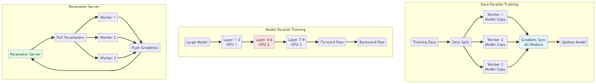
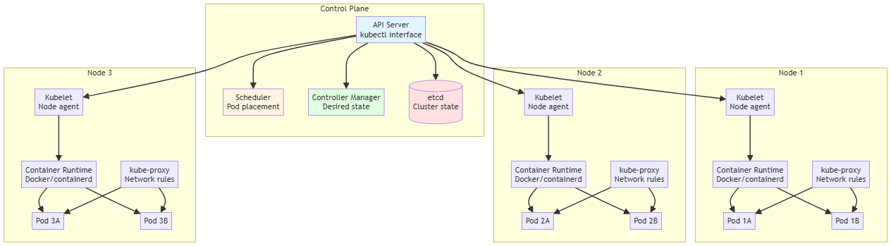

# Distributed Systems

[← Back to Main](../README.md)

## Overview

Distributed Systems are collections of independent computers that appear to users as a single coherent system. They enable scalability, fault tolerance, and geographic distribution of computational resources. In the context of AI and algorithms, distributed systems are crucial for training large models, processing massive datasets, and serving predictions at scale.

## Core Concepts

### Fundamental Principles

- **[Scalability](scalability.md)** - Horizontal and vertical scaling
- **[Fault Tolerance](fault-tolerance.md)** - Handling failures gracefully
- **[Consistency](consistency.md)** - Data consistency models
- **[Availability](availability.md)** - System uptime and reliability
- **[Partition Tolerance](partition-tolerance.md)** - Operating despite network splits
- **[CAP Theorem](cap-theorem.md)** - Consistency, Availability, Partition tolerance tradeoffs

### System Properties

- **[Transparency](transparency.md)** - Hiding distribution complexity
- **[Concurrency](concurrency.md)** - Simultaneous operations
- **[Replication](replication.md)** - Data redundancy
- **[Load Balancing](load-balancing.md)** - Distributing workload
- **[Latency](latency.md)** - Communication delays

## Distributed Computing Models

### Parallel Processing

- **[Data Parallelism](data-parallelism.md)** - Same operation on different data
- **[Model Parallelism](model-parallelism.md)** - Different parts of model on different devices
- **[Pipeline Parallelism](pipeline-parallelism.md)** - Sequential stage processing
- **[Task Parallelism](task-parallelism.md)** - Different operations simultaneously

### Communication Patterns

- **[Point-to-Point](point-to-point.md)** - Direct communication
- **[Broadcast](broadcast.md)** - One-to-all communication
- **[Reduce](reduce.md)** - All-to-one aggregation
- **[All-Reduce](all-reduce.md)** - Collective aggregation
- **[Scatter/Gather](scatter-gather.md)** - Distribution and collection

## Distributed Data Processing

### Big Data Frameworks

- **[MapReduce](mapreduce.md)** - Distributed data processing paradigm
- **[Apache Hadoop](hadoop.md)** - Distributed storage and processing
- **[Apache Spark](spark.md)** - Fast in-memory processing
- **[Apache Flink](flink.md)** - Stream processing
- **[Dask](dask.md)** - Parallel computing in Python

### Data Storage

- **[HDFS](hdfs.md)** - Hadoop Distributed File System
- **[Object Storage](object-storage.md)** - S3, Azure Blob, GCS
- **[Distributed Databases](distributed-databases.md)** - Cassandra, MongoDB
- **[Data Lakes](data-lakes.md)** - Centralized repositories
- **[Data Warehouses](data-warehouses.md)** - Analytical databases

### Stream Processing

- **[Apache Kafka](kafka.md)** - Distributed event streaming
- **[Apache Pulsar](pulsar.md)** - Cloud-native messaging
- **[RabbitMQ](rabbitmq.md)** - Message broker
- **[Redis Streams](redis-streams.md)** - In-memory streaming

## Distributed Machine Learning

### Training Strategies

- **[Data Parallel Training](data-parallel-training.md)** - Replicate model, split data
- **[Model Parallel Training](model-parallel-training.md)** - Split model across devices
- **[Hybrid Parallelism](hybrid-parallelism.md)** - Combining strategies
- **[Federated Learning](federated-learning.md)** - Training on decentralized data

### Synchronization Methods

- **[Synchronous SGD](synchronous-sgd.md)** - Wait for all workers
- **[Asynchronous SGD](asynchronous-sgd.md)** - Independent worker updates
- **[Parameter Server](parameter-server.md)** - Centralized parameter management
- **[Ring All-Reduce](ring-all-reduce.md)** - Efficient gradient aggregation
- **[Horovod](horovod.md)** - Distributed deep learning framework

### Distributed Training Frameworks

- **[PyTorch Distributed](pytorch-distributed.md)** - PyTorch's distributed package
- **[TensorFlow Distributed](tensorflow-distributed.md)** - TF distribution strategies
- **[DeepSpeed](deepspeed.md)** - Microsoft's training optimization
- **[Ray](ray.md)** - Distributed computing framework
- **[Mesh TensorFlow](mesh-tensorflow.md)** - Model parallelism

## Consensus and Coordination

### Consensus Algorithms

- **[Paxos](paxos.md)** - Classic consensus protocol
- **[Raft](raft.md)** - Understandable consensus
- **[Byzantine Fault Tolerance](bft.md)** - Handling malicious nodes
- **[Gossip Protocols](gossip-protocols.md)** - Epidemic information spread

### Coordination Services

- **[Apache ZooKeeper](zookeeper.md)** - Distributed coordination
- **[etcd](etcd.md)** - Distributed key-value store
- **[Consul](consul.md)** - Service mesh and configuration

### Distributed Locking

- **[Distributed Locks](distributed-locks.md)** - Mutual exclusion
- **[Leader Election](leader-election.md)** - Choosing coordinators
- **[Distributed Transactions](distributed-transactions.md)** - ACID across nodes

## Container Orchestration

### Kubernetes

- **[Kubernetes Basics](kubernetes-basics.md)** - Pods, services, deployments
- **[Kubernetes Networking](k8s-networking.md)** - Service discovery, ingress
- **[Kubernetes Storage](k8s-storage.md)** - Persistent volumes
- **[Kubernetes Scaling](k8s-scaling.md)** - HPA, VPA, cluster autoscaling
- **[Kubernetes Operators](k8s-operators.md)** - Custom resource management

### ML on Kubernetes

- **[Kubeflow](kubeflow.md)** - ML toolkit for Kubernetes
- **[KServe](kserve.md)** - Model serving on Kubernetes
- **[Seldon Core](seldon-core.md)** - ML deployment platform
- **[MLflow on K8s](mlflow-k8s.md)** - Experiment tracking

## Cloud Computing

### Cloud Platforms

- **[AWS](aws.md)** - Amazon Web Services
- **[Google Cloud](gcp.md)** - Google Cloud Platform
- **[Azure](azure.md)** - Microsoft Azure
- **[Multi-Cloud](multi-cloud.md)** - Using multiple providers

### Cloud Services

- **[Compute Services](cloud-compute.md)** - EC2, Compute Engine, VMs
- **[Storage Services](cloud-storage.md)** - S3, Cloud Storage, Blob
- **[Database Services](cloud-databases.md)** - RDS, Cloud SQL, Cosmos DB
- **[Serverless](serverless.md)** - Lambda, Cloud Functions, Azure Functions

## Performance and Optimization

### Performance Metrics

- **[Throughput](throughput.md)** - Operations per second
- **[Latency](latency-metrics.md)** - Response time (p50, p95, p99)
- **[Bandwidth](bandwidth.md)** - Data transfer rate
- **[Resource Utilization](resource-utilization.md)** - CPU, memory, network

### Optimization Techniques

- **[Caching](caching.md)** - Redis, Memcached, CDN
- **[Load Balancing](load-balancing-techniques.md)** - Round-robin, least connections
- **[Sharding](sharding.md)** - Horizontal data partitioning
- **[Compression](compression.md)** - Reducing data size
- **[Batching](batching.md)** - Grouping operations

### Network Optimization

- **[Network Topology](network-topology.md)** - Tree, mesh, ring
- **[Bandwidth Optimization](bandwidth-optimization.md)** - Compression, aggregation
- **[Latency Reduction](latency-reduction.md)** - Proximity, caching
- **[RDMA](rdma.md)** - Remote Direct Memory Access

## Fault Tolerance and Reliability

### Failure Handling

- **[Failure Detection](failure-detection.md)** - Heartbeats, timeouts
- **[Failure Recovery](failure-recovery.md)** - Checkpointing, restart
- **[Redundancy](redundancy.md)** - Replication strategies
- **[Circuit Breakers](circuit-breakers.md)** - Preventing cascade failures

### High Availability

- **[Replication Strategies](replication-strategies.md)** - Master-slave, multi-master
- **[Failover](failover.md)** - Automatic switching
- **[Disaster Recovery](disaster-recovery.md)** - Backup and restore
- **[Chaos Engineering](chaos-engineering.md)** - Testing resilience

## Monitoring and Observability

### Monitoring Tools

- **[Prometheus](prometheus.md)** - Metrics collection and alerting
- **[Grafana](grafana.md)** - Visualization and dashboards
- **[ELK Stack](elk-stack.md)** - Elasticsearch, Logstash, Kibana
- **[Jaeger](jaeger.md)** - Distributed tracing
- **[DataDog](datadog.md)** - Cloud monitoring

### Observability Practices

- **[Metrics](metrics.md)** - Quantitative measurements
- **[Logging](logging.md)** - Event recording
- **[Tracing](tracing.md)** - Request flow tracking
- **[Alerting](alerting-distributed.md)** - Automated notifications

## Security in Distributed Systems

### Security Concerns

- **[Authentication](authentication.md)** - Identity verification
- **[Authorization](authorization.md)** - Access control
- **[Encryption](encryption.md)** - Data protection in transit and at rest
- **[Network Security](network-security.md)** - Firewalls, VPNs, security groups
- **[Zero Trust](zero-trust.md)** - Never trust, always verify

### Security Practices

- **[Secrets Management](secrets-management.md)** - Vault, AWS Secrets Manager
- **[Certificate Management](certificate-management.md)** - TLS/SSL
- **[API Security](api-security.md)** - Rate limiting, authentication
- **[Compliance](compliance-distributed.md)** - Regulatory requirements

## Distributed AI Applications

### Model Serving

- **[Model Deployment](model-deployment-distributed.md)** - Distributed inference
- **[A/B Testing](ab-testing-distributed.md)** - Comparing models
- **[Canary Deployments](canary-deployments.md)** - Gradual rollout
- **[Multi-Model Serving](multi-model-serving.md)** - Serving multiple models

### Real-Time AI

- **[Online Learning](online-learning.md)** - Continuous model updates
- **[Stream Processing ML](stream-ml.md)** - Real-time predictions
- **[Edge Computing](edge-computing.md)** - Processing at the edge
- **[Hybrid Cloud-Edge](hybrid-cloud-edge.md)** - Distributed intelligence

## Design Patterns

### Architectural Patterns

- **[Microservices](microservices.md)** - Independent, loosely coupled services
- **[Service Mesh](service-mesh.md)** - Infrastructure layer for service communication
- **[Event-Driven Architecture](event-driven.md)** - Asynchronous communication
- **[CQRS](cqrs.md)** - Command Query Responsibility Segregation
- **[Saga Pattern](saga-pattern.md)** - Distributed transactions

### Communication Patterns

- **[Request-Response](request-response.md)** - Synchronous communication
- **[Publish-Subscribe](pub-sub.md)** - Asynchronous messaging
- **[Message Queue](message-queue.md)** - Buffered communication
- **[RPC](rpc.md)** - Remote Procedure Call

## Challenges and Solutions

### Common Challenges

- **Network Partitions** - Handling split-brain scenarios
- **Clock Synchronization** - Dealing with time differences
- **Data Consistency** - Maintaining coherent state
- **Debugging Complexity** - Tracing issues across systems
- **Cost Management** - Optimizing resource usage

### Best Practices

1. **Design for Failure** - Assume components will fail
2. **Idempotency** - Operations can be repeated safely
3. **Loose Coupling** - Minimize dependencies
4. **Monitoring First** - Instrument everything
5. **Gradual Rollouts** - Deploy changes incrementally

## Related Topics

- [Machine Learning](../machine-learning/README.md) - ML algorithms
- [Deep Learning](../deep-learning/README.md) - Neural networks
- [MLOps](../mlops/README.md) - ML operations
- [Data Science](../data-science/README.md) - Data analysis
- [Quantum Computing](../quantum-computing/README.md) - Quantum parallelism

## Further Learning

### Books
- "Designing Data-Intensive Applications" by Martin Kleppmann
- "Distributed Systems" by Maarten van Steen & Andrew Tanenbaum
- "Site Reliability Engineering" by Google
- "Building Microservices" by Sam Newman

### Courses
- MIT 6.824: Distributed Systems
- Coursera: Cloud Computing Specialization
- Udacity: Scalable Microservices with Kubernetes
- Linux Foundation: Kubernetes courses

### Resources
- Papers We Love - Distributed Systems
- The Morning Paper blog
- Distributed Systems Reading Group
- Cloud provider documentation

---

*Distributed Systems enable the scale and reliability required for modern AI applications, from training massive models to serving billions of predictions.*