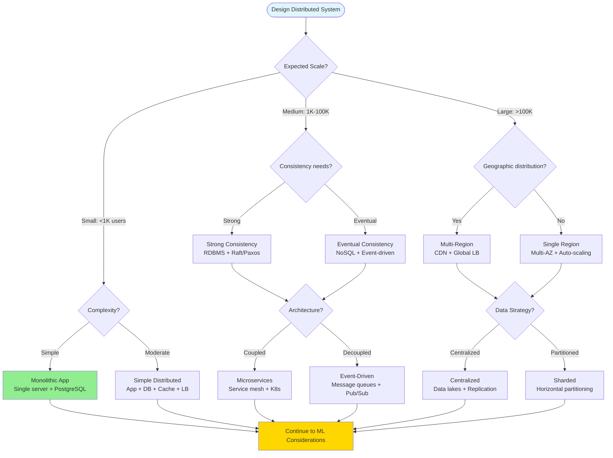
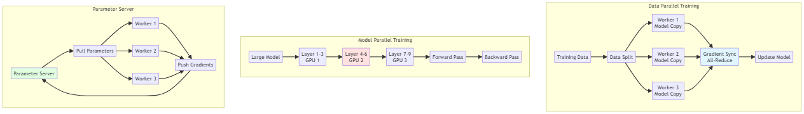
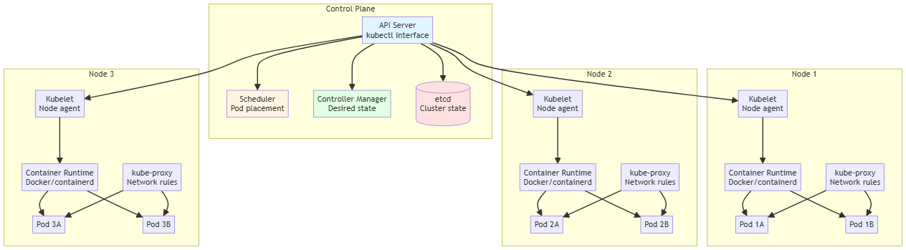

# Distributed Systems

[← Back to Main](../README.md)

## Overview

Distributed Systems are collections of independent computers that appear to users as a single coherent system. They enable scalability, fault tolerance, and geographic distribution of computational resources. In the context of AI and algorithms, distributed systems are crucial for training large models, processing massive datasets, and serving predictions at scale.

## System Design Decision Flowchart

Designing a distributed system requires making key architectural decisions based on scale, consistency needs, and workload type. Use these flowcharts to guide your design:

### Part 1: Scale and Architecture Selection

```mermaid
graph TD
    Start([Design Distributed System]) --> Scale{Expected Scale?}
    
    Scale -->|Small: <1K users| SmallQ{Complexity?}
    Scale -->|Medium: 1K-100K| MediumQ{Consistency needs?}
    Scale -->|Large: >100K| LargeQ{Geographic distribution?}
    
    SmallQ -->|Simple| Monolith[Monolithic App<br/>Single server + PostgreSQL]
    SmallQ -->|Moderate| SimpleDistrib[Simple Distributed<br/>App + DB + Cache + LB]
    
    MediumQ -->|Strong| StrongConsist[Strong Consistency<br/>RDBMS + Raft/Paxos]
    MediumQ -->|Eventual| EventualConsist[Eventual Consistency<br/>NoSQL + Event-driven]
    
    StrongConsist --> MedArch{Architecture?}
    EventualConsist --> MedArch
    
    MedArch -->|Coupled| Microservices[Microservices<br/>Service mesh + K8s]
    MedArch -->|Decoupled| EventDriven[Event-Driven<br/>Message queues + Pub/Sub]
    
    LargeQ -->|Yes| MultiRegion[Multi-Region<br/>CDN + Global LB]
    LargeQ -->|No| SingleRegion[Single Region<br/>Multi-AZ + Auto-scaling]
    
    MultiRegion --> DataStrategy{Data Strategy?}
    SingleRegion --> DataStrategy
    
    DataStrategy -->|Centralized| CentralData[Centralized<br/>Data lakes + Replication]
    DataStrategy -->|Partitioned| ShardedData[Sharded<br/>Horizontal partitioning]
    
    Monolith --> Next[Continue to ML Considerations]
    SimpleDistrib --> Next
    Microservices --> Next
    EventDriven --> Next
    CentralData --> Next
    ShardedData --> Next
    
    style Start fill:#e1f5ff
    style Monolith fill:#90EE90
    style Next fill:#FFD700
```

### Part 2: ML Workloads and Reliability

```mermaid
graph TD
    Start([From Architecture Selection]) --> MLQ{ML Workload?}
    
    MLQ -->|Training| TrainingArch{Training Type?}
    MLQ -->|Inference| InferenceArch{Latency Requirements?}
    MLQ -->|None| Monitor[Implement Monitoring]
    
    TrainingArch -->|Small models| SingleGPU[Single GPU<br/>Local training]
    TrainingArch -->|Large models| DistribTrain[Distributed Training<br/>Data/Model parallelism]
    
    InferenceArch -->|Low latency| EdgeInfer[Edge Deployment<br/>Model optimization]
    InferenceArch -->|High throughput| CloudInfer[Cloud Inference<br/>Batch + Auto-scaling]
    
    SingleGPU --> Monitor
    DistribTrain --> Monitor
    EdgeInfer --> Monitor
    CloudInfer --> Monitor
    
    Monitor --> Observability[Set Up Observability]
    Observability --> Metrics[Metrics: Prometheus]
    Observability --> Logs[Logs: ELK Stack]
    Observability --> Traces[Traces: Jaeger]
    
    Metrics --> Alerts[Configure Alerts]
    Logs --> Alerts
    Traces --> Alerts
    
    Alerts --> Reliability{Add Reliability?}
    
    Reliability -->|Yes| RelPatterns[Advanced Patterns<br/>Circuit breakers<br/>Chaos engineering]
    Reliability -->|Basic| BasicRel[Basic Reliability<br/>Health checks<br/>Timeouts]
    
    RelPatterns --> Deploy[Deploy & Iterate]
    BasicRel --> Deploy
    
    style Start fill:#e1f5ff
    style Deploy fill:#90EE90
    style RelPatterns fill:#FFD700
```

**Decision Factors**:
- **Scale**: Small (<1K users), Medium (1K-100K), Large (>100K)
- **Consistency**: Strong consistency vs Eventual consistency
- **Geography**: Single region vs Multi-region
- **Workload**: General applications vs ML-specific (training/inference)

The flowchart guides you from initial requirements through architecture selection, monitoring setup, and reliability patterns.

## Core Concepts

### Fundamental Principles

| Principle | Description | Key Challenge | Tradeoff |
|-----------|-------------|---------------|----------|
| **[Scalability](pages/scalability.md)** | Horizontal and vertical scaling | Resource coordination | Cost vs performance |
| **[Fault Tolerance](pages/fault-tolerance.md)** | Handling failures gracefully | Detecting and recovering | Complexity vs reliability |
| **[Consistency](pages/consistency.md)** | Data consistency models | Synchronization overhead | Strong vs eventual |
| **[Availability](pages/availability.md)** | System uptime and reliability | Redundancy management | Cost vs uptime |
| **[Partition Tolerance](pages/partition-tolerance.md)** | Operating despite network splits | Split-brain scenarios | CAP theorem limits |
| **[CAP Theorem](pages/cap-theorem.md)** | C-A-P tradeoffs | Cannot have all three | Choose 2 of 3 |

### System Properties

| Property | Description | Implementation | Complexity |
|----------|-------------|----------------|------------|
| **[Transparency](pages/transparency.md)** | Hiding distribution complexity | Abstraction layers, middleware | Medium |
| **[Concurrency](pages/concurrency.md)** | Simultaneous operations | Locks, transactions, coordination | High |
| **[Replication](pages/replication.md)** | Data redundancy | Master-slave, multi-master | Medium |
| **[Load Balancing](pages/load-balancing.md)** | Distributing workload | Round-robin, least-conn, consistent hashing | Medium |
| **[Latency](pages/latency.md)** | Communication delays | Caching, CDNs, edge computing | Low-Medium |

## Distributed Computing Models

### Parallel Processing

| Pattern | Description | Use Case | Efficiency |
|---------|-------------|----------|------------|
| **[Data Parallelism](pages/data-parallelism.md)** | Same operation on different data | Training with large datasets | High |
| **[Model Parallelism](pages/model-parallelism.md)** | Different model parts on different devices | Large models (GPT, BERT) | Medium |
| **[Pipeline Parallelism](pages/pipeline-parallelism.md)** | Sequential stage processing | Deep networks, ETL pipelines | Medium-High |
| **[Task Parallelism](pages/task-parallelism.md)** | Different operations simultaneously | Heterogeneous workloads | Varies |

### Communication Patterns

| Pattern | Direction | Complexity | Best For |
|---------|-----------|------------|----------|
| **[Point-to-Point](pages/point-to-point.md)** | One-to-one | O(1) | Direct messaging |
| **[Broadcast](pages/broadcast.md)** | One-to-all | O(n) | Parameter updates |
| **[Reduce](pages/reduce.md)** | All-to-one | O(log n) | Gradient aggregation |
| **[All-Reduce](pages/all-reduce.md)** | All-to-all | O(log n) | Distributed training |
| **[Scatter/Gather](pages/scatter-gather.md)** | Distribution + collection | O(n) | MapReduce operations |

## Distributed Data Processing

### Big Data Frameworks

- **[MapReduce](pages/mapreduce.md)** - Distributed data processing paradigm
- **[Apache Hadoop](pages/hadoop.md)** - Distributed storage and processing
- **[Apache Spark](pages/spark.md)** - Fast in-memory processing
- **[Apache Flink](pages/flink.md)** - Stream processing
- **[Dask](pages/dask.md)** - Parallel computing in Python

### Data Storage

- **[HDFS](pages/hdfs.md)** - Hadoop Distributed File System
- **[Object Storage](pages/object-storage.md)** - S3, Azure Blob, GCS
- **[Distributed Databases](pages/distributed-databases.md)** - Cassandra, MongoDB
- **[Data Lakes](pages/data-lakes.md)** - Centralized repositories
- **[Data Warehouses](pages/data-warehouses.md)** - Analytical databases

### Stream Processing

- **[Apache Kafka](pages/kafka.md)** - Distributed event streaming
- **[Apache Pulsar](pages/pulsar.md)** - Cloud-native messaging
- **[RabbitMQ](pages/rabbitmq.md)** - Message broker
- **[Redis Streams](pages/redis-streams.md)** - In-memory streaming

## Distributed Machine Learning

### Training Strategies

- **[Data Parallel Training](pages/data-parallel-training.md)** - Replicate model, split data
- **[Model Parallel Training](pages/model-parallel-training.md)** - Split model across devices
- **[Hybrid Parallelism](pages/hybrid-parallelism.md)** - Combining strategies
- **[Federated Learning](pages/federated-learning.md)** - Training on decentralized data

### Synchronization Methods

- **[Synchronous SGD](pages/synchronous-sgd.md)** - Wait for all workers
- **[Asynchronous SGD](pages/asynchronous-sgd.md)** - Independent worker updates
- **[Parameter Server](pages/parameter-server.md)** - Centralized parameter management
- **[Ring All-Reduce](pages/ring-all-reduce.md)** - Efficient gradient aggregation
- **[Horovod](pages/horovod.md)** - Distributed deep learning framework

### Distributed Training Frameworks

- **[PyTorch Distributed](pages/pytorch-distributed.md)** - PyTorch's distributed package
- **[TensorFlow Distributed](pages/tensorflow-distributed.md)** - TF distribution strategies
- **[DeepSpeed](pages/deepspeed.md)** - Microsoft's training optimization
- **[Ray](pages/ray.md)** - Distributed computing framework
- **[Mesh TensorFlow](pages/mesh-tensorflow.md)** - Model parallelism

## Consensus and Coordination

### Consensus Algorithms

| Algorithm | Complexity | Fault Tolerance | Use Case | Best For |
|-----------|------------|-----------------|----------|----------|
| **[Paxos](pages/paxos.md)** | High | Crash faults | Distributed consensus | Theoretical foundation |
| **[Raft](pages/raft.md)** | Medium | Crash faults | Leader election, log replication | Practical implementation |
| **[Byzantine Fault Tolerance](pages/bft.md)** | Very High | Malicious nodes | Blockchain, critical systems | Untrusted environments |
| **[Gossip Protocols](pages/gossip-protocols.md)** | Low | High | Membership, dissemination | Large-scale systems |

### Coordination Services

| Service | Type | Consistency | Use Case | Best For |
|---------|------|-------------|----------|----------|
| **[Apache ZooKeeper](pages/zookeeper.md)** | Coordination | Strong | Configuration, synchronization | Hadoop ecosystem |
| **[etcd](pages/etcd.md)** | Key-value store | Strong | Kubernetes, service discovery | Cloud-native apps |
| **[Consul](pages/consul.md)** | Service mesh | Strong | Service discovery, health checks | Microservices |

### Distributed Locking

| Mechanism | Granularity | Performance | Use Case | Best For |
|-----------|-------------|-------------|----------|----------|
| **[Distributed Locks](pages/distributed-locks.md)** | Resource-level | Medium | Mutual exclusion | Critical sections |
| **[Leader Election](pages/leader-election.md)** | System-level | Low | Coordinator selection | Single-master systems |
| **[Distributed Transactions](pages/distributed-transactions.md)** | Multi-resource | Low | ACID guarantees | Financial systems |

## Container Orchestration

### Kubernetes

- **[Kubernetes Basics](pages/kubernetes-basics.md)** - Pods, services, deployments
- **[Kubernetes Networking](pages/k8s-networking.md)** - Service discovery, ingress
- **[Kubernetes Storage](pages/k8s-storage.md)** - Persistent volumes
- **[Kubernetes Scaling](pages/k8s-scaling.md)** - HPA, VPA, cluster autoscaling
- **[Kubernetes Operators](pages/k8s-operators.md)** - Custom resource management

### ML on Kubernetes

- **[Kubeflow](pages/kubeflow.md)** - ML toolkit for Kubernetes
- **[KServe](pages/kserve.md)** - Model serving on Kubernetes
- **[Seldon Core](pages/seldon-core.md)** - ML deployment platform
- **[MLflow on K8s](pages/mlflow-k8s.md)** - Experiment tracking

## Cloud Computing

### Cloud Platforms

| Platform | Strengths | ML Services | Best For | Market Share |
|----------|-----------|-------------|----------|--------------|
| **[AWS](pages/aws.md)** | Mature, comprehensive | SageMaker, Bedrock | Enterprise, variety | ~32% |
| **[Google Cloud](pages/gcp.md)** | AI/ML, BigQuery | Vertex AI, TPUs | Data analytics, ML | ~10% |
| **[Azure](pages/azure.md)** | Enterprise integration | Azure ML, OpenAI | Microsoft ecosystem | ~23% |
| **[Multi-Cloud](pages/multi-cloud.md)** | Vendor independence | Varies | Avoid lock-in | Growing |

### Cloud Services

| Service Type | AWS | Google Cloud | Azure | Use Case |
|--------------|-----|--------------|-------|----------|
| **[Compute](pages/cloud-compute.md)** | EC2 | Compute Engine | Virtual Machines | General workloads |
| **[Storage](pages/cloud-storage.md)** | S3 | Cloud Storage | Blob Storage | Object storage |
| **[Database](pages/cloud-databases.md)** | RDS, DynamoDB | Cloud SQL, Firestore | SQL Database, Cosmos DB | Data persistence |
| **[Serverless](pages/serverless.md)** | Lambda | Cloud Functions | Azure Functions | Event-driven |

## Performance and Optimization

### Performance Metrics

| Metric | Measurement | Target | Impact | Monitoring |
|--------|-------------|--------|--------|------------|
| **[Throughput](pages/throughput.md)** | Ops/second | High | Capacity | Rate counters |
| **[Latency](pages/latency-metrics.md)** | Response time | Low (p50, p95, p99) | User experience | Histograms |
| **[Bandwidth](pages/bandwidth.md)** | Data transfer rate | High | Network efficiency | Traffic monitoring |
| **[Resource Utilization](pages/resource-utilization.md)** | CPU, memory, network | 60-80% | Cost efficiency | System metrics |

### Optimization Techniques

| Technique | Approach | Benefit | Trade-off | Best For |
|-----------|----------|---------|-----------|----------|
| **[Caching](pages/caching.md)** | Store frequently accessed data | Reduced latency | Stale data risk | Read-heavy workloads |
| **[Load Balancing](pages/load-balancing-techniques.md)** | Distribute requests | Even utilization | Complexity | High traffic |
| **[Sharding](pages/sharding.md)** | Partition data | Horizontal scaling | Query complexity | Large datasets |
| **[Compression](pages/compression.md)** | Reduce data size | Lower bandwidth | CPU overhead | Network-bound |
| **[Batching](pages/batching.md)** | Group operations | Higher throughput | Increased latency | Bulk processing |

### Network Optimization

| Technique | Approach | Benefit | Use Case | Complexity |
|-----------|----------|---------|----------|------------|
| **[Network Topology](pages/network-topology.md)** | Optimize layout | Reduced hops | Data center design | High |
| **[Bandwidth Optimization](pages/bandwidth-optimization.md)** | Compression, aggregation | Lower costs | WAN traffic | Medium |
| **[Latency Reduction](pages/latency-reduction.md)** | Proximity, caching | Faster response | Real-time apps | Medium |
| **[RDMA](pages/rdma.md)** | Direct memory access | Ultra-low latency | HPC, ML training | High |

## Fault Tolerance and Reliability

### Failure Handling

| Mechanism | Detection Time | Recovery Time | Overhead | Best For |
|-----------|----------------|---------------|----------|----------|
| **[Failure Detection](pages/failure-detection.md)** | Seconds | N/A | Low | Monitoring |
| **[Failure Recovery](pages/failure-recovery.md)** | N/A | Minutes | Medium | Stateful services |
| **[Redundancy](pages/redundancy.md)** | Instant | Instant | High | Critical systems |
| **[Circuit Breakers](pages/circuit-breakers.md)** | Milliseconds | Automatic | Low | Microservices |

### High Availability

| Strategy | Availability | Complexity | Cost | RPO/RTO |
|----------|--------------|------------|------|---------|
| **[Replication Strategies](pages/replication-strategies.md)** | 99.9-99.99% | Medium | Medium | Minutes |
| **[Failover](pages/failover.md)** | 99.95%+ | Medium | Medium | Seconds-Minutes |
| **[Disaster Recovery](pages/disaster-recovery.md)** | 99.9%+ | High | High | Hours |
| **[Chaos Engineering](pages/chaos-engineering.md)** | Testing only | High | Low | N/A |

## Monitoring and Observability

### Monitoring Tools

| Tool | Type | Strengths | Deployment | Cost |
|------|------|-----------|------------|------|
| **[Prometheus](pages/prometheus.md)** | Metrics | Time-series, pull-based | Self-hosted | Free |
| **[Grafana](pages/grafana.md)** | Visualization | Dashboards, multi-source | Self-hosted/Cloud | Free/Paid |
| **[ELK Stack](pages/elk-stack.md)** | Logging | Full-text search, analytics | Self-hosted | Free/Paid |
| **[Jaeger](pages/jaeger.md)** | Tracing | Distributed tracing | Self-hosted/Cloud | Free |
| **[DataDog](pages/datadog.md)** | All-in-one | Comprehensive, easy setup | SaaS | Paid |

### Observability Practices

| Practice | Purpose | Data Type | Retention | Query Pattern |
|----------|---------|-----------|-----------|---------------|
| **[Metrics](pages/metrics.md)** | Performance monitoring | Time-series | Long-term | Aggregations |
| **[Logging](pages/logging.md)** | Event tracking | Text/JSON | Medium-term | Search/filter |
| **[Tracing](pages/tracing.md)** | Request flow | Spans | Short-term | Trace lookup |
| **[Alerting](pages/alerting-distributed.md)** | Issue notification | Derived | N/A | Threshold-based |

## Security in Distributed Systems

### Security Concerns

| Concern | Mechanism | Scope | Complexity | Critical For |
|---------|-----------|-------|------------|--------------|
| **[Authentication](pages/authentication.md)** | Identity verification | User/service | Medium | Access control |
| **[Authorization](pages/authorization.md)** | Permission checking | Resource | Medium | Data protection |
| **[Encryption](pages/encryption.md)** | Data protection | Transit + rest | High | Confidentiality |
| **[Network Security](pages/network-security.md)** | Firewalls, VPNs | Network layer | High | Infrastructure |
| **[Zero Trust](pages/zero-trust.md)** | Continuous verification | All layers | Very High | Modern security |

### Security Practices

| Practice | Tools | Purpose | Complexity | Compliance |
|----------|-------|---------|------------|------------|
| **[Secrets Management](pages/secrets-management.md)** | Vault, AWS Secrets Manager | Credential storage | Medium | Required |
| **[Certificate Management](pages/certificate-management.md)** | Let's Encrypt, ACM | TLS/SSL | Medium | Required |
| **[API Security](pages/api-security.md)** | Rate limiting, OAuth | API protection | Medium | Recommended |
| **[Compliance](pages/compliance-distributed.md)** | Audit tools | Regulatory adherence | High | Industry-specific |

## Distributed AI Applications

### Model Serving

| Strategy | Approach | Risk | Rollback | Best For |
|----------|----------|------|----------|----------|
| **[Model Deployment](pages/model-deployment-distributed.md)** | Distributed inference | Medium | Manual | Production serving |
| **[A/B Testing](pages/ab-testing-distributed.md)** | Compare variants | Low | Easy | Model comparison |
| **[Canary Deployments](pages/canary-deployments.md)** | Gradual rollout | Low | Automatic | Safe deployment |
| **[Multi-Model Serving](pages/multi-model-serving.md)** | Multiple models | Medium | Complex | Ensemble/routing |

### Real-Time AI

| Approach | Latency | Throughput | Complexity | Use Case |
|----------|---------|------------|------------|----------|
| **[Online Learning](pages/online-learning.md)** | Low | Medium | High | Adaptive models |
| **[Stream Processing ML](pages/stream-ml.md)** | Very Low | High | Medium | Real-time predictions |
| **[Edge Computing](pages/edge-computing.md)** | Ultra Low | Low | High | IoT, mobile |
| **[Hybrid Cloud-Edge](pages/hybrid-cloud-edge.md)** | Low | High | Very High | Distributed intelligence |

## Design Patterns

### Architectural Patterns

| Pattern | Coupling | Scalability | Complexity | Best For |
|---------|----------|-------------|------------|----------|
| **[Microservices](pages/microservices.md)** | Loose | High | High | Large teams, independent services |
| **[Service Mesh](pages/service-mesh.md)** | Loose | High | Very High | Microservices communication |
| **[Event-Driven Architecture](pages/event-driven.md)** | Very Loose | Very High | Medium | Asynchronous workflows |
| **[CQRS](pages/cqrs.md)** | Medium | High | High | Read/write optimization |
| **[Saga Pattern](pages/saga-pattern.md)** | Medium | Medium | High | Distributed transactions |

### Communication Patterns

| Pattern | Synchronous | Coupling | Latency | Best For |
|---------|-------------|----------|---------|----------|
| **[Request-Response](pages/request-response.md)** | Yes | Tight | Low | Direct queries |
| **[Publish-Subscribe](pages/pub-sub.md)** | No | Loose | Medium | Event broadcasting |
| **[Message Queue](pages/message-queue.md)** | No | Loose | Medium | Buffered processing |
| **[RPC](pages/rpc.md)** | Yes | Medium | Low | Service calls |

## Challenges and Solutions

### Common Challenges

| Challenge | Impact | Difficulty | Mitigation Strategy |
|-----------|--------|------------|---------------------|
| **Network Partitions** | High | Very High | Consensus algorithms, partition tolerance |
| **Clock Synchronization** | Medium | High | NTP, logical clocks, vector clocks |
| **Data Consistency** | High | High | Eventual consistency, CQRS, conflict resolution |
| **Debugging Complexity** | Medium | Very High | Distributed tracing, centralized logging |
| **Cost Management** | High | Medium | Auto-scaling, resource optimization, monitoring |

### Best Practices

| Practice | Priority | Complexity | Impact | Implementation |
|----------|----------|------------|--------|----------------|
| **Design for Failure** | Critical | Medium | Very High | Circuit breakers, retries, fallbacks |
| **Idempotency** | High | Low | High | Unique request IDs, state checks |
| **Loose Coupling** | High | Medium | High | APIs, message queues, events |
| **Monitoring First** | Critical | Medium | Very High | Metrics, logs, traces, alerts |
| **Gradual Rollouts** | High | Medium | High | Canary, blue-green, feature flags |

## Related Topics

- [Machine Learning](../machine-learning/README.md) - ML algorithms
- [Deep Learning](../deep-learning/README.md) - Neural networks
- [MLOps](../mlops/README.md) - ML operations
- [Data Science](../data-science/README.md) - Data analysis
- [Quantum Computing](../quantum-computing/README.md) - Quantum parallelism

---

*Distributed Systems enable the scale and reliability required for modern AI applications, from training massive models to serving billions of predictions.*