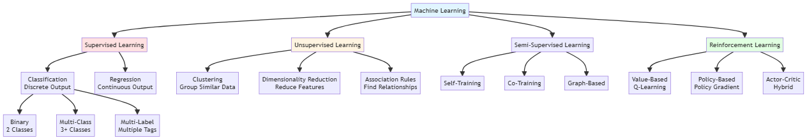

# Machine Learning

[← Back to Main](../README.md)

## Overview

Machine Learning encompasses classical algorithms that learn patterns from data without explicit programming. This section focuses on traditional ML models - the foundational algorithms that preceded deep learning and remain highly effective for many tasks, especially with structured/tabular data.

## Classical ML Models

### Algorithm Selection Guide

Choosing the right machine learning algorithm depends on your problem type, data size, and requirements. Use this interactive decision flowchart:

This flowchart guides you through:
- **Classification tasks**: From Naive Bayes (small data) to XGBoost (large data)
- **Regression tasks**: From Linear Regression to advanced ensemble methods
- **Clustering**: K-Means for spherical clusters, DBSCAN for arbitrary shapes
- **Dimensionality Reduction**: PCA for preprocessing, t-SNE/UMAP for visualization

**Color coding**:
- 🟢 Green: Simple, fast methods (good starting points)
- 🟡 Yellow: Advanced methods (better performance, more complex)

For additional guidance, see the [Scikit-learn Algorithm Cheat-Sheet](https://scikit-learn.org/stable/_static/ml_map.png) from the [official documentation](https://scikit-learn.org/stable/tutorial/machine_learning_map/index.html).

### Linear Models

**Core Concept**: Model relationships as linear combinations of features

| Model | Task | Regularization | Interpretability | Speed | Best For |
|-------|------|----------------|------------------|-------|----------|
| **[Linear Regression](pages/linear-regression.md)** | Regression | None (OLS) | High | Very Fast | Baseline, linear relationships |
| **[Ridge](pages/ridge-regression.md)** | Regression | L2 (shrinkage) | High | Very Fast | Multicollinearity, many features |
| **[Lasso](pages/lasso-regression.md)** | Regression | L1 (sparsity) | High | Fast | Feature selection, sparse models |
| **[Elastic Net](pages/elastic-net.md)** | Regression | L1 + L2 | High | Fast | Grouped features, balance |
| **[Logistic Regression](pages/logistic-regression.md)** | Classification | Optional L1/L2 | High | Very Fast | Binary/multi-class, baseline |
| **[Linear SVM](pages/linear-svm.md)** | Classification | L2 (margin) | Medium | Fast | Large datasets, linear separation |
| **[Kernel SVM](pages/kernel-svm.md)** | Classification | L2 (margin) | Low | Slow | Non-linear, small-medium data |
| **[SVR](pages/svr.md)** | Regression | Epsilon-insensitive | Medium | Medium | Non-linear regression |

**SVM Kernel Trick - Visual Explanation**:

*The Kernel Trick: Data that is not linearly separable in the original space (left) can be transformed to a higher-dimensional space where it becomes linearly separable (right). The polynomial kernel implicitly performs this transformation without explicitly computing the high-dimensional coordinates, making it computationally efficient.*
*Image source: [SVM with Polynomial Kernel Visualization](https://makeagif.com/gif/svm-with-polynomial-kernel-visualization-kL5RYf)*

**Regularization Comparison**:
- **L1 (Lasso)**: Sparse solutions, feature selection, some coefficients → 0
- **L2 (Ridge)**: Shrinks all coefficients, handles multicollinearity, no feature selection
- **Elastic Net**: Combines L1 + L2, best of both worlds

### Distance-Based Models

**Core Concept**: Predictions based on similarity/distance metrics

- **[K-Nearest Neighbors (KNN)](pages/knn.md)** - Instance-based learning
  - Classification (majority vote)
  - Regression (average)
  - Distance metrics (Euclidean, Manhattan, Minkowski)
  - Weighted KNN

- **[K-Means Clustering](pages/k-means.md)** - Centroid-based clustering
  - Standard K-means
  - K-means++
  - Mini-batch K-means
  - Elbow method for K selection

- **[KD-Tree](pages/kd-tree.md)** - Space-partitioning data structure

*KD-Tree (K-Dimensional Tree) construction: Recursively partitions space by alternating between dimensions. Each node represents a splitting hyperplane, creating a binary tree structure that enables efficient nearest neighbor search in O(log n) average time.*
*Image source: [Wikimedia Commons - KD-Tree Animation](https://commons.wikimedia.org/wiki/File:Kdtree_animation.gif)*

**Key Features**:
  - Efficient nearest neighbor search (O(log n) average)
  - Range queries for spatial data
  - Recursive construction by alternating dimensions
  - Ball trees as alternative for high dimensions

### Tree-Based Models

**Core Concept**: Hierarchical decision rules

| Model | Type | Ensemble | Speed | Overfitting Risk | Handles Categorical | Best For |
|-------|------|----------|-------|-----------------|---------------------|----------|
| **[Decision Tree](pages/decision-trees.md)** | Single | No | Fast | High | Yes | Interpretability, baseline |
| **[Random Forest](pages/random-forests.md)** | Bagging | Yes (parallel) | Medium | Low | Yes | General purpose, robust |
| **[XGBoost](pages/xgboost.md)** | Boosting | Yes (sequential) | Fast | Medium | With encoding | Competitions, performance |
| **[LightGBM](pages/lightgbm.md)** | Boosting | Yes (sequential) | Very Fast | Medium | With encoding | Large datasets, speed |
| **[CatBoost](pages/catboost.md)** | Boosting | Yes (sequential) | Medium | Low | Native support | Categorical features |
| **[AdaBoost](pages/adaboost.md)** | Boosting | Yes (sequential) | Medium | Medium | Yes | Weak learners, simple |

**Gradient Boosting Comparison**:

| Feature | XGBoost | LightGBM | CatBoost |
|---------|---------|----------|----------|
| **Speed** | Fast | Fastest | Medium |
| **Memory** | Medium | Low | Medium |
| **Categorical** | Manual encoding | Manual encoding | Native |
| **Overfitting** | Moderate | Higher risk | Lower risk |
| **GPU Support** | Yes | Yes | Yes |
| **Best For** | Balanced performance | Large data, speed | Categorical data |
| **Hyperparameters** | Many | Many | Fewer (auto-tuned) |

### Probabilistic Models

**Core Concept**: Modeling probability distributions

- **[Naive Bayes](pages/naive-bayes.md)** - Probabilistic classifier
  - Gaussian Naive Bayes
  - Multinomial Naive Bayes
  - Bernoulli Naive Bayes
  - Feature independence assumption

- **[Gaussian Mixture Models (GMM)](pages/gmm.md)** - Soft clustering
  - Expectation-Maximization (EM) algorithm
  - Covariance types (full, tied, diagonal, spherical)
  - Model selection (BIC, AIC)

- **[Hidden Markov Models (HMM)](pages/hmm.md)** - Sequential probabilistic models
  - Forward-backward algorithm
  - Viterbi algorithm
  - Baum-Welch training

### Clustering Models

**Core Concept**: Grouping similar data points without labels

#### Clustering Paradigms

There are two main approaches to clustering, each with different strengths:

**Centroid-Based Clustering** (e.g., K-Means):
- Defines clusters by central points (centroids)
- Requires specifying number of clusters (K) in advance
- Fast and scalable to large datasets
- Works best with spherical, well-separated clusters
- Sensitive to outliers and initialization
- Examples: K-Means, K-Medoids

**Density-Based Clustering** (e.g., DBSCAN):
- Defines clusters as dense regions separated by sparse areas
- Automatically determines number of clusters
- Can find arbitrarily shaped clusters
- Robust to outliers (marks them as noise)
- Struggles with varying density clusters
- Examples: DBSCAN, HDBSCAN, OPTICS

**Visual Comparison**:

Understanding how K-Means works helps explain its strengths and limitations:

*K-Means iterative process: (1) Initialize centroids, (2) Assign points to nearest centroid, (3) Update centroids, (4) Repeat until convergence*
*Image source: [Kernel K-Means and Cluster Evaluation](https://sandipanweb.wordpress.com/2016/08/29/kernel-k-means-and-cluster-evaluation/)*

Understanding how DBSCAN works - it uses two key parameters:

*DBSCAN parameters: **ε (epsilon)** = radius to search for neighbors, **MinPts** = minimum points to form a dense region. Points are classified as: Core points (≥MinPts neighbors), Border points (in ε-neighborhood of core), Noise points (neither core nor border)*
*Image source: [Understanding DBSCAN: A Practical Guide](https://medium.com/@jdseo/understanding-dbscan-a-practical-guide-for-beginners-with-business-applications-9458792d1df8)*

The key difference between centroid-based and density-based clustering is illustrated when clustering non-spherical data:
- **K-Means** (left): Splits the circular pattern incorrectly because it assumes spherical clusters
- **DBSCAN** (right): Correctly identifies the circular pattern as a single cluster based on density

*Image source: [Clustering Like a Pro: DBSCAN Guide](https://medium.com/@sachinsoni600517/clustering-like-a-pro-a-beginners-guide-to-dbscan-6c8274c362c4)*

**When to Choose**:
- Use **K-Means** when: clusters are roughly spherical, you know K, speed is critical, data is large
- Use **DBSCAN** when: clusters have arbitrary shapes, K is unknown, outliers present, varying densities

| Model | Shape Flexibility | Needs K | Handles Noise | Speed | Scalability | Best For |
|-------|------------------|---------|---------------|-------|-------------|----------|
| **[K-Means](pages/k-means.md)** | Spherical only | Yes | No | Very Fast | Excellent | Large data, spherical clusters |
| **[Hierarchical](pages/hierarchical-clustering.md)** | Any | No | No | Slow | Poor | Small data, dendrogram |
| **[DBSCAN](pages/dbscan.md)** | Arbitrary | No | Yes | Medium | Good | Arbitrary shapes, noise |
| **[HDBSCAN](pages/hdbscan.md)** | Arbitrary | No | Yes | Medium | Good | Varying density, noise |
| **[Mean Shift](pages/mean-shift.md)** | Arbitrary | No | Partial | Slow | Poor | Mode finding, few clusters |
| **[Spectral](pages/spectral-clustering.md)** | Non-convex | Yes | No | Slow | Poor | Graph data, non-convex |
| **[GMM](pages/gmm.md)** | Elliptical | Yes | Partial | Medium | Good | Soft clustering, probabilistic |
| **[OPTICS](pages/optics.md)** | Arbitrary | No | Yes | Slow | Medium | Varying density |

**Linkage Methods** (Hierarchical):
- **Single**: Minimum distance between clusters (chaining effect)
- **Complete**: Maximum distance (compact clusters)
- **Average**: Mean distance (balanced)
- **Ward**: Minimizes within-cluster variance (most popular)

## Model Comparison

### Model Characteristics

| Model Family | Interpretability | Training Speed | Prediction Speed | Memory | Handles Non-linear | Handles Mixed Types | Robust to Outliers |
|--------------|-----------------|----------------|------------------|--------|-------------------|--------------------|--------------------|
| **Linear** | High | Fast | Fast | Low | No | With encoding | No |
| **Tree-based** | Medium | Medium-Slow | Fast | Medium | Yes | Yes | Yes |
| **Distance-based** | Low | None/Fast | Slow | High | Yes | With encoding | No |
| **Probabilistic** | High | Fast | Fast | Low | Limited | Yes | No |

### Model Selection by Dataset

| Dataset Size | Recommended Models | Avoid |
|--------------|-------------------|-------|
| **Small (<1K)** | Naive Bayes, KNN, Linear models, Decision Trees | Deep ensembles, complex models |
| **Medium (1K-100K)** | Random Forest, SVM, XGBoost, LightGBM | KNN (slow prediction) |
| **Large (>100K)** | LightGBM, XGBoost, Linear models, SGD | KNN, Standard SVM |

### Model Selection by Feature Type

| Feature Type | Best Models | Notes |
|--------------|-------------|-------|
| **Numerical only** | Any model | Consider scaling for distance/linear models |
| **Categorical heavy** | Tree-based (CatBoost), Naive Bayes | CatBoost handles categories natively |
| **Mixed** | Tree-based, Linear (with encoding) | Encode categoricals for linear models |
| **High-dimensional** | Linear (L1/L2), Random Forest | L1 for feature selection |
| **Sparse** | Linear models, Naive Bayes | Efficient with sparse matrices |

### Model Selection by Problem Type

| Problem | Top Choices | Fast Baseline | Interpretable Option |
|---------|-------------|---------------|---------------------|
| **Binary Classification** | XGBoost, LightGBM, SVM | Logistic Regression | Logistic Regression, Decision Tree |
| **Multi-class** | XGBoost, Random Forest | Naive Bayes | Decision Tree |
| **Regression** | XGBoost, LightGBM, Random Forest | Linear Regression | Linear Regression, Decision Tree |
| **Clustering** | K-means, DBSCAN | K-means | Hierarchical (with dendrogram) |
| **Anomaly Detection** | Isolation Forest, One-class SVM | Z-score | Isolation Forest |

### Performance Characteristics

| Model | Training | Prediction | Memory | Scales to Large Data |
|-------|----------|------------|--------|---------------------|
| **Naive Bayes** | Very Fast | Very Fast | Very Low | Yes |
| **Linear Models** | Fast | Very Fast | Very Low | Yes (SGD) |
| **Decision Tree** | Fast | Fast | Low | No |
| **KNN** | None | Very Slow | Very High | No |
| **SVM** | Slow | Medium | Medium | No (kernel) |
| **Random Forest** | Medium | Fast | Medium | Partial |
| **XGBoost** | Medium | Fast | Medium | Yes |
| **LightGBM** | Fast | Fast | Low | Yes |
| **CatBoost** | Slow | Fast | Medium | Yes |

## Hyperparameter Tuning

### Key Hyperparameters by Model

**Random Forest**
- `n_estimators`: Number of trees (100-1000)
- `max_depth`: Tree depth (None, 10-50)
- `min_samples_split`: Minimum samples to split (2-20)
- `max_features`: Features per split ('sqrt', 'log2', None)

**XGBoost/LightGBM**
- `learning_rate`: Step size (0.01-0.3)
- `n_estimators`: Number of boosting rounds (100-1000)
- `max_depth`: Tree depth (3-10)
- `subsample`: Row sampling (0.5-1.0)
- `colsample_bytree`: Column sampling (0.5-1.0)

**SVM**
- `C`: Regularization (0.1-100)
- `kernel`: Kernel type ('linear', 'rbf', 'poly')
- `gamma`: Kernel coefficient (0.001-1)

**KNN**
- `n_neighbors`: Number of neighbors (3-20)
- `weights`: Weighting scheme ('uniform', 'distance')
- `metric`: Distance metric ('euclidean', 'manhattan')

## Best Practices

### Model Development
1. Start with simple baselines (logistic regression, decision tree)
2. Try ensemble methods (Random Forest, XGBoost)
3. Tune hyperparameters systematically
4. Use cross-validation for robust evaluation
5. Consider model interpretability requirements

### Feature Engineering
- Handle missing values appropriately
- Scale features for distance-based models
- Encode categorical variables
- Create interaction features for linear models
- Use domain knowledge

### Avoiding Overfitting
- Use regularization (L1/L2)
- Limit model complexity (tree depth, number of features)
- Employ cross-validation
- Use ensemble methods
- Gather more training data

## Related Topics

- [Deep Learning](../deep-learning/README.md) - Neural network models
- [Data Science](../data-science/README.md) - Data preparation and analysis
- [MLOps](../mlops/README.md) - Model deployment and monitoring
- [Tabular Data](../modalities/tabular/README.md) - Techniques for structured data

---

*Classical ML models remain the workhorses for structured data problems, offering excellent performance, interpretability, and efficiency.*