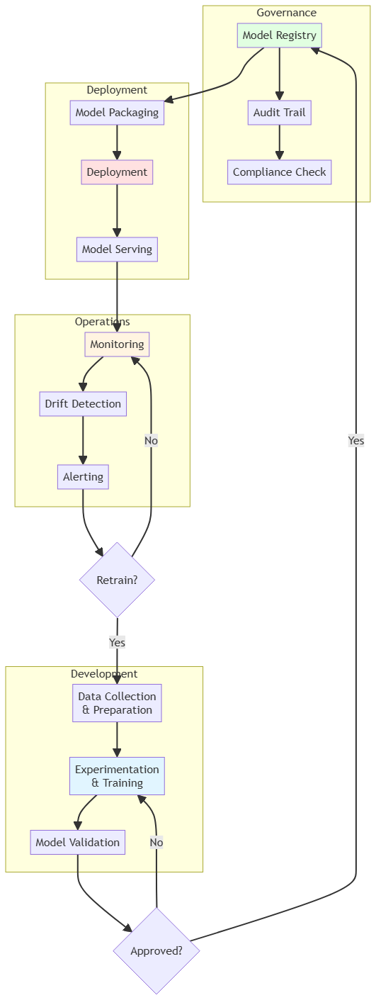
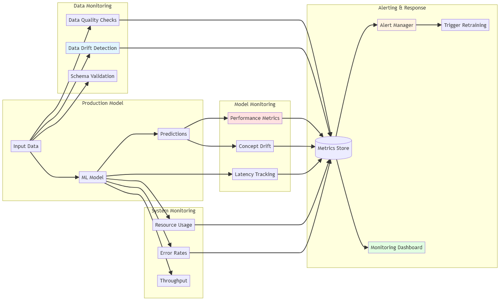
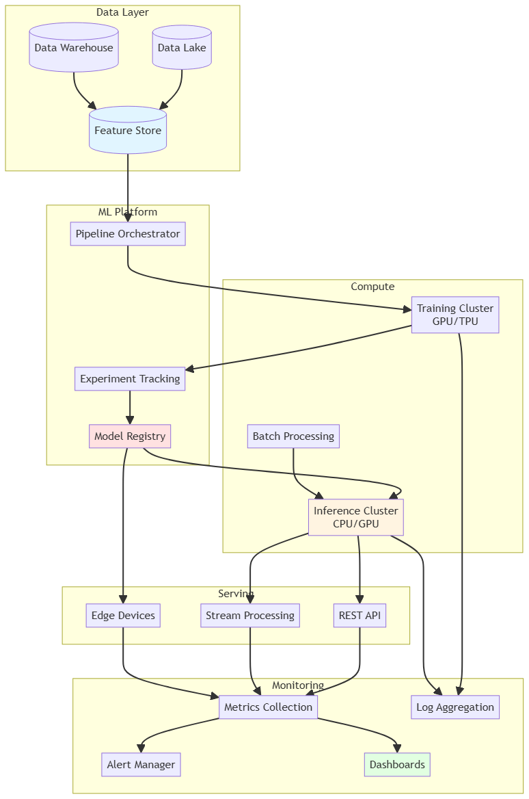

# MLOps

[← Back to Main](../README.md)

## Overview

MLOps (Machine Learning Operations) is the practice of deploying, monitoring, and maintaining machine learning models in production environments. It combines ML system development with operations, applying DevOps principles to ML workflows to ensure reliable, scalable, and reproducible ML systems.

## Core Principles

### Key Objectives

- **Automation** - Automate ML pipelines from data to deployment
- **Reproducibility** - Ensure consistent results across environments
- **Monitoring** - Track model and system performance
- **Scalability** - Handle growing data and traffic
- **Collaboration** - Enable team coordination
- **Governance** - Maintain compliance and auditability

## MLOps Lifecycle

### 1. Data Management

- **[Data Versioning](data-versioning.md)** - DVC, Git LFS, data lineage
- **[Data Quality](data-quality.md)** - Validation, profiling, monitoring
- **[Feature Stores](feature-stores.md)** - Centralized feature management
- **[Data Pipelines](data-pipelines.md)** - ETL/ELT workflows
- **[Data Governance](data-governance.md)** - Privacy, security, compliance

### 2. Model Development

- **[Experiment Tracking](experiment-tracking.md)** - MLflow, Weights & Biases
- **[Model Versioning](model-versioning.md)** - Model registry, lineage
- **[Hyperparameter Tuning](hyperparameter-tuning.md)** - Automated optimization
- **[Reproducible Environments](reproducible-environments.md)** - Docker, conda
- **[Collaborative Development](collaborative-dev.md)** - Code review, notebooks

### 3. Model Training

- **[Training Pipelines](training-pipelines.md)** - Automated training workflows
- **[Distributed Training](distributed-training.md)** - Multi-GPU, multi-node
- **[Resource Management](resource-management.md)** - GPU scheduling, cost optimization
- **[Training Monitoring](training-monitoring.md)** - Metrics, logs, alerts
- **[Model Validation](model-validation.md)** - Performance testing

### 4. Model Deployment

- **[Deployment Strategies](deployment-strategies.md)** - Blue-green, canary, A/B testing
- **[Model Serving](model-serving.md)** - REST APIs, gRPC, batch inference
- **[Containerization](containerization.md)** - Docker, Kubernetes
- **[Model Optimization](model-optimization.md)** - Quantization, pruning, distillation
- **[Edge Deployment](edge-deployment.md)** - Mobile, IoT devices

### 5. Monitoring and Maintenance

- **[Model Monitoring](model-monitoring.md)** - Performance metrics, drift detection
- **[Data Drift Detection](data-drift.md)** - Input distribution changes
- **[Concept Drift Detection](concept-drift.md)** - Target distribution changes
- **[Alerting](alerting.md)** - Automated notifications
- **[Model Retraining](model-retraining.md)** - Automated retraining triggers

### 6. Governance and Compliance

- **[Model Governance](model-governance.md)** - Policies, approval workflows
- **[Audit Trails](audit-trails.md)** - Tracking changes and decisions
- **[Explainability](explainability.md)** - Model interpretability
- **[Bias Detection](bias-detection.md)** - Fairness monitoring
- **[Regulatory Compliance](compliance.md)** - GDPR, CCPA, industry standards

## MLOps Architecture

### Infrastructure Components

#### Compute Resources

| Component | Purpose | Technologies | Scalability | Cost |
|-----------|---------|--------------|-------------|------|
| **Training Infrastructure** | Model training | GPUs, TPUs, distributed clusters | High | High |
| **Serving Infrastructure** | Model inference | CPU/GPU servers, serverless | Medium-High | Medium |
| **Storage** | Data persistence | Object storage, databases, data lakes | Very High | Low-Medium |
| **Orchestration** | Resource management | Kubernetes, cloud services | High | Medium |

#### ML Platform Components

| Component | Purpose | Popular Tools | Integration | Complexity |
|-----------|---------|---------------|-------------|------------|
| **Feature Store** | Feature management | Feast, Tecton, AWS Feature Store | Medium | Medium |
| **Model Registry** | Model versioning | MLflow, W&B, custom | High | Low |
| **Experiment Tracking** | Track experiments | MLflow, Neptune, Comet | High | Low |
| **Pipeline Orchestration** | Workflow automation | Airflow, Kubeflow, Prefect | High | Medium-High |
| **Monitoring** | System observability | Prometheus, Grafana, custom | High | Medium |

### CI/CD for ML

- **[Continuous Integration](ci-ml.md)** - Automated testing, validation
- **[Continuous Training](ct.md)** - Automated model retraining
- **[Continuous Deployment](cd-ml.md)** - Automated model deployment
- **[Testing Strategies](testing-ml.md)** - Unit, integration, model tests
- **[Pipeline Automation](pipeline-automation.md)** - End-to-end automation

## Tools and Technologies

### Experiment Tracking

- **MLflow** - Open-source platform for ML lifecycle
- **Weights & Biases** - Experiment tracking and visualization
- **Neptune.ai** - Metadata store for MLOps
- **Comet** - ML experiment management
- **TensorBoard** - TensorFlow visualization toolkit

### Model Serving

- **TensorFlow Serving** - Production ML serving system
- **TorchServe** - PyTorch model serving
- **Seldon Core** - Kubernetes-native ML deployment
- **KServe** - Serverless inference on Kubernetes
- **BentoML** - ML model serving framework
- **Ray Serve** - Scalable model serving

### Pipeline Orchestration

- **Kubeflow** - ML toolkit for Kubernetes
- **Apache Airflow** - Workflow orchestration
- **Prefect** - Modern workflow orchestration
- **Metaflow** - Human-centric ML framework
- **ZenML** - Extensible MLOps framework

### Feature Stores

- **Feast** - Open-source feature store
- **Tecton** - Enterprise feature platform
- **Hopsworks** - Data-intensive AI platform
- **AWS SageMaker Feature Store** - Managed feature store

### Model Monitoring

- **Evidently AI** - ML monitoring and testing
- **Arize AI** - ML observability platform
- **Fiddler** - ML model monitoring
- **WhyLabs** - Data and ML monitoring
- **Prometheus + Grafana** - Metrics and visualization

### Data Versioning

- **DVC** - Data Version Control
- **Pachyderm** - Data versioning and pipelines
- **LakeFS** - Git-like version control for data lakes
- **Delta Lake** - Storage layer with ACID transactions

## Best Practices

### Development Phase

1. **Version Everything**
   - Code (Git)
   - Data (DVC, LakeFS)
   - Models (MLflow, model registry)
   - Environments (Docker, conda)

2. **Automate Testing**
   - Unit tests for code
   - Data validation tests
   - Model performance tests
   - Integration tests

3. **Track Experiments**
   - Log all hyperparameters
   - Record metrics and artifacts
   - Document experiment context
   - Compare results systematically

### Deployment Phase

1. **Gradual Rollout**
   - Start with shadow mode
   - Use canary deployments
   - Implement A/B testing
   - Monitor closely

2. **Model Packaging**
   - Containerize models
   - Include preprocessing
   - Document dependencies
   - Version artifacts

3. **Performance Optimization**
   - Profile inference latency
   - Optimize batch sizes
   - Use model compression
   - Cache predictions when appropriate

### Production Phase

1. **Comprehensive Monitoring**
   - Model performance metrics
   - System health metrics
   - Data quality checks
   - Business metrics

2. **Alerting Strategy**
   - Define thresholds
   - Set up escalation paths
   - Automate responses
   - Document runbooks

3. **Continuous Improvement**
   - Regular model retraining
   - Feature engineering iteration
   - Architecture updates
   - Performance optimization

## Common Challenges

### Technical Challenges

- **[Model Drift](model-drift.md)** - Performance degradation over time
- **[Scalability](scalability.md)** - Handling increased load
- **[Latency](latency.md)** - Meeting response time requirements
- **[Resource Costs](cost-optimization.md)** - Managing infrastructure expenses
- **[Debugging](debugging-production.md)** - Troubleshooting production issues

### Organizational Challenges

- **[Team Collaboration](team-collaboration.md)** - Data scientists and engineers
- **[Skill Gaps](skill-gaps.md)** - MLOps expertise requirements
- **[Tool Proliferation](tool-management.md)** - Managing multiple tools
- **[Change Management](change-management.md)** - Adopting MLOps practices
- **[Governance](governance-challenges.md)** - Balancing speed and control

## MLOps Maturity Model

### Level 0: Manual Process
- Manual model training
- Manual deployment
- No automation
- Limited monitoring

### Level 1: ML Pipeline Automation
- Automated training pipeline
- Experiment tracking
- Model registry
- Basic monitoring

### Level 2: CI/CD Pipeline Automation
- Automated testing
- Continuous training
- Automated deployment
- Comprehensive monitoring

### Level 3: Full MLOps Automation
- Automated feature engineering
- Automated model selection
- Self-healing systems
- Advanced governance

## Cloud Platforms

### AWS
- **SageMaker** - End-to-end ML platform
- **Lambda** - Serverless inference
- **ECS/EKS** - Container orchestration
- **S3** - Data storage

### Google Cloud
- **Vertex AI** - Unified ML platform
- **Cloud Functions** - Serverless compute
- **GKE** - Kubernetes engine
- **BigQuery** - Data warehouse

### Azure
- **Azure ML** - ML platform
- **Azure Functions** - Serverless
- **AKS** - Kubernetes service
- **Blob Storage** - Object storage

## Security Considerations

- **[Model Security](model-security.md)** - Protecting model IP
- **[Data Privacy](data-privacy.md)** - PII handling, encryption
- **[Access Control](access-control.md)** - RBAC, authentication
- **[Adversarial Robustness](adversarial-robustness.md)** - Defending against attacks
- **[Compliance](compliance-security.md)** - Meeting regulatory requirements

## Metrics and KPIs

### Model Performance
- Accuracy, precision, recall, F1
- Inference latency (p50, p95, p99)
- Throughput (requests/second)
- Error rates

### System Performance
- CPU/GPU utilization
- Memory usage
- Network bandwidth
- Storage costs

### Business Metrics
- Model impact on KPIs
- Cost per prediction
- Time to deployment
- Model refresh frequency

## Related Topics

- [Machine Learning](../machine-learning/README.md) - ML algorithms and techniques
- [Deep Learning](../deep-learning/README.md) - Neural network models
- [Distributed Systems](../distributed-systems/README.md) - Scaling infrastructure
- [Data Science](../data-science/README.md) - Data analysis foundations

## Further Learning

### Books
- "Introducing MLOps" by Mark Treveil et al.
- "Machine Learning Design Patterns" by Lakshmanan et al.
- "Building Machine Learning Powered Applications" by Emmanuel Ameisen
- "Reliable Machine Learning" by Cathy Chen et al.

### Courses
- "Machine Learning Engineering for Production" (DeepLearning.AI)
- "MLOps Specialization" (Coursera)
- Cloud provider certifications (AWS, GCP, Azure)

### Resources
- MLOps Community
- Papers with Code - Production ML
- Cloud provider documentation
- Tool-specific documentation

---

*MLOps bridges the gap between ML development and production deployment, ensuring models deliver value reliably and at scale.*