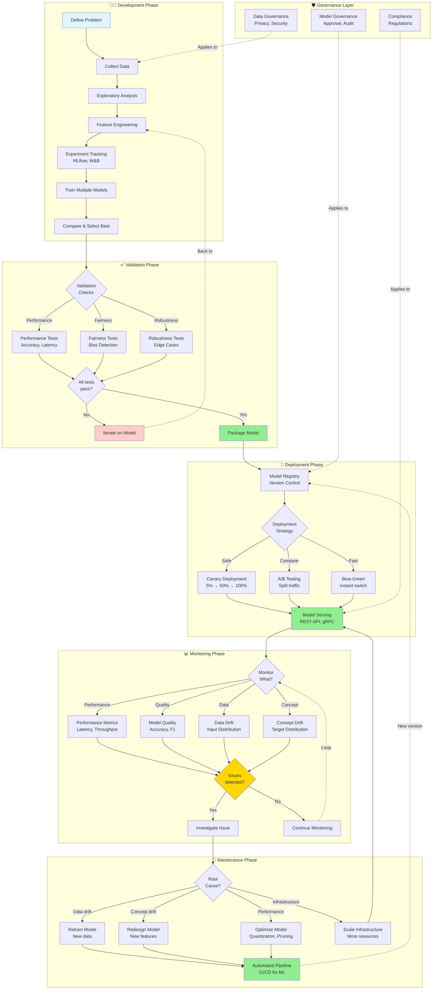
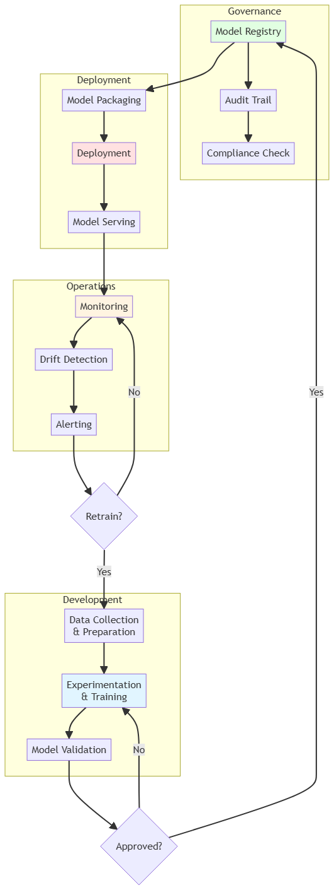
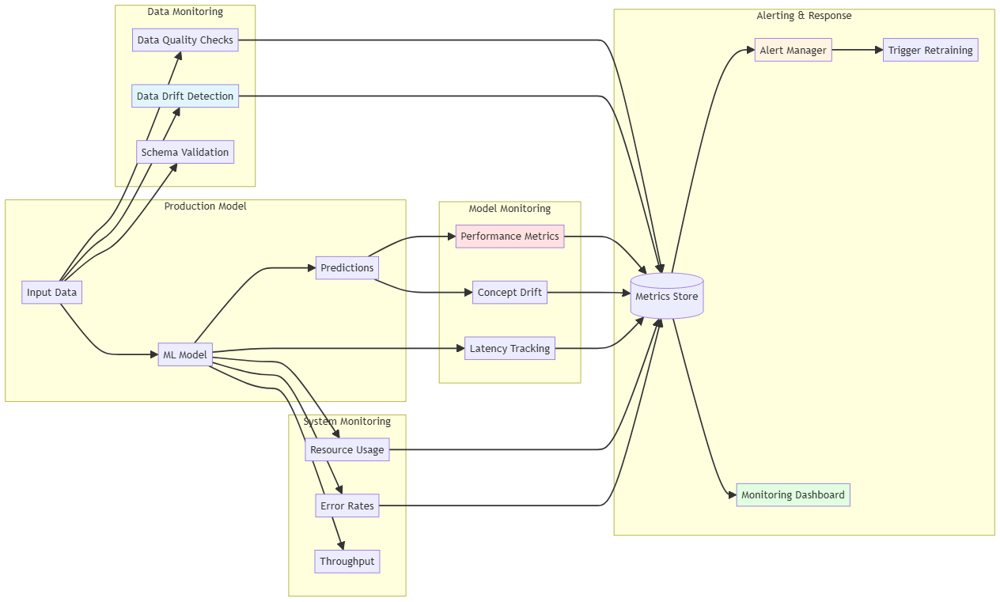
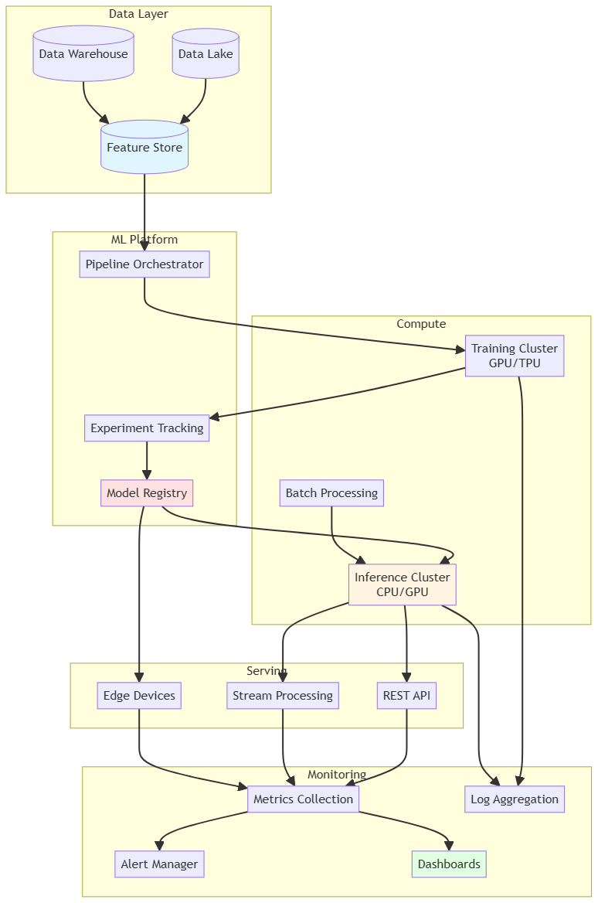

# MLOps

[← Back to Main](../README.md)

## Overview

MLOps (Machine Learning Operations) is the practice of deploying, monitoring, and maintaining machine learning models in production environments. It combines ML system development with operations, applying DevOps principles to ML workflows to ensure reliable, scalable, and reproducible ML systems.

## Complete MLOps Workflow

Understanding the end-to-end MLOps workflow is essential for successful ML deployment. This diagram shows how all components work together:

```mermaid
graph TB
    subgraph Development["👨‍💻 Development Phase"]
        Problem[Define Problem] --> Data[Collect Data]
        Data --> EDA[Exploratory Analysis]
        EDA --> Features[Feature Engineering]
        Features --> Experiment[Experiment Tracking<br/>MLflow, W&B]
        Experiment --> Models[Train Multiple Models]
        Models --> Compare[Compare & Select Best]
    end
    
    subgraph Validation["✅ Validation Phase"]
        Compare --> Validate{Validation<br/>Checks}
        Validate -->|Performance| PerfTest[Performance Tests<br/>Accuracy, Latency]
        Validate -->|Fairness| FairTest[Fairness Tests<br/>Bias Detection]
        Validate -->|Robustness| RobustTest[Robustness Tests<br/>Edge Cases]
        
        PerfTest --> AllPass{All tests<br/>pass?}
        FairTest --> AllPass
        RobustTest --> AllPass
        
        AllPass -->|No| Iterate[Iterate on Model]
        AllPass -->|Yes| Package[Package Model]
        
        Iterate -.->|Back to| Features
    end
    
    subgraph Deployment["🚀 Deployment Phase"]
        Package --> Registry[Model Registry<br/>Version Control]
        Registry --> Strategy{Deployment<br/>Strategy}
        
        Strategy -->|Safe| Canary[Canary Deployment<br/>5% → 50% → 100%]
        Strategy -->|Compare| AB[A/B Testing<br/>Split traffic]
        Strategy -->|Fast| BlueGreen[Blue-Green<br/>Instant switch]
        
        Canary --> Serve
        AB --> Serve
        BlueGreen --> Serve[Model Serving<br/>REST API, gRPC]
    end
    
    subgraph Monitoring["📊 Monitoring Phase"]
        Serve --> Monitor{Monitor<br/>What?}
        
        Monitor -->|Performance| PerfMon[Performance Metrics<br/>Latency, Throughput]
        Monitor -->|Quality| QualMon[Model Quality<br/>Accuracy, F1]
        Monitor -->|Data| DataMon[Data Drift<br/>Input Distribution]
        Monitor -->|Concept| ConceptMon[Concept Drift<br/>Target Distribution]
        
        PerfMon --> Alert{Issues<br/>detected?}
        QualMon --> Alert
        DataMon --> Alert
        ConceptMon --> Alert
        
        Alert -->|Yes| Investigate[Investigate Issue]
        Alert -->|No| Continue[Continue Monitoring]
        
        Continue -.->|Loop| Monitor
    end
    
    subgraph Maintenance["🔧 Maintenance Phase"]
        Investigate --> Root{Root<br/>Cause?}
        
        Root -->|Data drift| Retrain[Retrain Model<br/>New data]
        Root -->|Concept drift| Redesign[Redesign Model<br/>New features]
        Root -->|Performance| Optimize[Optimize Model<br/>Quantization, Pruning]
        Root -->|Infrastructure| Scale[Scale Infrastructure<br/>More resources]
        
        Retrain --> AutoPipeline[Automated Pipeline<br/>CI/CD for ML]
        Redesign --> AutoPipeline
        Optimize --> AutoPipeline
        Scale --> Serve
        
        AutoPipeline -.->|New version| Registry
    end
    
    subgraph Governance["🛡️ Governance Layer"]
        Gov1[Data Governance<br/>Privacy, Security]
        Gov2[Model Governance<br/>Approval, Audit]
        Gov3[Compliance<br/>Regulations]
        
        Gov1 -.->|Applies to| Data
        Gov2 -.->|Applies to| Registry
        Gov3 -.->|Applies to| Serve
    end
    
    style Problem fill:#e1f5ff
    style Package fill:#90EE90
    style Serve fill:#90EE90
    style Alert fill:#FFD700
    style Iterate fill:#ffcccc
    style AutoPipeline fill:#90EE90
```

**Workflow Phases**:
1. **👨‍💻 Development**: Experiment tracking, model training, and selection
2. **✅ Validation**: Performance, fairness, and robustness testing
3. **🚀 Deployment**: Canary, A/B testing, or blue-green strategies
4. **📊 Monitoring**: Track performance, data drift, and concept drift
5. **🔧 Maintenance**: Automated retraining and optimization
6. **🛡️ Governance**: Data privacy, model approval, and compliance

The workflow emphasizes automation, continuous monitoring, and iterative improvement.

## Core Principles

### Key Objectives

- **Automation** - Automate ML pipelines from data to deployment
- **Reproducibility** - Ensure consistent results across environments
- **Monitoring** - Track model and system performance
- **Scalability** - Handle growing data and traffic
- **Collaboration** - Enable team coordination
- **Governance** - Maintain compliance and auditability

## MLOps Lifecycle

### 1. Data Management

| Component | Description | Key Technologies |
|-----------|-------------|------------------|
| **Data Versioning** | Track data changes over time | DVC, Git LFS, data lineage |
| **Data Quality** | Ensure data reliability | Validation, profiling, monitoring |
| **Feature Stores** | Centralized feature management | Feast, Tecton, SageMaker |
| **Data Pipelines** | Automated data workflows | ETL/ELT, Airflow, Prefect |
| **Data Governance** | Data policies and compliance | Privacy, security, regulations |

### 2. Model Development

| Component | Description | Key Technologies |
|-----------|-------------|------------------|
| **Experiment Tracking** | Log and compare experiments | MLflow, Weights & Biases, Neptune |
| **Model Versioning** | Track model iterations | Model registry, lineage tracking |
| **Hyperparameter Tuning** | Optimize model parameters | Optuna, Ray Tune, Hyperopt |
| **Reproducible Environments** | Consistent execution environments | Docker, conda, virtual environments |
| **Collaborative Development** | Team coordination | Code review, shared notebooks, Git |

### 3. Model Training

| Component | Description | Key Technologies |
|-----------|-------------|------------------|
| **Training Pipelines** | Automated training workflows | Kubeflow, Airflow, custom pipelines |
| **Distributed Training** | Scale training across resources | Multi-GPU, multi-node, Ray |
| **Resource Management** | Optimize compute usage | GPU scheduling, cost optimization |
| **Training Monitoring** | Track training progress | Metrics, logs, alerts, TensorBoard |
| **Model Validation** | Verify model quality | Performance testing, validation sets |

### 4. Model Deployment

| Component | Description | Key Technologies |
|-----------|-------------|------------------|
| **Deployment Strategies** | Safe rollout approaches | Blue-green, canary, A/B testing |
| **Model Serving** | Expose models for inference | REST APIs, gRPC, batch inference |
| **Containerization** | Package models with dependencies | Docker, Kubernetes, containers |
| **Model Optimization** | Improve inference performance | Quantization, pruning, distillation |
| **Edge Deployment** | Deploy to edge devices | Mobile, IoT, embedded systems |

### 5. Monitoring and Maintenance

| Component | Description | Key Metrics |
|-----------|-------------|-------------|
| **Model Monitoring** | Track model performance | Accuracy, latency, throughput |
| **Data Drift Detection** | Detect input distribution changes | KL divergence, PSI, KS test |
| **Concept Drift Detection** | Detect target distribution changes | Performance degradation, label shift |
| **Alerting** | Automated issue notifications | Thresholds, escalation, runbooks |
| **Model Retraining** | Automated model updates | Triggers, schedules, CI/CD |

### 6. Governance and Compliance

| Component | Description | Key Aspects |
|-----------|-------------|-------------|
| **Model Governance** | Control model lifecycle | Policies, approval workflows, reviews |
| **Audit Trails** | Track all changes | Logging, versioning, documentation |
| **Explainability** | Understand model decisions | SHAP, LIME, interpretability |
| **Bias Detection** | Ensure fairness | Fairness metrics, bias mitigation |
| **Regulatory Compliance** | Meet legal requirements | GDPR, CCPA, industry standards |

## MLOps Architecture

### Infrastructure Components

#### Compute Resources

| Component | Purpose | Technologies | Scalability | Cost |
|-----------|---------|--------------|-------------|------|
| **Training Infrastructure** | Model training | GPUs, TPUs, distributed clusters | High | High |
| **Serving Infrastructure** | Model inference | CPU/GPU servers, serverless | Medium-High | Medium |
| **Storage** | Data persistence | Object storage, databases, data lakes | Very High | Low-Medium |
| **Orchestration** | Resource management | Kubernetes, cloud services | High | Medium |

#### ML Platform Components

| Component | Purpose | Popular Tools | Integration | Complexity |
|-----------|---------|---------------|-------------|------------|
| **Feature Store** | Feature management | Feast, Tecton, AWS Feature Store | Medium | Medium |
| **Model Registry** | Model versioning | MLflow, W&B, custom | High | Low |
| **Experiment Tracking** | Track experiments | MLflow, Neptune, Comet | High | Low |
| **Pipeline Orchestration** | Workflow automation | Airflow, Kubeflow, Prefect | High | Medium-High |
| **Monitoring** | System observability | Prometheus, Grafana, custom | High | Medium |

### CI/CD for ML

- **Continuous Integration** - Automated testing, validation
- **Continuous Training** - Automated model retraining
- **Continuous Deployment** - Automated model deployment
- **Testing Strategies** - Unit, integration, model tests
- **Pipeline Automation** - End-to-end automation

## Tools and Technologies

### Experiment Tracking

| Tool | Type | Strengths | Deployment | Cost |
|------|------|-----------|------------|------|
| **MLflow** | Open-source | Complete lifecycle, flexible | Self-hosted/Cloud | Free/Paid |
| **Weights & Biases** | SaaS | Visualization, collaboration | Cloud | Free/Paid |
| **Neptune.ai** | SaaS | Metadata management | Cloud | Free/Paid |
| **Comet** | SaaS | Experiment comparison | Cloud | Free/Paid |
| **TensorBoard** | Open-source | TensorFlow integration | Self-hosted | Free |

### Model Serving

| Tool | Framework | Scalability | Deployment | Best For |
|------|-----------|-------------|------------|----------|
| **TensorFlow Serving** | TensorFlow | High | Docker/K8s | TF models |
| **TorchServe** | PyTorch | High | Docker/K8s | PyTorch models |
| **Seldon Core** | Agnostic | Very High | Kubernetes | K8s-native |
| **KServe** | Agnostic | Very High | Kubernetes | Serverless on K8s |
| **BentoML** | Agnostic | High | Docker/K8s | Easy packaging |
| **Ray Serve** | Agnostic | Very High | Ray cluster | Distributed serving |

### Pipeline Orchestration

| Tool | Complexity | Scalability | Learning Curve | Best For |
|------|------------|-------------|----------------|----------|
| **Kubeflow** | High | Very High | Steep | K8s-native ML |
| **Apache Airflow** | Medium | High | Medium | General workflows |
| **Prefect** | Low | High | Easy | Modern Python workflows |
| **Metaflow** | Low | High | Easy | Data science teams |
| **ZenML** | Medium | High | Medium | Extensible pipelines |

### Feature Stores

| Tool | Type | Scalability | Integration | Cost |
|------|------|-------------|-------------|------|
| **Feast** | Open-source | High | Good | Free |
| **Tecton** | Enterprise | Very High | Excellent | Paid |
| **Hopsworks** | Open-source/Enterprise | High | Good | Free/Paid |
| **AWS SageMaker Feature Store** | Managed | Very High | AWS ecosystem | Paid |

### Model Monitoring

| Tool | Type | Features | Deployment | Cost |
|------|------|----------|------------|------|
| **Evidently AI** | Open-source | Drift detection, testing | Self-hosted | Free |
| **Arize AI** | SaaS | Full observability | Cloud | Paid |
| **Fiddler** | SaaS | Explainability, monitoring | Cloud | Paid |
| **WhyLabs** | SaaS | Data/model monitoring | Cloud | Free/Paid |
| **Prometheus + Grafana** | Open-source | Metrics, dashboards | Self-hosted | Free |

### Data Versioning

| Tool | Type | Key Features | Best For |
|------|------|--------------|----------|
| **DVC** | Open-source | Git-like versioning, pipeline tracking | Small to medium teams |
| **Pachyderm** | Open-source/Enterprise | Data versioning, pipeline automation | Data-centric workflows |
| **LakeFS** | Open-source | Git-like operations for data lakes | Large-scale data lakes |
| **Delta Lake** | Open-source | ACID transactions, time travel | Lakehouse architectures |

## Best Practices

### Development Phase

1. **Version Everything**
   - Code (Git)
   - Data (DVC, LakeFS)
   - Models (MLflow, model registry)
   - Environments (Docker, conda)

2. **Automate Testing**
   - Unit tests for code
   - Data validation tests
   - Model performance tests
   - Integration tests

3. **Track Experiments**
   - Log all hyperparameters
   - Record metrics and artifacts
   - Document experiment context
   - Compare results systematically

### Deployment Phase

1. **Gradual Rollout**
   - Start with shadow mode
   - Use canary deployments
   - Implement A/B testing
   - Monitor closely

2. **Model Packaging**
   - Containerize models
   - Include preprocessing
   - Document dependencies
   - Version artifacts

3. **Performance Optimization**
   - Profile inference latency
   - Optimize batch sizes
   - Use model compression
   - Cache predictions when appropriate

### Production Phase

1. **Comprehensive Monitoring**
   - Model performance metrics
   - System health metrics
   - Data quality checks
   - Business metrics

2. **Alerting Strategy**
   - Define thresholds
   - Set up escalation paths
   - Automate responses
   - Document runbooks

3. **Continuous Improvement**
   - Regular model retraining
   - Feature engineering iteration
   - Architecture updates
   - Performance optimization

## Common Challenges

### Technical Challenges

- **Model Drift** - Performance degradation over time
- **Scalability** - Handling increased load
- **Latency** - Meeting response time requirements
- **Resource Costs** - Managing infrastructure expenses
- **Debugging** - Troubleshooting production issues

### Organizational Challenges

- **Team Collaboration** - Data scientists and engineers
- **Skill Gaps** - MLOps expertise requirements
- **Tool Proliferation** - Managing multiple tools
- **Change Management** - Adopting MLOps practices
- **Governance** - Balancing speed and control

## MLOps Maturity Model

| Level | Name | Training | Deployment | Monitoring | Automation | Best For |
|-------|------|----------|------------|------------|------------|----------|
| **0** | Manual Process | Manual | Manual | Limited | None | Proof of concept |
| **1** | ML Pipeline Automation | Automated | Manual | Basic | Training only | Early production |
| **2** | CI/CD Pipeline Automation | Automated | Automated | Comprehensive | Training + deployment | Production systems |
| **3** | Full MLOps Automation | Automated | Automated | Advanced | End-to-end + self-healing | Enterprise scale |

**Level 0: Manual Process**
- Manual model training and deployment
- No automation or version control
- Limited monitoring capabilities

**Level 1: ML Pipeline Automation**
- Automated training pipelines
- Experiment tracking and model registry
- Basic performance monitoring

**Level 2: CI/CD Pipeline Automation**
- Automated testing and validation
- Continuous training and deployment
- Comprehensive monitoring and alerting

**Level 3: Full MLOps Automation**
- Automated feature engineering and model selection
- Self-healing systems with auto-remediation
- Advanced governance and compliance

## Cloud Platforms

| Platform | ML Service | Serverless | Containers | Storage | Best For |
|----------|------------|------------|------------|---------|----------|
| **AWS** | SageMaker | Lambda | ECS/EKS | S3 | Mature ecosystem, flexibility |
| **Google Cloud** | Vertex AI | Cloud Functions | GKE | BigQuery | Data analytics, AI/ML |
| **Azure** | Azure ML | Azure Functions | AKS | Blob Storage | Enterprise integration |

### Platform Details

**AWS**
- **SageMaker**: End-to-end ML platform with built-in algorithms
- **Lambda**: Serverless inference for lightweight models
- **ECS/EKS**: Container orchestration for scalable deployments
- **S3**: Scalable object storage for data and models

**Google Cloud**
- **Vertex AI**: Unified ML platform with AutoML capabilities
- **Cloud Functions**: Serverless compute for event-driven inference
- **GKE**: Managed Kubernetes for containerized workloads
- **BigQuery**: Data warehouse for large-scale analytics

**Azure**
- **Azure ML**: Comprehensive ML platform with MLOps features
- **Azure Functions**: Serverless compute with enterprise integration
- **AKS**: Managed Kubernetes service
- **Blob Storage**: Object storage with tiered access

## Security Considerations

| Aspect | Description | Key Techniques | Priority |
|--------|-------------|----------------|----------|
| **Model Security** | Protecting model IP | Encryption, access control, watermarking | High |
| **Data Privacy** | Protecting sensitive data | PII handling, encryption, anonymization | Critical |
| **Access Control** | Managing permissions | RBAC, authentication, authorization | High |
| **Adversarial Robustness** | Defending against attacks | Input validation, adversarial training | Medium |
| **Compliance** | Meeting regulations | GDPR, CCPA, audit trails | Critical |

## Metrics and KPIs

### Model Performance

| Metric | Description | Target | Monitoring |
|--------|-------------|--------|------------|
| **Accuracy/F1** | Model prediction quality | >95% (varies) | Real-time |
| **Inference Latency** | Response time (p50, p95, p99) | <100ms (varies) | Real-time |
| **Throughput** | Requests per second | >1000 (varies) | Real-time |
| **Error Rate** | Failed predictions | <1% | Real-time |

### System Performance

| Metric | Description | Target | Monitoring |
|--------|-------------|--------|------------|
| **CPU/GPU Utilization** | Compute resource usage | 60-80% | Real-time |
| **Memory Usage** | RAM consumption | <80% capacity | Real-time |
| **Network Bandwidth** | Data transfer rate | <80% capacity | Real-time |
| **Storage Costs** | Data storage expenses | Budget-dependent | Daily |

### Business Metrics

| Metric | Description | Target | Monitoring |
|--------|-------------|--------|------------|
| **Model Impact** | Effect on business KPIs | Positive ROI | Weekly |
| **Cost per Prediction** | Inference cost efficiency | Minimize | Daily |
| **Time to Deployment** | Model release cycle | <1 week | Per release |
| **Model Refresh Frequency** | Retraining cadence | Weekly/Monthly | Tracked |

## Related Topics

- [Machine Learning](../machine-learning/README.md) - ML algorithms and techniques
- [Deep Learning](../deep-learning/README.md) - Neural network models
- [Distributed Systems](../distributed-systems/README.md) - Scaling infrastructure
- [Data Science](../data-science/README.md) - Data analysis foundations

---

*MLOps bridges the gap between ML development and production deployment, ensuring models deliver value reliably and at scale.*