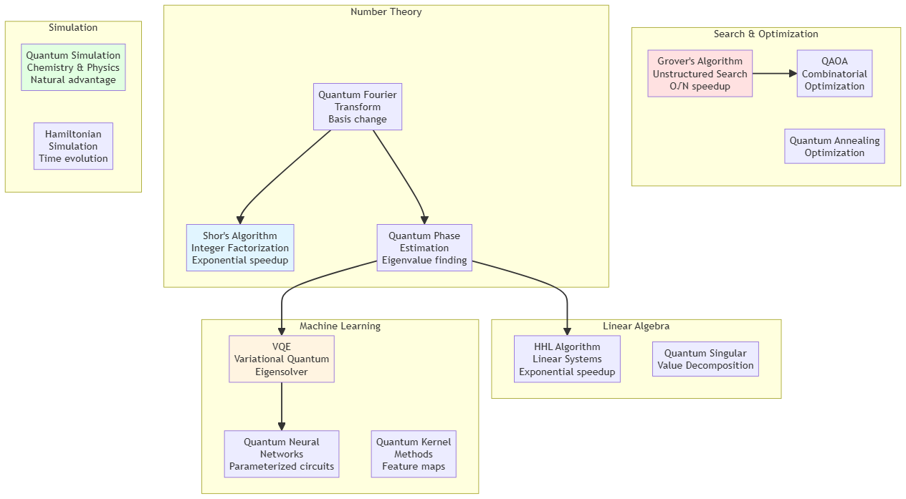
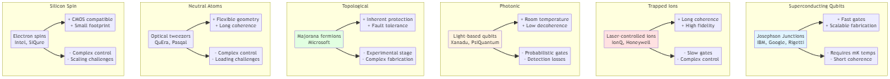

# Quantum Computing

[← Back to Main](../README.md)

## Overview

Quantum Computing leverages quantum mechanical phenomena such as superposition, entanglement, and interference to perform computations. Unlike classical computers that use bits (0 or 1), quantum computers use quantum bits (qubits) that can exist in superposition of states, potentially offering exponential speedup for certain computational problems.

## Quantum Mechanics Fundamentals

### Core Principles

- **[Superposition](superposition.md)** - Qubits existing in multiple states simultaneously
- **[Entanglement](entanglement.md)** - Quantum correlation between qubits
- **[Interference](interference.md)** - Amplifying correct answers, canceling wrong ones
- **[Measurement](measurement.md)** - Collapsing quantum states to classical outcomes
- **[No-Cloning Theorem](no-cloning.md)** - Impossibility of copying quantum states

### Mathematical Framework

- **[Quantum States](quantum-states.md)** - Ket notation, Bloch sphere
- **[Quantum Gates](quantum-gates.md)** - Unitary operations on qubits
- **[Quantum Circuits](quantum-circuits.md)** - Sequences of quantum gates
- **[Density Matrices](density-matrices.md)** - Mixed state representation
- **[Tensor Products](tensor-products.md)** - Multi-qubit systems

## Quantum Gates and Circuits

### Single-Qubit Gates

| Gate | Matrix | Effect | Use Case | Complexity |
|------|--------|--------|----------|------------|
| **[Pauli-X](pauli-gates.md)** | [[0,1],[1,0]] | Bit flip | NOT operation | O(1) |
| **[Pauli-Y](pauli-gates.md)** | [[0,-i],[i,0]] | Bit + phase flip | Combined operation | O(1) |
| **[Pauli-Z](pauli-gates.md)** | [[1,0],[0,-1]] | Phase flip | Phase correction | O(1) |
| **[Hadamard](hadamard-gate.md)** | 1/√2[[1,1],[1,-1]] | Superposition | Basis change | O(1) |
| **[S Gate](phase-gates.md)** | [[1,0],[0,i]] | π/2 phase | Phase rotation | O(1) |
| **[T Gate](phase-gates.md)** | [[1,0],[0,e^(iπ/4)]] | π/4 phase | Universal gate set | O(1) |
| **[Rotation](rotation-gates.md)** | Parametric | Arbitrary rotation | Variational circuits | O(1) |

### Multi-Qubit Gates

| Gate | Qubits | Effect | Use Case | Complexity |
|------|--------|--------|----------|------------|
| **[CNOT](cnot-gate.md)** | 2 | Controlled bit flip | Entanglement | O(1) |
| **[Toffoli](toffoli-gate.md)** | 3 | Controlled-controlled NOT | Reversible computing | O(1) |
| **[SWAP](swap-gate.md)** | 2 | Exchange states | Qubit routing | O(1) |
| **[Controlled-U](controlled-gates.md)** | 2+ | Conditional operation | General control | O(1) |

### Circuit Design

- **[Circuit Composition](circuit-composition.md)** - Building complex circuits
- **[Circuit Optimization](circuit-optimization.md)** - Reducing gate count
- **[Circuit Depth](circuit-depth.md)** - Minimizing sequential operations
- **[Quantum Compilation](quantum-compilation.md)** - Mapping to hardware

## Quantum Algorithms

### Foundational Algorithms

| Algorithm | Problem | Speedup | Qubits | Best For |
|-----------|---------|---------|--------|----------|
| **[Deutsch-Jozsa](deutsch-jozsa.md)** | Function property | Exponential | n+1 | Constant vs balanced |
| **[Bernstein-Vazirani](bernstein-vazirani.md)** | Hidden string | Exponential | n+1 | Linear function |
| **[Simon's](simons-algorithm.md)** | Period finding | Exponential | 2n | XOR periodicity |
| **[QFT](qft.md)** | Basis transform | Exponential | n | Phase estimation |

### Major Quantum Algorithms

| Algorithm | Problem | Speedup | Complexity | Impact |
|-----------|---------|---------|------------|--------|
| **[Shor's](shors-algorithm.md)** | Integer factorization | Exponential | O(log³N) | Cryptography |
| **[Grover's](grovers-algorithm.md)** | Unstructured search | Quadratic | O(√N) | Database search |
| **[QPE](qpe.md)** | Eigenvalue estimation | Exponential | O(1/ε) | Chemistry, physics |
| **[HHL](hhl-algorithm.md)** | Linear systems | Exponential | O(log N) | ML, optimization |

### Optimization Algorithms

| Algorithm | Type | Hardware | Convergence | Best For |
|-----------|------|----------|-------------|----------|
| **[QAOA](qaoa.md)** | Variational | Gate-based | Heuristic | Combinatorial optimization |
| **[VQE](vqe.md)** | Variational | Gate-based | Iterative | Ground state energy |
| **[Quantum Annealing](quantum-annealing.md)** | Adiabatic | Annealer | Probabilistic | QUBO problems |
| **[Quantum Walk](quantum-walk.md)** | Algorithmic | Gate-based | Varies | Graph problems |

## Quantum Machine Learning

### Quantum-Enhanced ML

- **[Quantum Neural Networks](quantum-neural-networks.md)** - Parameterized quantum circuits
- **[Quantum Kernels](quantum-kernels.md)** - Quantum feature maps
- **[Quantum Sampling](quantum-sampling.md)** - Generating quantum distributions
- **[Quantum Generative Models](quantum-generative.md)** - QGANs, QBMs

### Hybrid Quantum-Classical

- **[Variational Algorithms](variational-algorithms.md)** - Classical optimization of quantum circuits
- **[Quantum Transfer Learning](quantum-transfer-learning.md)** - Pre-trained quantum models
- **[Quantum Feature Extraction](quantum-features.md)** - Quantum preprocessing
- **[Classical Post-Processing](classical-postprocessing.md)** - Interpreting quantum results

### Applications

- **[Quantum Classification](quantum-classification.md)** - Supervised learning
- **[Quantum Clustering](quantum-clustering.md)** - Unsupervised learning
- **[Quantum Reinforcement Learning](quantum-rl.md)** - Decision making
- **[Quantum Optimization](quantum-optimization.md)** - Combinatorial problems

## Quantum Hardware

### Qubit Technologies

- **[Superconducting Qubits](superconducting-qubits.md)** - IBM, Google, Rigetti
- **[Trapped Ions](trapped-ions.md)** - IonQ, Honeywell
- **[Photonic Qubits](photonic-qubits.md)** - Xanadu, PsiQuantum
- **[Topological Qubits](topological-qubits.md)** - Microsoft
- **[Neutral Atoms](neutral-atoms.md)** - QuEra, Pasqal
- **[Silicon Spin Qubits](silicon-qubits.md)** - Intel, SiQure

### Hardware Challenges

- **[Decoherence](decoherence.md)** - Loss of quantum information
- **[Gate Fidelity](gate-fidelity.md)** - Error rates in operations
- **[Connectivity](qubit-connectivity.md)** - Physical qubit layout constraints
- **[Scalability](quantum-scalability.md)** - Building larger systems
- **[Cryogenics](cryogenics.md)** - Ultra-low temperature requirements

## Quantum Error Correction

### Error Types

- **[Bit Flip Errors](bit-flip-errors.md)** - X errors
- **[Phase Flip Errors](phase-flip-errors.md)** - Z errors
- **[Depolarizing Errors](depolarizing-errors.md)** - Random errors
- **[Measurement Errors](measurement-errors.md)** - Readout errors

### Error Correction Codes

- **[Repetition Code](repetition-code.md)** - Simple redundancy
- **[Shor Code](shor-code.md)** - 9-qubit code
- **[Steane Code](steane-code.md)** - 7-qubit CSS code
- **[Surface Code](surface-code.md)** - 2D topological code
- **[Color Code](color-code.md)** - Alternative topological code

### Fault-Tolerant Computing

- **[Logical Qubits](logical-qubits.md)** - Error-corrected qubits
- **[Fault-Tolerant Gates](fault-tolerant-gates.md)** - Protected operations
- **[Magic State Distillation](magic-state-distillation.md)** - Creating high-fidelity states
- **[Threshold Theorem](threshold-theorem.md)** - Error correction viability

## Quantum Programming

### Quantum Programming Languages

- **[Qiskit](qiskit.md)** - IBM's quantum framework (Python)
- **[Cirq](cirq.md)** - Google's quantum framework (Python)
- **[PennyLane](pennylane.md)** - Quantum ML library (Python)
- **[Q#](qsharp.md)** - Microsoft's quantum language
- **[Silq](silq.md)** - High-level quantum language

### Development Tools

- **[Quantum Simulators](quantum-simulators.md)** - Classical simulation of quantum systems
- **[Quantum Debuggers](quantum-debuggers.md)** - Debugging quantum programs
- **[Visualization Tools](quantum-visualization.md)** - Circuit and state visualization
- **[Benchmarking](quantum-benchmarking.md)** - Performance evaluation

### Programming Paradigms

- **[Gate-Based Programming](gate-based-programming.md)** - Circuit model
- **[Measurement-Based Computing](measurement-based.md)** - One-way quantum computing
- **[Adiabatic Computing](adiabatic-computing.md)** - Continuous evolution
- **[Topological Computing](topological-computing.md)** - Braiding anyons

## Applications

### Cryptography

- **[Quantum Key Distribution](qkd.md)** - Secure communication (BB84, E91)
- **[Post-Quantum Cryptography](post-quantum-crypto.md)** - Quantum-resistant algorithms
- **[Quantum Random Number Generation](qrng.md)** - True randomness

### Chemistry and Materials

- **[Molecular Simulation](molecular-simulation.md)** - Electronic structure
- **[Drug Discovery](quantum-drug-discovery.md)** - Molecular interactions
- **[Materials Design](materials-design.md)** - Novel material properties
- **[Catalysis](quantum-catalysis.md)** - Reaction mechanisms

### Optimization

- **[Portfolio Optimization](portfolio-optimization.md)** - Financial applications
- **[Supply Chain](supply-chain-quantum.md)** - Logistics optimization
- **[Scheduling](quantum-scheduling.md)** - Resource allocation
- **[Traffic Flow](traffic-optimization.md)** - Route optimization

### Machine Learning

- **[Quantum Data Encoding](quantum-encoding.md)** - Classical to quantum data
- **[Quantum Feature Maps](feature-maps.md)** - Kernel methods
- **[Quantum Training](quantum-training.md)** - Parameter optimization
- **[Quantum Inference](quantum-inference.md)** - Making predictions

## Quantum Advantage

### Demonstrating Quantum Supremacy

- **[Google's Sycamore](sycamore.md)** - Random circuit sampling (2019)
- **[Quantum Advantage Experiments](quantum-advantage-experiments.md)** - Various demonstrations
- **[Practical Quantum Advantage](practical-advantage.md)** - Real-world applications

### Complexity Theory

- **[BQP Complexity Class](bqp.md)** - Bounded-error quantum polynomial time
- **[Quantum vs Classical](quantum-vs-classical.md)** - Computational power comparison
- **[Oracle Separation](oracle-separation.md)** - Theoretical speedups

## Quantum Networking

- **[Quantum Internet](quantum-internet.md)** - Distributed quantum computing
- **[Quantum Repeaters](quantum-repeaters.md)** - Long-distance entanglement
- **[Quantum Teleportation](quantum-teleportation.md)** - State transfer
- **[Distributed Quantum Computing](distributed-quantum.md)** - Multi-node computation

## Current Limitations

### Technical Challenges

- **Noise and Errors** - High error rates in current hardware
- **Limited Qubits** - Small system sizes (50-1000 qubits)
- **Short Coherence Times** - Rapid decoherence
- **Connectivity Constraints** - Limited qubit interactions
- **Calibration** - Frequent recalibration needed

### Practical Challenges

- **Cost** - Expensive infrastructure
- **Expertise** - Specialized knowledge required
- **Algorithm Development** - Few practical quantum algorithms
- **Verification** - Difficulty validating quantum results
- **Integration** - Combining with classical systems

## Future Directions

- **[Fault-Tolerant Quantum Computing](ftqc.md)** - Error-corrected systems
- **[Quantum Cloud Services](quantum-cloud.md)** - Accessible quantum computing
- **[Hybrid Algorithms](hybrid-algorithms.md)** - Quantum-classical synergy
- **[Quantum Sensors](quantum-sensors.md)** - Precision measurement
- **[Quantum Communication](quantum-communication.md)** - Secure networks

## Related Topics

- [Machine Learning](../machine-learning/README.md) - Classical ML algorithms
- [Deep Learning](../deep-learning/README.md) - Neural networks
- [Distributed Systems](../distributed-systems/README.md) - Parallel computing
- [Data Science](../data-science/README.md) - Data analysis

## Further Learning

### Books
- "Quantum Computation and Quantum Information" by Nielsen & Chuang
- "Quantum Computing: An Applied Approach" by Jack Hidary
- "Programming Quantum Computers" by Johnston, Harrigan & Gimeno-Segovia
- "Quantum Computing for Computer Scientists" by Yanofsky & Mannucci

### Online Courses
- IBM Quantum Learning
- Microsoft Quantum Development Kit
- Qiskit Textbook
- Coursera Quantum Computing courses

### Research Resources
- arXiv Quantum Physics section
- Quantum Algorithm Zoo
- Quantum Computing Report
- IEEE Quantum Week

### Platforms
- IBM Quantum Experience
- Amazon Braket
- Azure Quantum
- Google Quantum AI

---

*Quantum Computing represents a paradigm shift in computation, leveraging quantum mechanics to solve problems intractable for classical computers.*