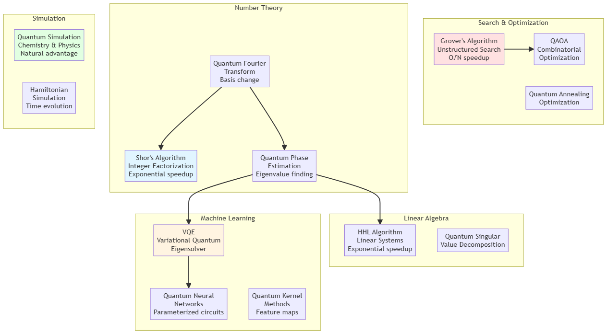
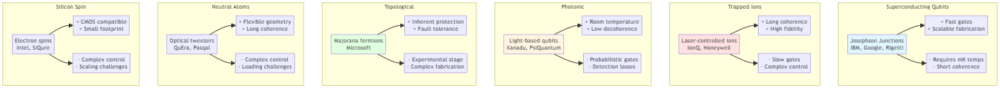

# Quantum Computing

[← Back to Main](../README.md)

## Overview

Quantum Computing leverages quantum mechanical phenomena such as superposition, entanglement, and interference to perform computations. Unlike classical computers that use bits (0 or 1), quantum computers use quantum bits (qubits) that can exist in superposition of states, potentially offering exponential speedup for certain computational problems.

## Quantum Mechanics Fundamentals

### Core Principles

| Principle | Description | Key Property | Impact |
|-----------|-------------|--------------|--------|
| **[Superposition](pages/superposition.md)** | Qubits in multiple states simultaneously | Exponential state space | Parallel computation |
| **[Entanglement](pages/entanglement.md)** | Quantum correlation between qubits | Non-local correlations | Quantum advantage |
| **[Interference](pages/interference.md)** | Amplify correct, cancel wrong answers | Constructive/destructive | Algorithm design |
| **[Measurement](pages/measurement.md)** | Collapse to classical outcomes | Probabilistic results | Information extraction |
| **[No-Cloning Theorem](pages/no-cloning.md)** | Cannot copy quantum states | Fundamental limit | Quantum security |

### Mathematical Framework

| Concept | Description | Notation | Complexity |
|---------|-------------|----------|------------|
| **[Quantum States](pages/quantum-states.md)** | State representation | Ket notation \|ψ⟩, Bloch sphere | Basic |
| **[Quantum Gates](pages/quantum-gates.md)** | Unitary operations | Matrix representation | Medium |
| **[Quantum Circuits](pages/quantum-circuits.md)** | Gate sequences | Circuit diagrams | Medium |
| **[Density Matrices](pages/density-matrices.md)** | Mixed state representation | ρ = Σ pᵢ\|ψᵢ⟩⟨ψᵢ\| | Advanced |
| **[Tensor Products](pages/tensor-products.md)** | Multi-qubit systems | \|ψ⟩ ⊗ \|φ⟩ | Medium |

## Quantum Gates and Circuits

### Single-Qubit Gates

| Gate | Matrix | Effect | Use Case | Complexity |
|------|--------|--------|----------|------------|
| **[Pauli-X](pages/pauli-gates.md)** | [[0,1],[1,0]] | Bit flip | NOT operation | O(1) |
| **[Pauli-Y](pages/pauli-gates.md)** | [[0,-i],[i,0]] | Bit + phase flip | Combined operation | O(1) |
| **[Pauli-Z](pages/pauli-gates.md)** | [[1,0],[0,-1]] | Phase flip | Phase correction | O(1) |
| **[Hadamard](pages/hadamard-gate.md)** | 1/√2[[1,1],[1,-1]] | Superposition | Basis change | O(1) |
| **[S Gate](pages/phase-gates.md)** | [[1,0],[0,i]] | π/2 phase | Phase rotation | O(1) |
| **[T Gate](pages/phase-gates.md)** | [[1,0],[0,e^(iπ/4)]] | π/4 phase | Universal gate set | O(1) |
| **[Rotation](pages/rotation-gates.md)** | Parametric | Arbitrary rotation | Variational circuits | O(1) |

### Multi-Qubit Gates

| Gate | Qubits | Effect | Use Case | Complexity |
|------|--------|--------|----------|------------|
| **[CNOT](pages/cnot-gate.md)** | 2 | Controlled bit flip | Entanglement | O(1) |
| **[Toffoli](pages/toffoli-gate.md)** | 3 | Controlled-controlled NOT | Reversible computing | O(1) |
| **[SWAP](pages/swap-gate.md)** | 2 | Exchange states | Qubit routing | O(1) |
| **[Controlled-U](pages/controlled-gates.md)** | 2+ | Conditional operation | General control | O(1) |

### Circuit Design

| Aspect | Description | Goal | Techniques |
|--------|-------------|------|------------|
| **[Circuit Composition](pages/circuit-composition.md)** | Building complex circuits | Modularity | Subroutines, decomposition |
| **[Circuit Optimization](pages/circuit-optimization.md)** | Reducing gate count | Efficiency | Gate cancellation, synthesis |
| **[Circuit Depth](pages/circuit-depth.md)** | Minimizing sequential operations | Speed | Parallelization, scheduling |
| **[Quantum Compilation](pages/quantum-compilation.md)** | Mapping to hardware | Fidelity | Transpilation, routing |

## Quantum Algorithms

### Foundational Algorithms

| Algorithm | Problem | Speedup | Qubits | Best For |
|-----------|---------|---------|--------|----------|
| **[Deutsch-Jozsa](pages/deutsch-jozsa.md)** | Function property | Exponential | n+1 | Constant vs balanced |
| **[Bernstein-Vazirani](pages/bernstein-vazirani.md)** | Hidden string | Exponential | n+1 | Linear function |
| **[Simon's](pages/simons-algorithm.md)** | Period finding | Exponential | 2n | XOR periodicity |
| **[QFT](pages/qft.md)** | Basis transform | Exponential | n | Phase estimation |

### Major Quantum Algorithms

| Algorithm | Problem | Speedup | Complexity | Impact |
|-----------|---------|---------|------------|--------|
| **[Shor's](pages/shors-algorithm.md)** | Integer factorization | Exponential | O(log³N) | Cryptography |
| **[Grover's](pages/grovers-algorithm.md)** | Unstructured search | Quadratic | O(√N) | Database search |
| **[QPE](pages/qpe.md)** | Eigenvalue estimation | Exponential | O(1/ε) | Chemistry, physics |
| **[HHL](pages/hhl-algorithm.md)** | Linear systems | Exponential | O(log N) | ML, optimization |

### Optimization Algorithms

| Algorithm | Type | Hardware | Convergence | Best For |
|-----------|------|----------|-------------|----------|
| **[QAOA](pages/qaoa.md)** | Variational | Gate-based | Heuristic | Combinatorial optimization |
| **[VQE](pages/vqe.md)** | Variational | Gate-based | Iterative | Ground state energy |
| **[Quantum Annealing](pages/quantum-annealing.md)** | Adiabatic | Annealer | Probabilistic | QUBO problems |
| **[Quantum Walk](pages/quantum-walk.md)** | Algorithmic | Gate-based | Varies | Graph problems |

## Quantum Machine Learning

### Quantum-Enhanced ML

- **[Quantum Neural Networks](pages/quantum-neural-networks.md)** - Parameterized quantum circuits
- **[Quantum Kernels](pages/quantum-kernels.md)** - Quantum feature maps
- **[Quantum Sampling](pages/quantum-sampling.md)** - Generating quantum distributions
- **[Quantum Generative Models](pages/quantum-generative.md)** - QGANs, QBMs

### Hybrid Quantum-Classical

- **[Variational Algorithms](pages/variational-algorithms.md)** - Classical optimization of quantum circuits
- **[Quantum Transfer Learning](pages/quantum-transfer-learning.md)** - Pre-trained quantum models
- **[Quantum Feature Extraction](pages/quantum-features.md)** - Quantum preprocessing
- **[Classical Post-Processing](pages/classical-postprocessing.md)** - Interpreting quantum results

### Applications

- **[Quantum Classification](pages/quantum-classification.md)** - Supervised learning
- **[Quantum Clustering](pages/quantum-clustering.md)** - Unsupervised learning
- **[Quantum Reinforcement Learning](pages/quantum-rl.md)** - Decision making
- **[Quantum Optimization](pages/quantum-optimization.md)** - Combinatorial problems

## Quantum Hardware

### Qubit Technologies

- **[Superconducting Qubits](pages/superconducting-qubits.md)** - IBM, Google, Rigetti
- **[Trapped Ions](pages/trapped-ions.md)** - IonQ, Honeywell
- **[Photonic Qubits](pages/photonic-qubits.md)** - Xanadu, PsiQuantum
- **[Topological Qubits](pages/topological-qubits.md)** - Microsoft
- **[Neutral Atoms](pages/neutral-atoms.md)** - QuEra, Pasqal
- **[Silicon Spin Qubits](pages/silicon-qubits.md)** - Intel, SiQure

### Hardware Challenges

- **[Decoherence](pages/decoherence.md)** - Loss of quantum information
- **[Gate Fidelity](pages/gate-fidelity.md)** - Error rates in operations
- **[Connectivity](pages/qubit-connectivity.md)** - Physical qubit layout constraints
- **[Scalability](pages/quantum-scalability.md)** - Building larger systems
- **[Cryogenics](pages/cryogenics.md)** - Ultra-low temperature requirements

## Quantum Error Correction

### Error Types

- **[Bit Flip Errors](pages/bit-flip-errors.md)** - X errors
- **[Phase Flip Errors](pages/phase-flip-errors.md)** - Z errors
- **[Depolarizing Errors](pages/depolarizing-errors.md)** - Random errors
- **[Measurement Errors](pages/measurement-errors.md)** - Readout errors

### Error Correction Codes

- **[Repetition Code](pages/repetition-code.md)** - Simple redundancy
- **[Shor Code](pages/shor-code.md)** - 9-qubit code
- **[Steane Code](pages/steane-code.md)** - 7-qubit CSS code
- **[Surface Code](pages/surface-code.md)** - 2D topological code
- **[Color Code](pages/color-code.md)** - Alternative topological code

### Fault-Tolerant Computing

| Concept | Purpose | Overhead | Maturity | Critical For |
|---------|---------|----------|----------|--------------|
| **[Logical Qubits](pages/logical-qubits.md)** | Error-corrected qubits | 100-1000x | Research | Scalable quantum computing |
| **[Fault-Tolerant Gates](pages/fault-tolerant-gates.md)** | Protected operations | High | Research | Reliable computation |
| **[Magic State Distillation](pages/magic-state-distillation.md)** | High-fidelity states | Very High | Research | Universal gate set |
| **[Threshold Theorem](pages/threshold-theorem.md)** | Error correction viability | N/A | Theoretical | Feasibility proof |

## Quantum Programming

### Quantum Programming Languages

| Language | Provider | Language | Maturity | Best For |
|----------|----------|----------|----------|----------|
| **[Qiskit](pages/qiskit.md)** | IBM | Python | Mature | IBM hardware, education |
| **[Cirq](pages/cirq.md)** | Google | Python | Mature | Google hardware, NISQ |
| **[PennyLane](pages/pennylane.md)** | Xanadu | Python | Mature | Quantum ML, hybrid |
| **[Q#](pages/qsharp.md)** | Microsoft | Domain-specific | Mature | Azure Quantum |
| **[Silq](pages/silq.md)** | Academic | High-level | Research | Intuitive programming |

### Development Tools

| Tool | Purpose | Complexity | Accuracy | Best For |
|------|---------|------------|----------|----------|
| **[Quantum Simulators](pages/quantum-simulators.md)** | Classical simulation | Low | Exact (small systems) | Development, testing |
| **[Quantum Debuggers](pages/quantum-debuggers.md)** | Program debugging | Medium | N/A | Finding bugs |
| **[Visualization Tools](pages/quantum-visualization.md)** | Circuit/state display | Low | N/A | Understanding, teaching |
| **[Benchmarking](pages/quantum-benchmarking.md)** | Performance evaluation | Medium | Varies | Hardware comparison |

### Programming Paradigms

| Paradigm | Model | Hardware | Maturity | Best For |
|----------|-------|----------|----------|----------|
| **[Gate-Based Programming](pages/gate-based-programming.md)** | Circuit | Universal | Mature | General algorithms |
| **[Measurement-Based Computing](pages/measurement-based.md)** | One-way | Photonic | Research | Specific architectures |
| **[Adiabatic Computing](pages/adiabatic-computing.md)** | Continuous evolution | Annealer | Commercial | Optimization |
| **[Topological Computing](pages/topological-computing.md)** | Braiding | Topological | Research | Fault tolerance |

## Applications

### Cryptography

- **[Quantum Key Distribution](pages/qkd.md)** - Secure communication (BB84, E91)
- **[Post-Quantum Cryptography](pages/post-quantum-crypto.md)** - Quantum-resistant algorithms
- **[Quantum Random Number Generation](pages/qrng.md)** - True randomness

### Chemistry and Materials

- **[Molecular Simulation](pages/molecular-simulation.md)** - Electronic structure
- **[Drug Discovery](pages/quantum-drug-discovery.md)** - Molecular interactions
- **[Materials Design](pages/materials-design.md)** - Novel material properties
- **[Catalysis](pages/quantum-catalysis.md)** - Reaction mechanisms

### Optimization

- **[Portfolio Optimization](pages/portfolio-optimization.md)** - Financial applications
- **[Supply Chain](pages/supply-chain-quantum.md)** - Logistics optimization
- **[Scheduling](pages/quantum-scheduling.md)** - Resource allocation
- **[Traffic Flow](pages/traffic-optimization.md)** - Route optimization

### Machine Learning

- **[Quantum Data Encoding](pages/quantum-encoding.md)** - Classical to quantum data
- **[Quantum Feature Maps](pages/feature-maps.md)** - Kernel methods
- **[Quantum Training](pages/quantum-training.md)** - Parameter optimization
- **[Quantum Inference](pages/quantum-inference.md)** - Making predictions

## Quantum Advantage

### Demonstrating Quantum Supremacy

- **[Google's Sycamore](pages/sycamore.md)** - Random circuit sampling (2019)
- **[Quantum Advantage Experiments](pages/quantum-advantage-experiments.md)** - Various demonstrations
- **[Practical Quantum Advantage](pages/practical-advantage.md)** - Real-world applications

### Complexity Theory

- **[BQP Complexity Class](pages/bqp.md)** - Bounded-error quantum polynomial time
- **[Quantum vs Classical](pages/quantum-vs-classical.md)** - Computational power comparison
- **[Oracle Separation](pages/oracle-separation.md)** - Theoretical speedups

## Quantum Networking

- **[Quantum Internet](pages/quantum-internet.md)** - Distributed quantum computing
- **[Quantum Repeaters](pages/quantum-repeaters.md)** - Long-distance entanglement
- **[Quantum Teleportation](pages/quantum-teleportation.md)** - State transfer
- **[Distributed Quantum Computing](pages/distributed-quantum.md)** - Multi-node computation

## Current Limitations

### Technical Challenges

| Challenge | Current State | Impact | Timeline to Solve |
|-----------|---------------|--------|-------------------|
| **Noise and Errors** | 0.1-1% error rates | High | 5-10 years |
| **Limited Qubits** | 50-1000 qubits | High | 3-5 years |
| **Short Coherence Times** | Microseconds-milliseconds | High | 5-10 years |
| **Connectivity Constraints** | Limited topology | Medium | 3-5 years |
| **Calibration** | Daily recalibration | Medium | 2-5 years |

### Practical Challenges

| Challenge | Impact | Difficulty | Mitigation |
|-----------|--------|------------|------------|
| **Cost** | Very High | High | Cloud access, shared resources |
| **Expertise** | High | Very High | Education, tools, abstractions |
| **Algorithm Development** | High | Very High | Research, hybrid approaches |
| **Verification** | Medium | High | Classical simulation, benchmarks |
| **Integration** | Medium | Medium | Hybrid frameworks, APIs |

## Future Directions

- **[Fault-Tolerant Quantum Computing](pages/ftqc.md)** - Error-corrected systems
- **[Quantum Cloud Services](pages/quantum-cloud.md)** - Accessible quantum computing
- **[Hybrid Algorithms](pages/hybrid-algorithms.md)** - Quantum-classical synergy
- **[Quantum Sensors](pages/quantum-sensors.md)** - Precision measurement
- **[Quantum Communication](pages/quantum-communication.md)** - Secure networks

## Related Topics

- [Machine Learning](../machine-learning/README.md) - Classical ML algorithms
- [Deep Learning](../deep-learning/README.md) - Neural networks
- [Distributed Systems](../distributed-systems/README.md) - Parallel computing
- [Data Science](../data-science/README.md) - Data analysis

---

*Quantum Computing represents a paradigm shift in computation, leveraging quantum mechanics to solve problems intractable for classical computers.*