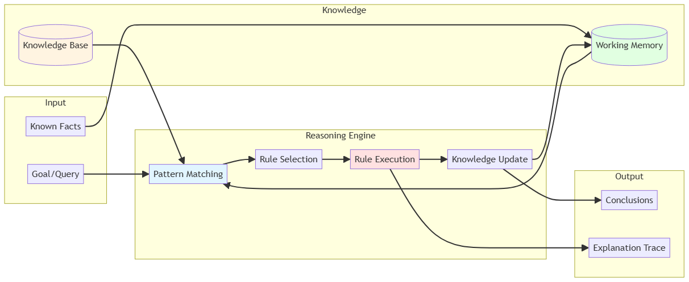
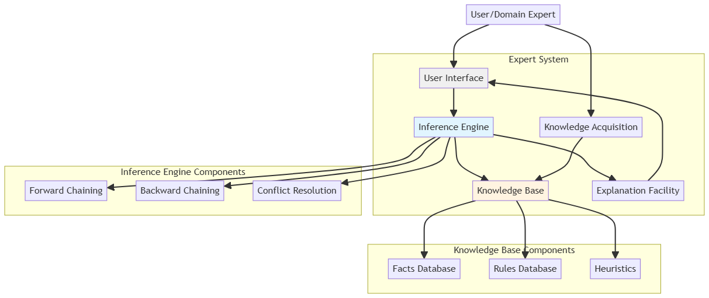

# Symbolic AI

[← Back to Main](../README.md)

## Overview

Symbolic AI, also known as "Good Old-Fashioned AI" (GOFAI), represents the classical approach to artificial intelligence based on high-level symbolic representations of problems, logic, and search. Unlike modern machine learning approaches, symbolic AI explicitly encodes human knowledge using symbols, rules, and logical reasoning.

## Core Concepts

### Knowledge Representation
How information and relationships are formally encoded for computational reasoning.

- **[Semantic Networks](semantic-networks.md)** - Graph-based knowledge structures
- **[Frames and Scripts](frames-and-scripts.md)** - Structured knowledge templates
- **[Ontologies](ontologies.md)** - Formal specifications of conceptual domains
- **[Logic Systems](logic-systems.md)** - Propositional, first-order, and higher-order logic

### Reasoning Systems

- **[Forward Chaining](forward-chaining.md)** - Data-driven inference
- **[Backward Chaining](backward-chaining.md)** - Goal-driven inference
- **[Resolution](resolution.md)** - Automated theorem proving
- **[Non-monotonic Reasoning](non-monotonic-reasoning.md)** - Reasoning with incomplete information

### Search Algorithms

| Algorithm Type | Strategy | Completeness | Optimality | Complexity | Best For |
|----------------|----------|--------------|------------|------------|----------|
| **[BFS](uninformed-search.md)** | Breadth-first | Yes | Yes (unit cost) | O(b^d) | Shortest path |
| **[DFS](uninformed-search.md)** | Depth-first | No | No | O(b^m) | Memory-limited |
| **[Uniform-Cost](uninformed-search.md)** | Lowest cost | Yes | Yes | O(b^(C*/ε)) | Weighted graphs |
| **[A*](informed-search.md)** | Best-first + heuristic | Yes | Yes (admissible h) | O(b^d) | Optimal path |
| **[Greedy Best-First](informed-search.md)** | Heuristic only | No | No | O(b^m) | Fast solutions |
| **[Minimax](adversarial-search.md)** | Game tree | Yes | Yes | O(b^m) | Two-player games |
| **[Alpha-Beta](adversarial-search.md)** | Pruned minimax | Yes | Yes | O(b^(m/2)) | Game optimization |

### Planning Approaches

| Approach | Representation | Uncertainty | Complexity | Best For |
|----------|----------------|-------------|------------|----------|
| **[STRIPS](classical-planning.md)** | State-space | None | PSPACE-complete | Deterministic domains |
| **[HTN](hierarchical-planning.md)** | Task hierarchy | None | Varies | Structured problems |
| **[Temporal](temporal-planning.md)** | Time constraints | None | EXPTIME | Scheduling |
| **[Probabilistic](probabilistic-planning.md)** | MDPs, POMDPs | Yes | PSPACE-complete | Stochastic domains |

### Expert Systems

- **[Rule-Based Systems](rule-based-systems.md)** - Production rules and inference engines
- **[Fuzzy Logic Systems](fuzzy-logic.md)** - Reasoning with imprecise information
- **[Blackboard Systems](blackboard-systems.md)** - Collaborative problem-solving architecture

## Historical Context

Symbolic AI dominated the field from the 1950s through the 1980s, achieving notable successes in:
- Chess programs (Deep Blue)
- Expert systems (MYCIN, DENDRAL)
- Natural language processing (SHRDLU)
- Automated theorem proving

## Strengths and Limitations

| Aspect | Strengths | Limitations |
|--------|-----------|-------------|
| **Interpretability** | Fully explainable reasoning chains | Verbose explanations |
| **Knowledge** | Direct domain expertise encoding | Knowledge acquisition bottleneck |
| **Correctness** | Logical guarantees | Brittleness with uncertainty |
| **Structure** | Excellent for structured problems | Poor scaling to complexity |
| **Learning** | No training data needed | Cannot learn from data |
| **Uncertainty** | Deterministic reasoning | Struggles with probabilistic data |

## Modern Relevance

While deep learning has dominated recent AI advances, symbolic AI remains relevant in:
- **Hybrid Systems** - Combining neural and symbolic approaches (neurosymbolic AI)
- **Explainable AI** - Providing interpretable reasoning chains
- **Knowledge Graphs** - Structured knowledge for search and recommendation
- **Automated Reasoning** - Formal verification and theorem proving

## Related Topics

- [Machine Learning](../machine-learning/README.md) - Data-driven learning approaches
- [Deep Learning](../deep-learning/README.md) - Neural network-based methods
- [Quantum Computing](../quantum-computing/README.md) - Quantum algorithms for search and optimization

---

*This section covers the foundational approaches to AI based on symbolic reasoning and explicit knowledge representation.*