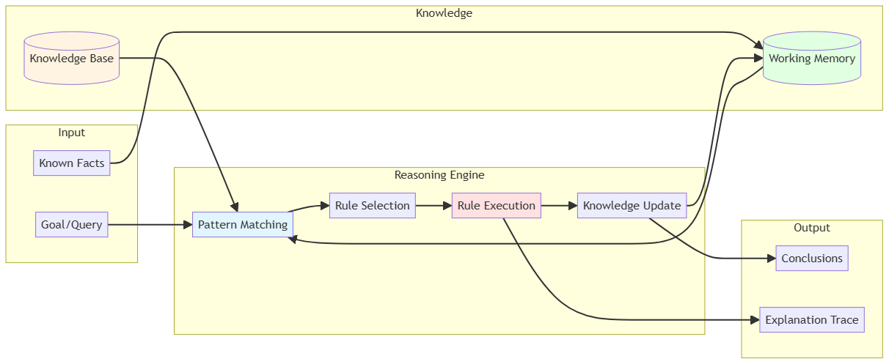
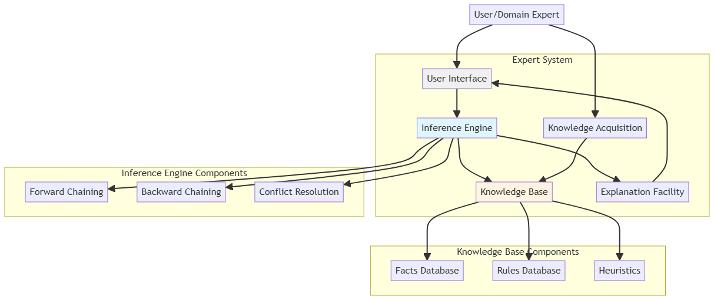
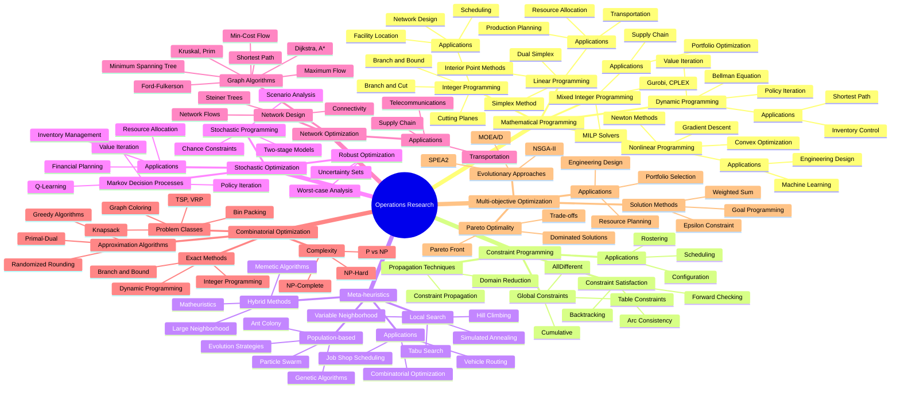
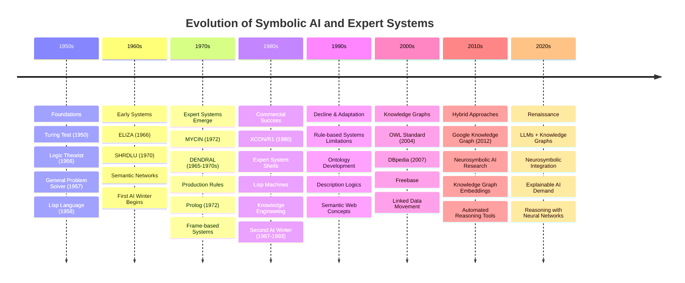

# Symbolic AI

[← Back to Main](../README.md)

## Overview

Symbolic AI, also known as "Good Old-Fashioned AI" (GOFAI), represents the classical approach to artificial intelligence based on high-level symbolic representations of problems, logic, and search. Unlike modern machine learning approaches, symbolic AI explicitly encodes human knowledge using symbols, rules, and logical reasoning.

## Core Concepts

### Knowledge Representation
How information and relationships are formally encoded for computational reasoning.

| Approach | Description | Structure | Best For |
|----------|-------------|-----------|----------|
| **[Semantic Networks](pages/semantic-networks.md)** | Graph-based knowledge structures | Nodes + edges | Relationships, hierarchies |
| **[Frames and Scripts](pages/frames-and-scripts.md)** | Structured knowledge templates | Slots + fillers | Stereotypical situations |
| **[Ontologies](pages/ontologies.md)** | Formal conceptual specifications | Classes + properties | Domain modeling |
| **[Logic Systems](pages/logic-systems.md)** | Formal logical reasoning | Propositions + rules | Theorem proving |

### Reasoning Systems

| Method | Direction | Strategy | Complexity | Best For |
|--------|-----------|----------|------------|----------|
| **[Forward Chaining](pages/forward-chaining.md)** | Data → Goal | Data-driven inference | O(n×m) | Reactive systems |
| **[Backward Chaining](pages/backward-chaining.md)** | Goal → Data | Goal-driven inference | O(b^d) | Query answering |
| **[Resolution](pages/resolution.md)** | Bidirectional | Automated theorem proving | Exponential | Logic proofs |
| **[Non-monotonic Reasoning](pages/non-monotonic-reasoning.md)** | Context-dependent | Defeasible inference | Varies | Incomplete info |

### Search Algorithms

| Algorithm Type | Strategy | Completeness | Optimality | Complexity | Best For |
|----------------|----------|--------------|------------|------------|----------|
| **[BFS](pages/uninformed-search.md)** | Breadth-first | Yes | Yes (unit cost) | O(b^d) | Shortest path |
| **[DFS](pages/uninformed-search.md)** | Depth-first | No | No | O(b^m) | Memory-limited |
| **[Uniform-Cost](pages/uninformed-search.md)** | Lowest cost | Yes | Yes | O(b^(C*/ε)) | Weighted graphs |
| **[A*](pages/informed-search.md)** | Best-first + heuristic | Yes | Yes (admissible h) | O(b^d) | Optimal path |
| **[Greedy Best-First](pages/informed-search.md)** | Heuristic only | No | No | O(b^m) | Fast solutions |
| **[Minimax](pages/adversarial-search.md)** | Game tree | Yes | Yes | O(b^m) | Two-player games |
| **[Alpha-Beta](pages/adversarial-search.md)** | Pruned minimax | Yes | Yes | O(b^(m/2)) | Game optimization |

### Planning Approaches

| Approach | Representation | Uncertainty | Complexity | Best For |
|----------|----------------|-------------|------------|----------|
| **[STRIPS](pages/classical-planning.md)** | State-space | None | PSPACE-complete | Deterministic domains |
| **[HTN](pages/hierarchical-planning.md)** | Task hierarchy | None | Varies | Structured problems |
| **[Temporal](pages/temporal-planning.md)** | Time constraints | None | EXPTIME | Scheduling |
| **[Probabilistic](pages/probabilistic-planning.md)** | MDPs, POMDPs | Yes | PSPACE-complete | Stochastic domains |

### Expert Systems

| Type | Approach | Uncertainty Handling | Best For |
|------|----------|---------------------|----------|
| **[Rule-Based Systems](pages/rule-based-systems.md)** | IF-THEN production rules | None (deterministic) | Well-defined domains |
| **[Fuzzy Logic Systems](pages/fuzzy-logic.md)** | Fuzzy sets and rules | Degrees of truth | Imprecise information |
| **[Blackboard Systems](pages/blackboard-systems.md)** | Shared knowledge space | Collaborative | Complex problems |

## Operations Research

Operations Research (OR) is a discipline that uses mathematical modeling, optimization, and analytical methods to make better decisions. It's a key component of symbolic AI, providing systematic approaches to complex decision-making problems.

### Operations Research Mind Map

The following mind map shows how different OR techniques relate to each other:

```mermaid
mindmap
  root((Operations Research))
    Mathematical Programming
      Linear Programming
        Simplex Method
        Interior Point Methods
        Dual Simplex
        Applications
          Resource Allocation
          Production Planning
          Transportation
      Integer Programming
        Branch and Bound
        Cutting Planes
        Branch and Cut
        Applications
          Scheduling
          Facility Location
          Network Design
      Mixed Integer Programming
        MILP Solvers
        Gurobi, CPLEX
        Applications
          Supply Chain
          Portfolio Optimization
      Nonlinear Programming
        Convex Optimization
        Gradient Descent
        Newton Methods
        Applications
          Machine Learning
          Engineering Design
      Dynamic Programming
        Bellman Equation
        Value Iteration
        Policy Iteration
        Applications
          Shortest Path
          Inventory Control
    Constraint Programming
      Constraint Satisfaction
        Arc Consistency
        Backtracking
        Forward Checking
      Global Constraints
        AllDifferent
        Cumulative
        Table Constraints
      Propagation Techniques
        Domain Reduction
        Constraint Propagation
      Applications
        Scheduling
        Rostering
        Configuration
    Meta-heuristics
      Local Search
        Hill Climbing
        Simulated Annealing
        Tabu Search
        Variable Neighborhood
      Population-based
        Genetic Algorithms
        Evolution Strategies
        Particle Swarm
        Ant Colony
      Hybrid Methods
        Memetic Algorithms
        Matheuristics
        Large Neighborhood
      Applications
        Vehicle Routing
        Job Shop Scheduling
        Combinatorial Optimization
    Stochastic Optimization
      Stochastic Programming
        Two-stage Models
        Chance Constraints
        Scenario Analysis
      Robust Optimization
        Worst-case Analysis
        Uncertainty Sets
      Markov Decision Processes
        Value Iteration
        Policy Iteration
        Q-Learning
      Applications
        Inventory Management
        Financial Planning
        Resource Allocation
    Network Optimization
      Graph Algorithms
        Shortest Path
        Dijkstra, A*
        Minimum Spanning Tree
        Kruskal, Prim
        Maximum Flow
        Ford-Fulkerson
        Min-Cost Flow
      Network Design
        Steiner Trees
        Network Flows
        Connectivity
      Applications
        Transportation
        Telecommunications
        Supply Chain
    Combinatorial Optimization
      Exact Methods
        Branch and Bound
        Dynamic Programming
        Integer Programming
      Approximation Algorithms
        Greedy Algorithms
        Primal-Dual
        Randomized Rounding
      Problem Classes
        TSP, VRP
        Knapsack
        Bin Packing
        Graph Coloring
      Complexity
        P vs NP
        NP-Complete
        NP-Hard
    Multi-objective Optimization
      Pareto Optimality
        Pareto Front
        Dominated Solutions
        Trade-offs
      Solution Methods
        Weighted Sum
        Epsilon Constraint
        Goal Programming
      Evolutionary Approaches
        NSGA-II
        MOEA/D
        SPEA2
      Applications
        Engineering Design
        Portfolio Selection
        Resource Planning
```

### OR Technique Comparison

| Category | Approach | Optimality | Speed | Best For | Limitations |
|----------|----------|------------|-------|----------|-------------|
| **[Linear Programming](pages/linear-programming.md)** | Exact | Guaranteed | Fast | Continuous variables, linear constraints | Linear relationships only |
| **[Integer Programming](pages/integer-programming.md)** | Exact | Guaranteed | Slow | Discrete decisions | Exponential complexity |
| **[Constraint Programming](pages/constraint-programming.md)** | Exact/Heuristic | Varies | Medium | Complex constraints, scheduling | Scalability issues |
| **[Meta-heuristics](pages/meta-heuristics.md)** | Heuristic | Approximate | Fast | Large-scale, NP-hard | No optimality guarantee |
| **[Dynamic Programming](pages/dynamic-programming.md)** | Exact | Guaranteed | Medium | Sequential decisions | Curse of dimensionality |
| **[Stochastic Optimization](pages/stochastic-optimization.md)** | Exact/Heuristic | Varies | Slow | Uncertainty | Computational cost |
| **[Network Optimization](pages/network-optimization.md)** | Exact | Guaranteed | Fast | Graph problems | Specific structure needed |

### Key Relationships

**Hierarchy of Techniques**:
1. **Mathematical Programming** (foundation) → Provides exact solutions when possible
2. **Constraint Programming** (declarative) → Focuses on constraint satisfaction
3. **Meta-heuristics** (approximate) → Used when exact methods are too slow
4. **Hybrid Approaches** (matheuristics) → Combine exact and heuristic methods

**When to Use What**:
- **Small problems + Linear**: Linear Programming (LP)
- **Small problems + Discrete**: Integer Programming (IP)
- **Medium problems + Complex constraints**: Constraint Programming (CP)
- **Large problems + NP-hard**: Meta-heuristics
- **Sequential decisions**: Dynamic Programming (DP)
- **Uncertainty**: Stochastic Optimization
- **Graph structure**: Network Optimization
- **Multiple objectives**: Multi-objective Optimization

### OR in AI Context

Operations Research bridges symbolic AI and optimization:
- **Planning** uses OR techniques for action selection
- **Scheduling** applies constraint programming and IP
- **Resource allocation** leverages LP and network optimization
- **Game playing** employs dynamic programming and search
- **Robotics** uses path planning algorithms from network optimization

## Historical Context

### Evolution Timeline

```mermaid
timeline
    title Evolution of Symbolic AI and Expert Systems
    
    1950s : Foundations
          : Turing Test (1950)
          : Logic Theorist (1956)
          : General Problem Solver (1957)
          : Lisp Language (1958)
    
    1960s : Early Systems
          : ELIZA (1966)
          : SHRDLU (1970)
          : Semantic Networks
          : First AI Winter Begins
    
    1970s : Expert Systems Emerge
          : MYCIN (1972)
          : DENDRAL (1965-1970s)
          : Production Rules
          : Prolog (1972)
          : Frame-based Systems
    
    1980s : Commercial Success
          : XCON/R1 (1980)
          : Expert System Shells
          : Lisp Machines
          : Knowledge Engineering
          : Second AI Winter (1987-1993)
    
    1990s : Decline & Adaptation
          : Rule-based Systems Limitations
          : Ontology Development
          : Description Logics
          : Semantic Web Concepts
    
    2000s : Knowledge Graphs
          : OWL Standard (2004)
          : DBpedia (2007)
          : Freebase
          : Linked Data Movement
    
    2010s : Hybrid Approaches
          : Google Knowledge Graph (2012)
          : Neurosymbolic AI Research
          : Knowledge Graph Embeddings
          : Automated Reasoning Tools
    
    2020s : Renaissance
          : LLMs + Knowledge Graphs
          : Neurosymbolic Integration
          : Explainable AI Demand
          : Reasoning with Neural Networks
```

### Notable Achievements

Symbolic AI dominated the field from the 1950s through the 1980s, achieving notable successes in:
- Chess programs (Deep Blue)
- Expert systems (MYCIN, DENDRAL)
- Natural language processing (SHRDLU)
- Automated theorem proving

## Strengths and Limitations

| Aspect | Strengths | Limitations |
|--------|-----------|-------------|
| **Interpretability** | Fully explainable reasoning chains | Verbose explanations |
| **Knowledge** | Direct domain expertise encoding | Knowledge acquisition bottleneck |
| **Correctness** | Logical guarantees | Brittleness with uncertainty |
| **Structure** | Excellent for structured problems | Poor scaling to complexity |
| **Learning** | No training data needed | Cannot learn from data |
| **Uncertainty** | Deterministic reasoning | Struggles with probabilistic data |

## Modern Relevance

While deep learning has dominated recent AI advances, symbolic AI remains relevant in:
- **Hybrid Systems** - Combining neural and symbolic approaches (neurosymbolic AI)
- **Explainable AI** - Providing interpretable reasoning chains
- **Knowledge Graphs** - Structured knowledge for search and recommendation
- **Automated Reasoning** - Formal verification and theorem proving

## Related Topics

- [Machine Learning](../machine-learning/README.md) - Data-driven learning approaches
- [Deep Learning](../deep-learning/README.md) - Neural network-based methods
- [Quantum Computing](../quantum-computing/README.md) - Quantum algorithms for search and optimization

---

*This section covers the foundational approaches to AI based on symbolic reasoning and explicit knowledge representation.*