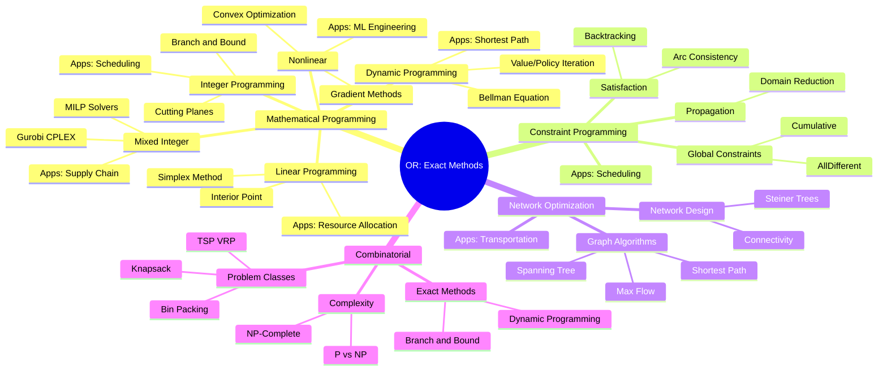
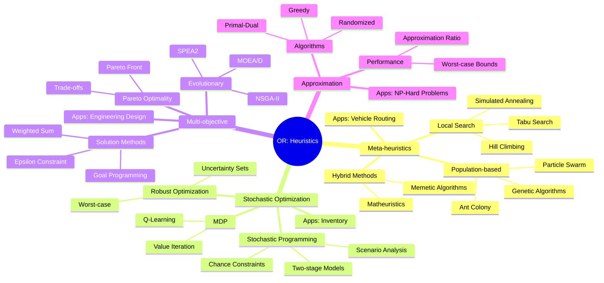
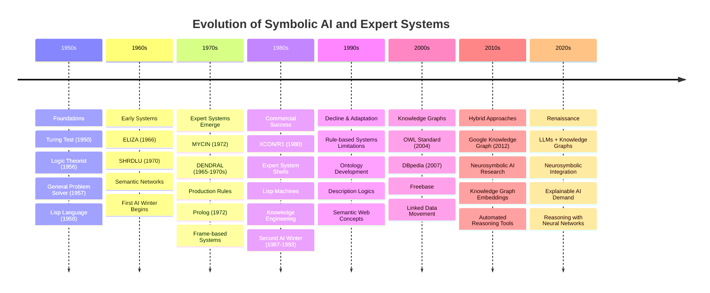

# Symbolic AI

[← Back to Main](../README.md)

## Overview

Symbolic AI, also known as "Good Old-Fashioned AI" (GOFAI), represents the classical approach to artificial intelligence based on high-level symbolic representations of problems, logic, and search. Unlike modern machine learning approaches, symbolic AI explicitly encodes human knowledge using symbols, rules, and logical reasoning.

## Core Concepts

### Knowledge Representation
How information and relationships are formally encoded for computational reasoning.

| Approach | Description | Structure | Best For |
|----------|-------------|-----------|----------|
| **Semantic Networks** | Graph-based knowledge structures | Nodes + edges | Relationships, hierarchies |
| **Frames and Scripts** | Structured knowledge templates | Slots + fillers | Stereotypical situations |
| **Ontologies** | Formal conceptual specifications | Classes + properties | Domain modeling |
| **Logic Systems** | Formal logical reasoning | Propositions + rules | Theorem proving |

### Reasoning Systems

| Method | Direction | Strategy | Complexity | Best For |
|--------|-----------|----------|------------|----------|
| **Forward Chaining** | Data → Goal | Data-driven inference | O(n×m) | Reactive systems |
| **Backward Chaining** | Goal → Data | Goal-driven inference | O(b^d) | Query answering |
| **Resolution** | Bidirectional | Automated theorem proving | Exponential | Logic proofs |
| **Non-monotonic Reasoning** | Context-dependent | Defeasible inference | Varies | Incomplete info |

### Search Algorithms

| Algorithm Type | Strategy | Completeness | Optimality | Complexity | Best For |
|----------------|----------|--------------|------------|------------|----------|
| **BFS** | Breadth-first | Yes | Yes (unit cost) | O(b^d) | Shortest path |
| **DFS** | Depth-first | No | No | O(b^m) | Memory-limited |
| **Uniform-Cost** | Lowest cost | Yes | Yes | O(b^(C*/ε)) | Weighted graphs |
| **A*** | Best-first + heuristic | Yes | Yes (admissible h) | O(b^d) | Optimal path |
| **Greedy Best-First** | Heuristic only | No | No | O(b^m) | Fast solutions |
| **Minimax** | Game tree | Yes | Yes | O(b^m) | Two-player games |
| **Alpha-Beta** | Pruned minimax | Yes | Yes | O(b^(m/2)) | Game optimization |

### Planning Approaches

| Approach | Representation | Uncertainty | Complexity | Best For |
|----------|----------------|-------------|------------|----------|
| **STRIPS** | State-space | None | PSPACE-complete | Deterministic domains |
| **HTN** | Task hierarchy | None | Varies | Structured problems |
| **Temporal** | Time constraints | None | EXPTIME | Scheduling |
| **Probabilistic** | MDPs, POMDPs | Yes | PSPACE-complete | Stochastic domains |

### Expert Systems

| Type | Approach | Uncertainty Handling | Best For |
|------|----------|---------------------|----------|
| **Rule-Based Systems** | IF-THEN production rules | None (deterministic) | Well-defined domains |
| **Fuzzy Logic Systems** | Fuzzy sets and rules | Degrees of truth | Imprecise information |
| **Blackboard Systems** | Shared knowledge space | Collaborative | Complex problems |

## Operations Research

Operations Research (OR) is a discipline that uses mathematical modeling, optimization, and analytical methods to make better decisions. It's a key component of symbolic AI, providing systematic approaches to complex decision-making problems.

### Operations Research Mind Maps

The following mind maps show how different OR techniques relate to each other:

#### Part 1: Exact Methods and Mathematical Programming

```mermaid
mindmap
  root((OR: Exact Methods))
    Mathematical Programming
      Linear Programming
        Simplex Method
        Interior Point
        Apps: Resource Allocation
      Integer Programming
        Branch and Bound
        Cutting Planes
        Apps: Scheduling
      Mixed Integer
        MILP Solvers
        Gurobi CPLEX
        Apps: Supply Chain
      Nonlinear
        Convex Optimization
        Gradient Methods
        Apps: ML Engineering
      Dynamic Programming
        Bellman Equation
        Value/Policy Iteration
        Apps: Shortest Path
    Constraint Programming
      Satisfaction
        Arc Consistency
        Backtracking
      Global Constraints
        AllDifferent
        Cumulative
      Propagation
        Domain Reduction
      Apps: Scheduling
    Network Optimization
      Graph Algorithms
        Shortest Path
        Spanning Tree
        Max Flow
      Network Design
        Steiner Trees
        Connectivity
      Apps: Transportation
    Combinatorial
      Exact Methods
        Branch and Bound
        Dynamic Programming
      Problem Classes
        TSP VRP
        Knapsack
        Bin Packing
      Complexity
        P vs NP
        NP-Complete
```

#### Part 2: Heuristics and Stochastic Methods

```mermaid
mindmap
  root((OR: Heuristics))
    Meta-heuristics
      Local Search
        Hill Climbing
        Simulated Annealing
        Tabu Search
      Population-based
        Genetic Algorithms
        Particle Swarm
        Ant Colony
      Hybrid Methods
        Memetic Algorithms
        Matheuristics
      Apps: Vehicle Routing
    Stochastic Optimization
      Stochastic Programming
        Two-stage Models
        Chance Constraints
        Scenario Analysis
      Robust Optimization
        Worst-case
        Uncertainty Sets
      MDP
        Value Iteration
        Q-Learning
      Apps: Inventory
    Multi-objective
      Pareto Optimality
        Pareto Front
        Trade-offs
      Solution Methods
        Weighted Sum
        Epsilon Constraint
        Goal Programming
      Evolutionary
        NSGA-II
        MOEA/D
        SPEA2
      Apps: Engineering Design
    Approximation
      Algorithms
        Greedy
        Primal-Dual
        Randomized
      Performance
        Approximation Ratio
        Worst-case Bounds
      Apps: NP-Hard Problems
```

### OR Technique Comparison

| Category | Approach | Optimality | Speed | Best For | Limitations |
|----------|----------|------------|-------|----------|-------------|
| **Linear Programming** | Exact | Guaranteed | Fast | Continuous variables, linear constraints | Linear relationships only |
| **Integer Programming** | Exact | Guaranteed | Slow | Discrete decisions | Exponential complexity |
| **Constraint Programming** | Exact/Heuristic | Varies | Medium | Complex constraints, scheduling | Scalability issues |
| **Meta-heuristics** | Heuristic | Approximate | Fast | Large-scale, NP-hard | No optimality guarantee |
| **Dynamic Programming** | Exact | Guaranteed | Medium | Sequential decisions | Curse of dimensionality |
| **Stochastic Optimization** | Exact/Heuristic | Varies | Slow | Uncertainty | Computational cost |
| **Network Optimization** | Exact | Guaranteed | Fast | Graph problems | Specific structure needed |

### Key Relationships

**Hierarchy of Techniques**:
1. **Mathematical Programming** (foundation) → Provides exact solutions when possible
2. **Constraint Programming** (declarative) → Focuses on constraint satisfaction
3. **Meta-heuristics** (approximate) → Used when exact methods are too slow
4. **Hybrid Approaches** (matheuristics) → Combine exact and heuristic methods

**When to Use What**:
- **Small problems + Linear**: Linear Programming (LP)
- **Small problems + Discrete**: Integer Programming (IP)
- **Medium problems + Complex constraints**: Constraint Programming (CP)
- **Large problems + NP-hard**: Meta-heuristics
- **Sequential decisions**: Dynamic Programming (DP)
- **Uncertainty**: Stochastic Optimization
- **Graph structure**: Network Optimization
- **Multiple objectives**: Multi-objective Optimization

### OR in AI Context

Operations Research bridges symbolic AI and optimization:
- **Planning** uses OR techniques for action selection
- **Scheduling** applies constraint programming and IP
- **Resource allocation** leverages LP and network optimization
- **Game playing** employs dynamic programming and search
- **Robotics** uses path planning algorithms from network optimization

## Historical Context

### Evolution Timeline

```mermaid
timeline
    title Evolution of Symbolic AI and Expert Systems
    
    1950s : Foundations
          : Turing Test (1950)
          : Logic Theorist (1956)
          : General Problem Solver (1957)
          : Lisp Language (1958)
    
    1960s : Early Systems
          : ELIZA (1966)
          : SHRDLU (1970)
          : Semantic Networks
          : First AI Winter Begins
    
    1970s : Expert Systems Emerge
          : MYCIN (1972)
          : DENDRAL (1965-1970s)
          : Production Rules
          : Prolog (1972)
          : Frame-based Systems
    
    1980s : Commercial Success
          : XCON/R1 (1980)
          : Expert System Shells
          : Lisp Machines
          : Knowledge Engineering
          : Second AI Winter (1987-1993)
    
    1990s : Decline & Adaptation
          : Rule-based Systems Limitations
          : Ontology Development
          : Description Logics
          : Semantic Web Concepts
    
    2000s : Knowledge Graphs
          : OWL Standard (2004)
          : DBpedia (2007)
          : Freebase
          : Linked Data Movement
    
    2010s : Hybrid Approaches
          : Google Knowledge Graph (2012)
          : Neurosymbolic AI Research
          : Knowledge Graph Embeddings
          : Automated Reasoning Tools
    
    2020s : Renaissance
          : LLMs + Knowledge Graphs
          : Neurosymbolic Integration
          : Explainable AI Demand
          : Reasoning with Neural Networks
```

### Notable Achievements

Symbolic AI dominated the field from the 1950s through the 1980s, achieving notable successes in:
- Chess programs (Deep Blue)
- Expert systems (MYCIN, DENDRAL)
- Natural language processing (SHRDLU)
- Automated theorem proving

## Strengths and Limitations

| Aspect | Strengths | Limitations |
|--------|-----------|-------------|
| **Interpretability** | Fully explainable reasoning chains | Verbose explanations |
| **Knowledge** | Direct domain expertise encoding | Knowledge acquisition bottleneck |
| **Correctness** | Logical guarantees | Brittleness with uncertainty |
| **Structure** | Excellent for structured problems | Poor scaling to complexity |
| **Learning** | No training data needed | Cannot learn from data |
| **Uncertainty** | Deterministic reasoning | Struggles with probabilistic data |

## Modern Relevance

While deep learning has dominated recent AI advances, symbolic AI remains relevant in:
- **Hybrid Systems** - Combining neural and symbolic approaches (neurosymbolic AI)
- **Explainable AI** - Providing interpretable reasoning chains
- **Knowledge Graphs** - Structured knowledge for search and recommendation
- **Automated Reasoning** - Formal verification and theorem proving

## Related Topics

- [Machine Learning](../machine-learning/README.md) - Data-driven learning approaches
- [Deep Learning](../deep-learning/README.md) - Neural network-based methods
- [Quantum Computing](../quantum-computing/README.md) - Quantum algorithms for search and optimization

---

*This section covers the foundational approaches to AI based on symbolic reasoning and explicit knowledge representation.*